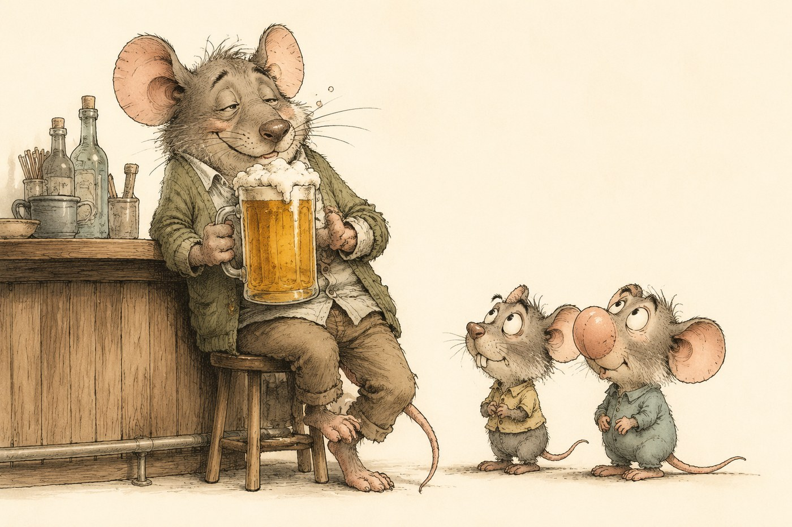
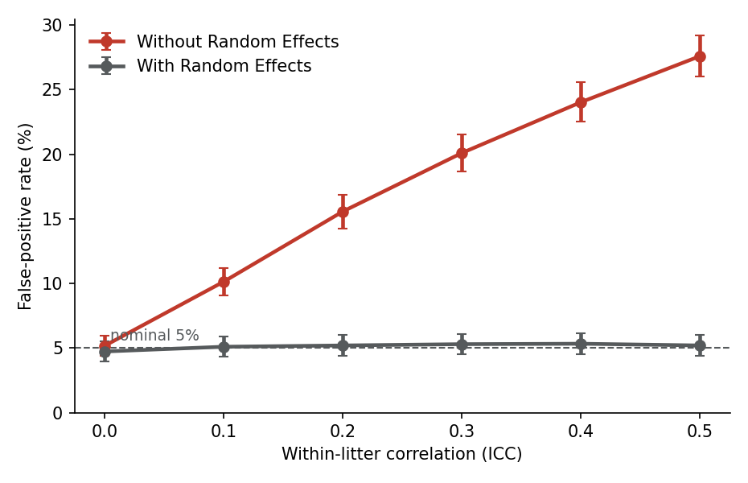
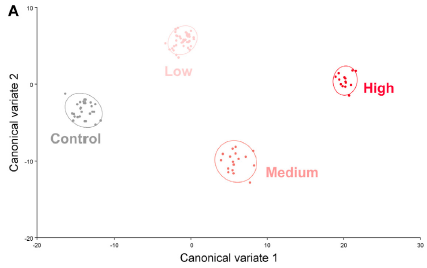
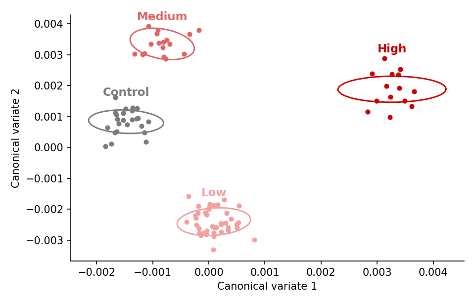

{fig-alt="A cartoon father mouse in a cardigan sits at a bar with a large mug of beer while two baby mice with comically odd faces look up at him." width="100%"}

In a [recent piece published in The Atlantic](https://www.theatlantic.com/family/2026/07/alcohol-conception-fathers-men/687943/), science journalist Olga Khazan presents the argument that fathers-to-be, not just mothers, should watch their drinking before conception. In support of this claim, she interviews Michael Golding, a co-author of an experimental mouse study presenting a dramatic claim: "when a male mouse drank alcohol, then impregnated a female mouse that was not given alcohol, their fetuses tended to develop facial changes, such as smaller jaws, similar to those seen in some human children with fetal alcohol syndrome."

The claim references a [paper recently published in the journal "Frontiers in Cell and Developmental Biology"](https://www.frontiersin.org/journals/cell-and-developmental-biology/articles/10.3389/fcell.2024.1415653/full) (Higgins et al. 2024). While I don't know much about biology, I know a decent amount about experimental design and statistics, so I decided to open the paper and see for myself. After only a few minutes, I was convinced that the paper contains multiple issues. Let's dig in.

## What the paper showed and how

The design is pretty straightforward. Male mice are randomly given access to water, or a drink containing a low, medium, or high dose of ethanol. They are then bred to untreated females (i.e., females who did not drink any alcohol), producing 98 fetuses in total (24, 43, 17, and 14 across the four conditions). They then measure the craniofacial features of the fetuses, and analyze them using a variety of statistical techniques.

The thing that immediately jumped out at me is that they report (among other things) differences in offspring facial shape at p = 2.1 × 10⁻⁵⁴.

## The insanity of p = 2.1 × 10⁻⁵⁴

p = 2.1 × 10⁻⁵⁴ is an insanely small number. To put it in context, the statistical threshold physicists use to declare a discovery is "five sigma," roughly p = 3 × 10⁻⁷. When looking for the Higgs boson, physicists needed to generate roughly ~10¹⁵ collisions to justify announcing a discovery at p ≈ 3 × 10⁻⁷. This paper reports p = 2.1 × 10⁻⁵⁴ — *47 orders of magnitude smaller* — from *98 mouse fetuses*.

But forget about the Higgs boson. Let's compare apples-to-apples, or mice-to-mice. The first result reported in the paper is a manipulation check: The amount of ethanol per gram that the male mice consumed in the three experimental conditions. On this manipulation check, the authors find p = .031 (when comparing the "Low" to "Medium" ethanol condition) and p = .027 (when comparing the "Medium" and "High" conditions). In other words, there are just enough mice in the experiment to detect differences in how much alcohol the subjects consumed at the p = .05 threshold.

So if the effect is barely detectable on an upstream outcome (the amount of ethanol consumed), how can it be significant at p = 2.1 × 10⁻⁵⁴ on a *downstream outcome* (the craniofacial features of the fetuses)? It shouldn't be. It is a red flag that something in the analysis has gone wrong. In the case of that paper, several things have.

## Major problem one: the fetuses are not independent observations

The first issue in this paper is something called *pseudoreplication*: non-independent observations are analyzed as if they were independent.

The treatment was assigned to the fathers, so the father is the experimental unit. However, all the statistics reported in the paper are derived from fetus-level analysis treating each fetus as an independent observation.

This is not correct for obvious genetic reasons. Half of each fetus' genes are transmitted from the father, such that pups from a given father are going to have correlated craniofacial features. In addition, the paper argues that a father's exposure to alcohol will reshape his offspring... ironically suggesting another reason why pups from the same father might have correlated outcomes.

What is the consequence of pseudoreplication? Counting fetuses instead of fathers will inflate the apparent sample size, and thus mechanically shrink the p-value.

How strongly can pseudoreplication shift the conclusions of a paper? Here is a simulation. I create two groups with the same mean (i.e., the null is true), each with 5 fathers siring 5 fetuses. Fetuses from the same father share a father-level value, such that littermates have correlated outcomes; the strength of that correlation is the intraclass correlation, or ICC.

I then test for a group difference in two ways: by counting each fetus as an independent observation (what the paper did), and by testing at the father level with a father random-effects model (what the paper should have done). Here are the results of 3,000 simulated studies.

<details>
<summary>Show the code</summary>

```python
import numpy as np, pandas as pd
from scipy import stats

def simulate(icc, k_fathers=5, pups=5, seed=0):
    rng = np.random.default_rng(seed)
    tau = np.sqrt(icc / (1 - icc)) if icc > 0 else 0.0
    rows = []
    for group in (0, 1):                                   # two groups, SAME mean (null is true)
        for f in range(k_fathers):
            father_value = rng.normal(0, 1) * tau          # shared by this father's litter
            for _ in range(pups):
                rows.append((group, f"{group}_{f}", father_value + rng.normal(0, 1)))
    return pd.DataFrame(rows, columns=["group", "father", "y"])

def false_positive_rate(icc, k_fathers=5, pups=5, n_sim=3000):
    naive = mixed = 0
    for s in range(n_sim):
        df = simulate(icc, k_fathers=k_fathers, pups=pups, seed=s)
        a, b = df.y[df.group == 0], df.y[df.group == 1]
        naive += stats.ttest_ind(a, b).pvalue < .05        # (a) count each fetus
        # (b) test at the father level: compare the groups using the BETWEEN-father
        # variation. For this balanced design this is the exact test of the
        # random-intercept (father random-effect) model — a t-test on per-father means.
        fa = df[df.group == 0].groupby("father").y.mean()
        fb = df[df.group == 1].groupby("father").y.mean()
        mixed += stats.ttest_ind(fa, fb).pvalue < .05
    return naive / n_sim, mixed / n_sim                    # -> (0.201, 0.053) at icc=0.3
```

</details>



When littermates are independent (ICC = 0), both approaches reject the true null 5% of the time, exactly as they should. But littermates are not independent — that is the entire premise of the paper. At a moderate within-litter correlation of 0.3[^1], analysis of the fetus-level data without adding random effects will reject the null approximately 20% of the time, a four-fold increase in the false-positive rate.

All the results reported in the paper suffer from this issue.

## Major problem two: tautological differences

While the consequences of pseudoreplication can be severe, it alone will not bring you to p = 2.1 × 10⁻⁵⁴. To reach this insane level of significance, another error is required... and I must admit I had never seen this one before.

To obtain this p-value, the authors proceed in three steps:

1. They apply a procedure called *canonical variate analysis* (CVA) to the 47 craniofacial features. This is a method that identifies the feature combinations that maximize the separation between groups. Think of it as a PCA that knows each observation's group, and rotates the data to pull the groups as far apart as possible *relative to the scatter within each group*.
2. They score the observations (the fetuses) on these axes.
3. They then test for differences between groups on these scores.

Yes, you read that right. The paper tests for the existence of craniofacial differences between groups *using indices that were constructed to maximize separation between groups*. It would be like splitting a classroom into two groups based on the gender of the students, and applying a statistical test to check whether one group has more women than the other.

You might think I'm exaggerating, but Figure 2 of the paper (reproduced below) shows a perfect separation between groups on the CVA scores. This is exactly what you'd expect after running a CVA using ~90 variables (47 craniofacial features scored on two dimensions) on 98 observations. When you have almost as many variables as observations, you can perfectly separate the groups into distinct clusters.



*Figure 2A from Higgins et al. (2024), reproduced under CC BY.*

In case this intuitive argument is not enough, I'm going to show that I can reproduce this result with groups that have zero true differences between them.

I followed the setup of the paper: four groups matching its cell sizes (24, 43, 17, and 14 fetuses), and 47 landmarks scored on two dimensions. The landmarks are, in expectation, identical between groups: No differences between them. I also follow the exact same processing pipeline:
* I run every observation through a *Procrustes alignment*, which slides, scales, and rotates each set of landmarks until they overlap as closely as possible, stripping out differences in position, size, and orientation. 
* That step removes four degrees of freedom (two for position, one for size, one for rotation), turning the 94 raw coordinates (47 landmarks × 2 dimensions) into ~90 shape variables. 
* I then apply the CVA, and plot the first two canonical variates.

<details>
<summary>Show the code</summary>

```python
def gen_landmarks(rng, n, k=47, noise=0.05):    # 47 landmarks in 2D: one shared shape + noise
    template = rng.normal(0, 1, (k, 2))         # identical across groups (no real differences)
    return template[None] + rng.normal(0, noise, (n, k, 2))

def gpa(L, iters=3):                            # Procrustes: center, scale, rotate to a common frame
    L = L - L.mean(1, keepdims=True)
    L = L / np.sqrt((L**2).sum((1, 2), keepdims=True))
    ref = L[0].copy()
    for _ in range(iters):
        for i in range(len(L)):
            U, _, Vt = np.linalg.svd(L[i].T @ ref)
            L[i] = L[i] @ (U @ Vt)
        ref = L.mean(0); ref /= np.sqrt((ref**2).sum())
    return L.reshape(len(L), -1)

def shape_space(X, k=47):                        # 47 landmarks x 2D  ->  90 shape variables
    Xc = X - X.mean(0); U, s, _ = np.linalg.svd(Xc, full_matrices=False)
    return U[:, :2*k - 4] * s[:2*k - 4]

def cva_scores(X, y):                           # axes chosen to maximize group separation
    grand = X.mean(0); p = X.shape[1]
    Sw = np.zeros((p, p)); Sb = np.zeros((p, p))
    for g in np.unique(y):
        Xi = X[y == g]; d = (Xi.mean(0) - grand)[:, None]
        Sw += (Xi - Xi.mean(0)).T @ (Xi - Xi.mean(0))          # within-group scatter
        Sb += len(Xi) * d @ d.T                                # between-group scatter
    evals, vecs = np.linalg.eig(np.linalg.solve(Sw, Sb))       # maximize between / within
    return X @ vecs[:, np.argsort(evals.real)[::-1][:len(np.unique(y)) - 1]].real

def manova(X, y):                               # one-way MANOVA: Wilks' lambda -> Bartlett p
    grand = X.mean(0); n, p = X.shape; g = len(np.unique(y))
    T = (X - grand).T @ (X - grand)
    W = sum((X[y==k] - X[y==k].mean(0)).T @ (X[y==k] - X[y==k].mean(0)) for k in np.unique(y))
    lnlam = np.linalg.slogdet(W)[1] - np.linalg.slogdet(T)[1]
    return stats.chi2.sf(-(n - 1 - (p + g) / 2) * lnlam, p * (g - 1))

sizes = [24, 43, 17, 14]; y = np.repeat(range(4), sizes)
rng = np.random.default_rng(0)
X = shape_space(gpa(gen_landmarks(rng, sum(sizes))))   # noise -> Procrustes -> 90 shape variables
manova(cva_scores(X, y)[:, :3], y)                     # the paper's step: test the maximally-separating scores
```

</details>

Here is the result: Perfect separation between groups, just like in the figure reported by the paper.



And of course, the differences between groups come out wildly significant. Across the pairwise comparisons, the p-values on this pure-noise dataset run from 5.7 × 10⁻²⁵ down to 1.3 × 10⁻⁴⁸ — the same astronomical range the paper itself reports, from random simulated data.

The paper does report other analyses of craniofacial features that do not suffer from this issue. The Procrustes ANOVA in Table 1, for instance, compares the groups' average shapes directly on the aligned landmark coordinates, rather than on axes built to separate them. The p-values of these analyses are far less extreme (from p < .0001 down to p = .0825).

However, they are computed like everything else in the paper: one row per fetus, with fetuses from the same father treated as independent.

## Another smaller problem: An unmodeled cohort effect

The authors also mention that the Control and Low-dose groups were topped up with animals from a *separate experimental cohort*, citing the practice of splitting a study into "mini-experiments" for robustness.

The trouble is that this practice is only valid if you then include cohort as a factor in the analysis — which they do not. And because only two of the four groups were supplemented, cohort is now confounded with treatment.

## What about the other studies in The Atlantic article?

I also checked the five other mouse studies cited in support of the thesis that paternal drinking affects offspring — four of them also from Michael Golding's lab. The good news is that none make the extremely strange CVA error, so none are reporting anything close to p = 2.1 × 10⁻⁵⁴. The bad news is that all commit the same pseudoreplication error — analyzing individual offspring (or, in one IVF study, embryos pooled from a handful of sires) as if they were independent.

## Conclusion

My perspective is that these issues are severe. The pseudoreplication problem alone, in my view, invalidates the conclusions of the article. Yet, this is a study that The Atlantic is leading with, in an article telling prospective fathers to change their behavior.

Don't get me wrong. I am not saying Olga Khazan (or her editor) should have caught these issues. I am also not saying that it is a journalist's job (or a magazine editor's job) to scrutinize every single paper that they write about. This is first and foremost a problem of bad science and inadequate peer-reviewing. 

What I am saying, though, is that the piece should have reported on these findings with greater skepticism. If you are a science journalist, you should know that bad science exists. You should know that peer-reviewing (particularly at lower-tier journals) is not a perfect stamp of quality or accuracy. You should know that scientists sometimes have their own professional agenda, and that they will seek media coverage to enhance their social status.

So yes, I do believe that when **writing a story about a scientific finding, journalists should consider seeking dissenting perspectives, particularly for a finding that overturns conventional wisdom in public health.** One possibility is to call a second scientist — one with no stake in the answer — and ask them for their brutally honest opinion. Another would be to ask a frontier AI model. Large Language Models are not perfect tools, but in that case Claude Opus 4.8 spotted the issues immediately, and was able to explain them in clear language.

People are already buried under contradictory health advice, and trust in public health is waning. Let's not add to the confusion by uncritically reporting on sloppy, scare-mongering science.

[^1]: Since I'm not a biologist or geneticist, I had to trust Claude Opus 4.8 for identifying a plausible range of ICC. According to our search, for littermates that are full siblings (same sire and dam), a correlation of roughly ½h² is expected, where h² is the heritability of the trait. Research suggests that mouse craniofacial shape is moderately-to-highly heritable: SNP-based heritability is estimated at ~0.42–0.44 for skull and mandible shape (Pallares et al., 2015, *PLoS Genetics*, doi:10.1371/journal.pgen.1005607). That puts the littermate correlation from genes alone near ½ × 0.43 ≈ 0.2. Note that this ICC assumes that only heritability contributes to craniofacial similarity: It does not account for the shared maternal and uterine environment, or for any other epigenetic impact coming from the father (what the paper hypothesizes).
