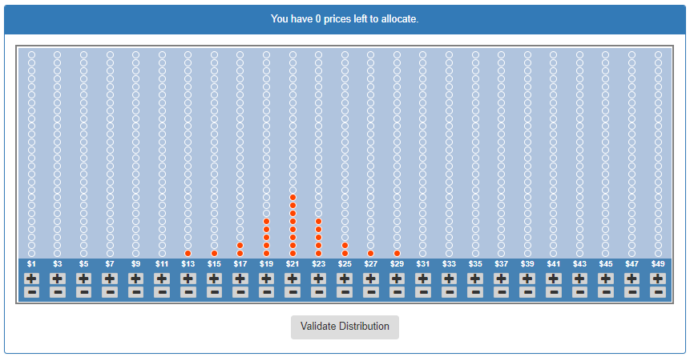
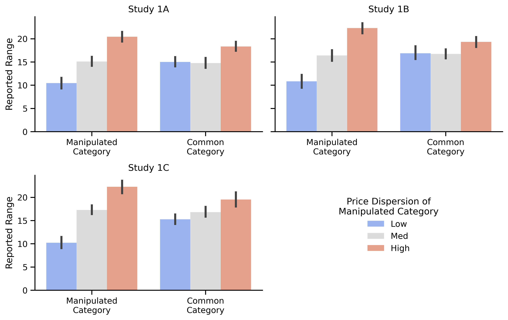
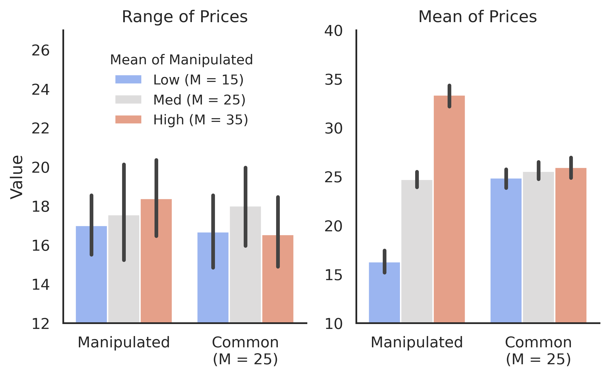
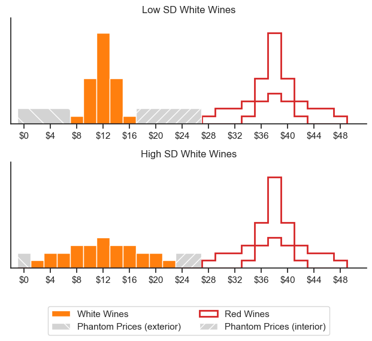

Can Consumers Learn Price Dispersion?

Evidence for Dispersion Spillover Across Categories

Forthcoming, *Journal of Consumer Research*

*The version of the record is accessible at this DOI: 10.1093/jcr/ucab030*

QUENTIN ANDRÉ

NICHOLAS REINHOLTZ

BART DE LANGHE

Quentin André (corresponding author; quentin.andre@colorado.edu) and Nicholas Reinholtz (nicholas.reinholtz@colorado.edu) are assistant professors of marketing at the Leeds School of Business, CU Boulder, CO 80309, United States. Bart de Langhe (bart.delanghe@esade.edu) is an associate professor of marketing at Universitat Ramon Llull, ESADE, 08034 Barcelona, Spain. The authors wish to thank Dan Goldstein, and past and current colleagues at the Rotterdam School of Management, University of Colorado Boulder, ESADE, and INSEAD, for their comments and feedback. This paper is based on Quentin André’s dissertation, on which Nicholas Reinholtz and Bart de Langhe served as advisors.

# ABSTRACT

Price knowledge is a key antecedent of many consumer judgments and decisions. This paper examines consumers’ ability to form accurate beliefs about the minimum, the maximum, and the overall variability of prices for multiple product categories. Eight experiments provide evidence for a novel phenomenon we call *dispersion spillover*: Consumers tend to overestimate price dispersion in a category after encountering another category in which prices are more dispersed (versus equally or less dispersed). Our experiments show that this dispersion spillover is consequential: It influences the likelihood that consumers will search for (and find) better prices and offers, and how much consumers bid in auctions. Finally, we disentangle two cognitive processes that might underlie dispersion spillover. Our results suggest that judgments of dispersion are not only based on specific prices stored in memory, and that dispersion spillover does not simply reflect the inappropriate activation of prices from other categories. Instead, it appears that consumers also form “intuitive statistics” of dispersion: Summary representations that encode the dispersion of prices in the environment, but that are insufficiently category-specific. (174 words).

*Keywords*: consumer learning, numerical cognition, intuitive statistics, price search, price knowledge, reference price, price dispersion, mental representation, behavioral pricing.

# INTRODUCTION

To make decisions, consumers often rely on their beliefs about the minimum price, the maximum price, or the overall variability of prices in a product category. This price dispersion knowledge is a central feature of many streams of research in marketing, such as the literatures on perceived price attractiveness (e.g., Janiszewski and Lichtenstein 1999), price search (Bloch, Sherrell, and Ridgway 1986), multi-attribute choice (e.g., Meyer 1981), and consumer financial decision-making (Gallagher et al. 2018; Skinner 1988). While the influence of price dispersion knowledge on consumers’ decisions is widely recognized, many questions remain about how consumers form dispersion knowledge from experience, especially in multi-category environments, and about the mental representations that underlie price judgments (Mazumdar, Raj and Sinha 2005, p. 92).

To illustrate, take a consumer who regularly buys red and white wines, sometimes at the local liquor store, sometimes from an online retailer. Would this consumer, after repeated shopping experiences, be able to make accurate judgments about the price dispersion of wines? Would the consumer’s judgments of price dispersion for red wines be influenced by the prices of white wines? Does it matter if prices of white wines are more dispersed or less dispersed than prices of red wines? Would the consumer’s decisions at the local liquor store be influenced by prices encountered when shopping online? And what are the cognitive processes that underlie these judgments and decisions? Are they based exclusively on the retrieval of previously-seen prices stored in memory? Or are they based also on abstract mental representations, also known as “intuitive statistics,” that summarize the general properties of price distributions in various contexts?

This paper aims to make three contributions. First, we report a series of experiments that test consumers’ ability to accurately judge price dispersion in multi-category environments. When two product categories have equal price dispersion, we find that consumers can form highly accurate beliefs about price dispersion in each category. However, when two product categories have different amounts of price dispersion, we find that consumers overestimate price dispersion in the category with the smaller amount of price dispersion. We call this phenomenon *dispersion spillover*.

Second, we report three pre-registered and incentive-compatible experiments that demonstrate downstream consequences of dispersion spillover. We find that after encountering a larger amount of price dispersion in another category, consumers are more likely to forego attractive prices, to search longer in hope of finding better alternatives that do not exist, and to overbid in auctions

Finally, we report two experiments that disentangle two cognitive processes that might underlie dispersion spillover. According to the first process, judgments of price dispersion are determined by the weighted activation of previously encountered prices stored in memory. According to the second process, judgments of price dispersion are also informed by “intuitive statistics” of dispersion: Abstract cognitive representations that summarize the prices that consumers have encountered. These two processes make different predictions. For instance, the activation of prices from another category would predict that consumers also perceive more price dispersion when two categories have a different (vs. identical) average price. In contrast, the formation of intuitive statistics suggest that people may report “phantom prices” that never appeared in any of the two categories, but that are consistent with their summary impression of dispersion. Our studies suggest that the exemplar-based process cannot fully account for the dispersion spillover, and provide evidence that dispersion spillover appears to be driven in part by intuitive statistics.

# CONCEPTUAL DEVELOPMENT

Prices are some of the most important inputs in consumers’ judgments and decisions, but they are not inherently evaluable (Hsee and Zhang 2010). For this reason, the perceived attractiveness of a price is based on a comparison, either to external standards, such as the price of another item presented next to it, or to internal standards, such as a consumer’s belief about the average price in the category. Internal standards are often referred to as price knowledge (Dickson and Sawyer 1990), and reflect the information that consumers have accumulated about prices. In the sections below, we first position our investigation within existing marketing literatures on price knowledge, and identify knowledge gaps that our investigation of price dispersion learning intends to fill. We then hypothesize, based on relevant literatures in cognitive science, two cognitive mechanisms that make diverging predictions about price dispersion judgments in multi-category environments.

## Single-Value Models of Price Knowledge

When evaluating a price, consumers may rely on their belief about the “average price”, or the “habitual price” for a comparable good in comparable circumstances. This point of comparison is often called the “internal reference price” (IRP; Kalyanaram and Winer 1995). Decades of research in marketing have debated how past prices are integrated into IRPs, how many IRPs consumers possess, whether consumers form IRPs at the brand, category, or store-level, and the conditions under which IRPs drive judgments and decisions (see Mazumdar et al. 2005 for a review).

A common feature of IRP models is that they are “single-value” models of price knowledge: Past prices are integrated into a single reference point, the “habitual” or “expected” price, against which target prices are then compared (Monroe 1973). This view is informed by a long-standing literature in psychology and cognitive science describing people as “intuitive statisticians” (Birnbaum 1976; Peterson and Beach 1967; Winkler 1970) who possess a natural ability to efficiently summarize the multiple numerical distributions that they encounter into “intuitive averages” (Malmi and Samson 1983).

## Price Dispersion Knowledge and Consumer Choice

In addition to beliefs about the “average” or “habitual” price in a category, consumers’ judgments and decisions can also be influenced by their beliefs about the minimum, the maximum, and the overall dispersion of prices in a category. This dispersion knowledge plays an important role in various marketing literatures.

First, experimental research has demonstrated that consumers’ judgments of price attractiveness are not only based on the average price in a category, but also on the category’s perceived price dispersion. Janiszewski and Lichtenstein (1999), for instance, showed that consumers judge the same price as less attractive when the minimum price they have encountered in the category is lower. Others have demonstrated that consumers judge a price as less attractive when they have been exposed to a larger number of cheaper prices (e.g., Niedrich, Sharma, and Wedell 2001; Schley, de Langhe, and Long 2020).

Second, prior research has connected consumers’ perceptions of price dispersion to consequential decisions. In this line of work, consumers’ beliefs about price dispersion are often measured using Likert scales (e.g., “The price of \[the item\] is likely to vary significantly from one store to another in the marketplace”; Srivastava and Lurie 2001). Researchers have found that these measures of perceived price dispersion correlate with perceptions of a store’s price image (Hamilton and Chernev 2013), persistence during price search (Urbany, Dickson, and Kalapurakal 1996), and the perceived availability of low prices (Biswas, Dutta, and Pullig 2006; Urbany, Bearden, and Weilbaker 1988).

Finally, formal models of consumer decision-making often assume that dispersion knowledge plays a role. In multi-attribute choice models, a consumer’s expectation about an attribute (e.g., price) is often represented using two parameters: One for the expected (average) value of the attribute, and a second summarizing uncertainty about the value of the attribute (effectively the mean and variance in consumers’ beliefs; e.g., Erdem and Keane 1996; Meyer 1981, 1982). These models are typically calibrated and validated on choice data. For multiple reasons however, it is difficult to derive conclusions about consumers’ ability to learn dispersion from the parameter estimates of these models. To start, these estimates are contingent upon the assumptions of the models, which might not correspond to reality. For instance, Meyer and Sathi (1985) assume perfect memory for previous attribute values, and Erdem and Keane (1996) assume that beliefs are formed independently across product categories. In addition, the variability parameters might not only capture beliefs about price dispersion, but also other inputs of decision-making (e.g., risk preferences). Finally, the accuracy of price dispersion knowledge is difficult to assess in the context of observational data because researchers do not know the exact prices that consumers have sampled prior to making their choices.

## Are Judgments of Price Dispersion Accurate?

While various marketing literatures have recognized the importance of dispersion knowledge for understanding consumer decisions, many questions remain about how consumers form dispersion knowledge from experience, and whether consumers’ dispersion knowledge corresponds to reality.

A few experiments in cognitive science have examined people’s ability to learn the properties of numerical distributions. In a typical study, participants are first presented with a sequence of numbers, and then asked questions about the central tendency and dispersion of these numbers. A general conclusion from this literature is that people’s judgments of central tendency tend to be highly accurate (Levin 1974; Peterson and Miller 1964; Spencer 1963), but that people struggle to accurately report the “variance” or the “standard deviation” of a distribution of numbers (Beach and Scopp 1968; Kareev, Arnon, and Horwitz-Zeliger 2002; Lovie 1978; Lovie and Lovie 1976). However, this result may reflect that “variance” or “standard deviation” are statistical conventions that do not correspond to how consumers would naturally describe their impressions of dispersion. It is therefore difficult to draw conclusions about people’s ability to learn dispersion from these finding. More recently, a study by Goldstein and Rothschild (2014) demonstrated that people can reproduce a numerical distribution with high accuracy if they are allowed to express their beliefs in ways that are more intuitive to them. Specifically, the authors tested a graphical elicitation technique that invites people to build a histogram of the distribution by allocating “balls” (representing frequencies) to “buckets” (representing values or ranges of values).

To the best of our knowledge, no studies have examined people’s ability to form accurate beliefs about dispersion for multiple categories. The question of how dispersion knowledge is formed across multiple categories is particularly relevant in the context of prices, and the category-specificity of price knowledge has been identified as an important future research direction (Mazumdar et al. 2005 p. 92). For instance, a simple trip to the grocery store will expose a consumer to prices from dozens of product categories, and consumers often encounter prices for the same products across a variety of shopping environments (both online and offline). To make effective decisions, it is not enough to have knowledge about the overall amount of price dispersion: Consumers’ judgment of price dispersion need to be category- and context-specific. This is especially important because price dispersion can be highly heterogeneous across product categories and purchase environments. For instance, wine prices tend to be more variable for reds than for whites (Jaeger and Storchmann 2011), flight prices tend to be more variable for unpopular destinations than for popular destinations (Borenstein and Rose 1994), prices tend to be more variable in online stores than in brick-and-mortar stores (Zhuang, Leszczyc, and Lin 2018), and some stores offer a much wider range of prices than others (Ancarani and Shankar 2004).

## The Role of Exemplars and Intuitive Statistics in Judgments of Dispersion

Another under-researched area in the domain of price knowledge is the cognitive mechanisms that underlie price judgments (Mazumdar et al. 2005 p. 92), and judgments of price dispersion in particular. Building on the literature in cognitive science about knowledge representation (Goldstone, Kersten, and Carvalho 2012; Lamberts 1997; Markman 2013; Murphy 2004; Ross and Makin 1999), we identify two possible mechanisms.

First, according to *exemplar-based models* of judgment (Gillund and Shiffrin 1984; Hintzman 1984; Juslin, Olsson and Olsson 2003; Medin and Schaffer 1978; Murdock 1995), judgments of price dispersion may be based on specific prices that people have encountered and stored in memory, and reflect the weighted activation of these memory traces. For instance, a consumer’s likelihood judgment of finding a white wine priced at \$4 may be computed from the number of memory traces associated with white wines that are cheaper (vs. more expensive) than \$4. At the extreme, if all memory traces involve prices higher than \$4, a consumer might conclude that a price of \$4 is unlikely to exist in the category.

Second, judgments of price dispersion may be based on higher-order representations, or “intuitive statistics” (Gigerenzer and Murray 2015; Peterson and Beach 1967) that summarize the price distributions that consumers have encountered. This process involves abstractions from the concrete prices in a category, and thus corresponds to *prototype-based models* of category knowledge (Rosch et al. 1976), or to the notion of ensemble representations in visual perception (Alvarez 2011). As mentioned earlier, formal models of consumer behavior generally assume the existence of these summary representations. In models of multi-attribute choice, for instance, consumers’ beliefs about the distribution of an attribute (e.g., the gas efficiency of cars, or the price of houses) are generally represented using two parameters, one representing the average value that consumers expect, and another representing the expected variability of the attribute (Erdem and Keane 1996; Meyer and Sathi 1985; Roberts and Urban 1988). On the one hand, there is considerable evidence that people form and use “intuitive averages” in domains as diverse as perceptions of object sizes (Ariely 2001), colors (Gardelle and Summerfield 2011), spatial orientations (Parkes et al. 2001), perceptions of emotions or gender balance in crowds (Haberman and Whitney 2007), duration and tone of sequence of sounds (Piazza et al. 2013), and price perception (Kalyanaram and Winer 1995). On the other hand, the formation of “intuitive variances,” and their potential role in driving judgments of price dispersion in multi-category environments, have not been empirically examined.

## Cross-Category Influences in Judgments of Dispersion

Both the exemplar-based model and the prototype-based model allow that prices encountered in one product category could affect judgments of price dispersion for another product category. However, the two models make different predictions about the specific nature of these influences across categories.

According to the exemplar model, judgments of price dispersion in a category are based on the memory traces of the prices that are associated with the category. If the memory traces are properly linked to the categories in which the prices were encountered, people’s judgments of dispersion should be independent across categories. However, the activation of the memory traces might be insufficiently category-specific, such that prices encountered in one category would influence the judgments of price dispersion in another category. In a case where two categories would have the same average price, but different levels of price disperison, we would expect an assimilation effect, such that people judge the price dispersions of the two categories as more similar than justified. In addition, such cross-category activation of exemplars predicts other effects. For instance, people’s judgments of price dispersion will depend on whether the two categories have the same (vs. different) average price. Indeed, activating memory traces from another price distribution with a larger or smaller mean would inflate judgments of price dispersion in both categories.

According to the prototype-based model, judgments of dispersion would be based on “intuitive statistics” that summarize the amount of price dispersion that people have faced. If these “intuitive statistics” of dispersion are insufficiently category-specific, we might again observe assimilation effects in dispersion learning. These assimilation effects, however, would manifest themselves differently from the ones predicted by the exemplar model. First, we would not necessarily expect that people provide higher judgments of dispersion when two categories have different (vs. identical) means. Second, we might observe that these assimilation effects lead people to report “phantom prices”: values that never appeared in any of the two categories, but that are consistent with the overall impression of dispersion that people formed. In particular, some of these phantom prices may be more extreme than any of the prices they encountered across categories. Such extrapolation beyond the range of existing exemplars is a characteristic feature of prototype models of learning (DeLosh, Busemeyer and McDaniel 1997; Hahn and Chater 1998; Juslin et al. 2003). If observed, such phantom prices would constitute evidence that people’s impressions of dispersion are not only grounded in exemplar prices, but also informed by “intuitive statistics” of dispersion.

# SUMMARY OF STUDIES

This paper presents eight experiments. In a typical study we first present participants with prices from two different product categories. We then examine the accuracy of participants’ judgments of price dispersion, and test if consumers’ judgments of price dispersion in one category are influenced by the prices in the other category. We present these eight experiments in three parts.

Part 1 (studies 1A–1C) examines people’s ability to accurately judge the price dispersions of two product categories. When both categories have similar price dispersions, we find that participants’ judgments of dispersion closely match the actual price dispersions in each category. When prices in one category are more dispersed than in the other, we find an asymmetric assimilation effect that we call *dispersion spillover*: Participants overestimate the price dispersion of the category that had a lower amount of price dispersion. For instance, participants in study 1B were more likely to report seeing a white wine priced at \$13—while the cheapest white wine they saw was in fact priced at \$17—when the price range for red wines was greater than for white wines.

Part 2 (studies 2–4) presents incentive-compatible studies that examine how dispersion spillover influences consumer decisions. When people see more dispersed prices in another category, we find that they wait too long before buying a plane ticket (study 2), reject objectively attractive compensation offers (study 3), and place excessive bids in an auction for a gift card (study 4).

Part 3 (studies 5 and 6) examines the mental representations that underlie dispersion spillover. In study 5, we test a prediction of the exemplar model, and examine whether people judge price dispersion to be higher when the two categories have different (vs. similar) average prices. We do not find this result. In study 6, we test a prediction of the prototype model, and examine whether people report “phantom” prices that are more extreme than the prices that appeared in any of the two categories. We find this result. We conclude that judgments of dispersion are based in part of the formation and application of “intuitive statistics” of dispersion. However, the dispersion spillover we observe suggests that these representations are insufficiently category-specific.

# PART 1: DISPERSION SPILLOVER

We conducted three experiments that share the same critical features and yield similar results. These experiments are presented in aggregate for brevity. In these studies, participants are first exposed to prices from two categories (a learning phase), and they then answer questions about the two price distributions they saw (a test phase). Prices in one category were identical for all participants. We call this the “common” category. Prices in the other category were manipulated between participants. We call this the “manipulated” category. This experimental design allows us to examine whether and how the amount of price dispersion in the manipulated category influences participants’ judgments of price dispersion in the common category.

For each study, we recruited 300 respondents from Amazon Mechanical Turk (MTurk) and paid them 50 cents (study 1A) or 70 cents (studies 1B and 1C) for their participation. We did not record any demographic or psychographic variables.

## Learning Phases

Participants in all studies learned 26 prices for a “common” category and 26 prices for a “manipulated” category. Prices in the common category were identical for all participants and had a medium amount of price dispersion (with prices ranging between \$17 and \$34, SD = 4.5). Prices in the manipulated category varied between participants and could have a high amount of price dispersion (with prices ranging between \$13 and \$38, SD = 7.5), a medium amount (with prices ranging between \$17 and \$34, SD = 4.5), or a low amount of price dispersion (with prices ranging between \$23 and \$28, SD = 1.1).

The labels assigned to the two product categories varied across studies. In studies 1A and 1B, the categories were labeled as “red wines” and “white wines”. In study 1C, the categories were labeled as “pillows” and “blankets.”[^1]

The way prices were presented to participants also varied across studies. In study 1A, participants saw one price at a time, each displayed for 1.2 seconds, with prices from both categories intermixed, in a random order. Each price was displayed together with a picture of the corresponding item (i.e., a bottle of red or white wine), and participants were encouraged to say the prices aloud as they viewed them. The presentation of prices in study 1B was identical to study 1A, except that participants first saw the 26 prices of one category and then saw the 26 prices of the other category. The presentation of prices in study 1C was also identical to study 1A, except that participants could view the prices at their own pace (taking, on average, 93 seconds to view all 52 prices).

## Test Phases

The way we elicited participants’ beliefs about price dispersion varied across studies. In study 1A, we asked participants to report the “most expensive” and the “cheapest” price they saw in each category (i.e., most expensive white wine, most expensive red wine, cheapest white wine, cheapest red wine). In studies 1B and 1C, we measured participants’ beliefs about the entire distribution of prices in each category with a distribution builder (Goldstein and Rothschild 2014). This graphical user interface allows participants to create a histogram by allocating a fixed number of “balls” (representing frequencies) to “buckets” (representing possible values or ranges of values). In these studies, we asked participants to create two histograms of the “prices that they remember seeing” in each of the two categories, by allocating 26 markers (one for each price presented in the learning phase) to 25 buckets (corresponding to prices from \$1 to \$49, in increments of \$2; see Figure 1 for an illustration).[^2]

|  |
|-------------------------------------------------------------------------|
| Figure 1. A price distribution created with the distribution builder.   |

## Results

Each participant reported their beliefs about the manipulated category and the common category. If participants’ dispersion knowledge is accurate, we should observe two patterns. First, participants should report that prices in the manipulated category have a wider range when the prices they saw in this category had a high (vs. medium vs. low) price dispersion. Second, participants should report a similar price range for the common category, regardless of the amount of price dispersion in the manipulated category.

In study 1A, we computed the perceived price range of each category by subtracting the “cheapest price” from the “most expensive price” that each participant reported. We excluded data from seven participants for incoherent responses (i.e., reporting a maximum price that was strictly lower than the minimum price for at least one of the two categories). In studies 1B and 1C, we computed the perceived price range of each category by subtracting the smallest value that people entered in the distribution builder from the largest value.[^3] Data of ten participants in study 1B and four participants in study 1C were not properly recorded because of a technical glitch. All exclusions were performed prior to analysis. The final sample sizes were 293, 290 and 296 in studies 1A, 1B and 1C respectively.

Figure 2. Range of prices reported in Studies 1A, 1B and 1C (error bars are 95% bootstrapped confidence intervals). Judgments of price dispersion for the common category are inflated after seeing more dispersed prices in the manipulated category.

Figure 2 shows the average price ranges reported by participants, split across studies (1A, 1B, 1C), categories (manipulated vs. common), and conditions (low vs. medium vs. high price variance in the manipulated category). For the manipulated category, we find that reported price ranges were appropriately wider when the price dispersion in this category was indeed higher. This suggests that people were sensitive to the actual amount of price dispersion in the manipulated category. However, we find that people’s perception of price range in the common category was inappropriately influenced by the price dispersion of the manipulated category. More specifically, we observe a *dispersion spillover:* Participants reported a wider price range for the common category when the prices in the manipulated category had a high amount of price dispersion.

Mixed linear models with category type (common vs. manipulated) as a within-participant factor, the actual price dispersion of the manipulated category (low vs. medium vs. high) as a between-participant factor, and the interaction between these two factors as predictors revealed consistent results across all three studies. We report individual results for studies 1A, 1B, and 1C respectively within square brackets. As observed in Figure 1, participants created significantly wider ranges for the manipulated category when the actual price dispersion in the manipulated category was high versus medium versus low (*M*high for studies 1A, 1B, 1C = \[20.42, 22.26, 22.31\] vs. *M*med = \[15.10, 17.28, 16.40\] vs. *M*low = \[10.44, 10.21, 10.84\], *p* = \[\< .001, \< .001, \< .001\] for all pairwise comparisons between low/medium/high, standardized b for smallest pairwise difference = \[.77, .70, .82\]). The dispersion spillover was also significant: Across all three studies, participants reported wider ranges for the common category when the actual price dispersion in the manipulated category was high versus medium (*M*high = \[18.34, 19.51, 19.33\] vs. *M*med = \[14.77, 16.82, 16.72\]; z = \[4.77, 3.14, 3.07\], *p* = \[ \<.001, .002, .002\]; standardized b = \[.59, .38, .39\]). Finally, participants created similar ranges for the common category when the actual price dispersion in the manipulated category was medium versus low (*M*med = \[14.77, 16.72, 16.82\] vs. *M*low = \[14.99, 16.86, 15.27\], *p* = \[.767, .869, .076\]).

In sum, studies 1A–AC present mixed evidence regarding people’s ability to learn price dispersion. When participants saw prices from two categories with equal dispersion (i.e., the manipulated category had medium dispersion), we find that their judgments of price dispersion are highly accurate: 42% of participants were less than \$1 off from the actual price range, and the median participant missed the actual price range by less than \$3. When prices in the manipulated category were more dispersed than in the common category, we observe a *dispersion spillover*: Participants overestimated price dispersion in the common category. This spillover is asymmetric: Observing a smaller amount of price dispersion in the manipulated category did not change people’s perception of the price range in the common category. We return to this asymmetry in the third part of the paper, in which we examine the cognitive foundations of judgments of price dispersion. In the web appendix (available on the OSF repository), we present a study (study A1) showing that dispersion spillover also occurs when two categories have the same price range, but a different amount of price variance (e.g., a uniform vs. quasi-normal distribution).

# PART 2: DOWNSTREAM CONSEQUENCES

In studies 2–4, we test the downstream consequences of the dispersion spillover using pre-registered, incentive-compatible, studies. Based on previous empirical results and models of decision-making, we expected that the dispersion spillover would change how long consumers search for lower prices (study 2), how long workers search for higher remunerations (study 3), and how much consumers bid in auctions (study 4). If, as our previous results suggest, participants overestimate price dispersion in a category when prices in another category are more dispersed, they should make suboptimal search and bidding decisions, as these decisions require accurate dispersion knowledge.

## Study 2: Search for Lower Prices

Consumers often face circumstances in which they compare a currently offered price to future expected prices (e.g., signing a lease on an apartment, booking a flight ticket or a hotel room, accepting a job offer). The decision to search longer (vs. accept the price currently offered) is influenced by people’s beliefs about the availability and likelihood of finding better offers, and thus about the dispersion of prices (e.g., Grewal and Marmorstein 1994; McCall 1970; Mortensen 1970). Given the dispersion spillover we observed in previous studies, we expected that people would overestimate the availability of attractive offers in a product category when prices in another category were more dispersed. In turn, they should search longer than what is optimal, and be less likely to buy at the best price available.

We tested these hypotheses in the context of flight reservations in study 2. In this study, we place participants in a naturalistic setting in which they receive daily price notifications from a travel agent, and then must book a flight for an upcoming business trip. On each of the six “days” leading up to the business trip, participants see the price currently offered for a flight to their destination, and have to decide between booking the flight at the price currently offered or waiting until the next “day” in the hope that a better price will be offered. The study was incentive compatible: The more participants spent on the flight, the less they earned as a bonus payment. As in real life, participants tried to book the flight at the right moment to get the cheapest possible price.

*Method.* We pre-registered our hypothesis, target sample size, detailed analysis plan, and expected pattern of results on as AsPredicted (Simonsohn, Simmons and Nelson 2015), and posted our pre-registration on the [OSF repository](https://osf.io/hvxje/) of the paper.

We posted 500 HITs worth 40 cents on MTurk. We obtained data from 503 respondents and excluded data from 21 participants who reported seeing a minimum price that was strictly higher than the true median price (\$320), leaving a final sample size of 482. We did not record any demographic or psychographic variables.

Participants imagined they often travel for work to Florida and Colorado, and that they have subscribed to daily notifications from a travel agent indicating the best prices currently available for round-trip flights to Colorado and to Florida. Participants first reviewed the 26 price notifications they had received in the past month, thus observing 26 prices for flights to both destinations (as each notification displayed both prices side by side). This presentation format was meant to imitate “push notifications” that websites send to consumers (e.g., “SkyScanner,” “Kayak,” or “AirfareWatchDog”). Participants took as much time as they wanted to review each notification before dismissing it, after which a new notification appeared.

We manipulated the dispersion of flight prices that appeared on the notifications. Prices in one “common category” were the same for all participants (with prices ranging between \$240 and \$400; SD = 40). Prices in the other “manipulated” category had either greater dispersion (with prices ranging between \$140 and \$500; SD = 96) or the same amount of dispersion as the common category. We instructed participants to pay close attention to the prices because they would have to book a flight later. As in previous studies, we counterbalanced the labels (i.e., destinations) across categories, and did not find any significant effect of this counterbalancing factor.

After reviewing all 26 notifications, participants learned about an unexpected business trip to Florida (or Colorado, depending on which destination was the common category) seven days from now. We told participants that they had received a travel allowance of \$500 to book a flight with their usual travel agent, and that any money remaining from this allowance could be used to enjoy meals and drinks at their destination. To make decisions incentive-compatible, participants earned a bonus of 10 cents for every \$50 they had left after booking the flight. On each of the six “days” before the trip, participants received an offer from the travel agent, and participants decided between booking the flight at the offered price or defering until the next day in the hope that a cheaper price will be offered. If participants defered booking a flight until the day before departure, they had to book the flight at the price offered on this last day. We further clarified that the tickets are non-refundable, that the prices offered by the travel agent would be comparable to those they had seen so far, and that the prices would not become systematically cheaper or more expensive over time.

Unbeknownst to participants, the sequence of prices offered by the travel agent was determined in advance: The agent would first offer a price of \$340, then a price of \$320, then \$260, \$380, \$300, and finally a price of \$320 on the day before departure. Given the prices presented in the learning phase for the common-category destination, accepting the price of \$260 offered on the third day is a clear dominant option: The expected value of rejecting this offer is negative (Cox and Oaxaca 1989), and there was only an 11% chance of receiving a cheaper price across the remaining three days. After participants purchased a flight, we finally asked them to report the minimum price they remembered seeing in the common category, and to estimate the average price of flights to this destination (which was perceived as equal across conditions, as expected).

*Results.* The actual cheapest flight in the common category was \$240. Among participants in the “equal dispersion” condition, only 8% reported a minimum price lower than this value. In contrast, 43% of participants in the “higher dispersion” condition did so. Following our pre-registration, we analyzed the reported minimum value using an OLS regression including as predictors a dummy for the experimental condition (equal vs. high dispersion in the manipulated category), a contrast for the counterbalancing factor (Colorado vs. Florida), and the interaction of these variables. As predicted, only the experimental condition had a significant effect (*t*(481) = -6.84, *p* \< .001, standardized b = -.60). Consistent with the dispersion spillover we observed in studies 1A­–1C, the minimum price reported by participants was on average \$24.85 lower when price dispersion in the manipulated category was higher than in the common category.

In turn, we find that the amount of price dispersion in the manipulated category had an influence on participants’ search behavior. Only 8% of participants in the “equal dispersion” condition continued searching after seeing the third offer of \$260. In contrast, 21% of participants in the “more dispersion” condition continued searching beyond this utility-maximizing offer. Following our preregistration, we analyzed the duration of search using an ordered logistic model. This model represents search depth in a latent utility space divided in 5 thresholds (delineating the preference between accepting the price offered on day D vs. D+1) and estimates the impact of our predictors (a dummy coding the experimental condition, a contrast for the counterbalancing factor, and the interaction of those terms) in this latent utility space. As predicted, the subjective utility of search was significantly higher when dispersion in the manipulated category was high (b = .47; *t*(481) = 2.41, *p* = .016, odds ratio = 1.60).

In sum, study 2 demonstrates that dispersion spillover can lead consumers to forego attractive purchase opportunities, even in circumstances in which they are incentivized to make accurate decisions. In another study (reported as study A2 in the web appendix), we observe a similar impact on judgments of price attractiveness. Based on Janiszewski and Lichtenstein (1999), we predicted and found that people judge the same flight prices as less attractive when they have learned another distribution of prices with a higher (vs. equal) amount of price dispersion.

## Study 3: Search for Higher Compensation

Study 3 examines how dispersion spillover influences the decisions of people working on Human Intelligence Tasks (HITs) on Amazon’s Mechanical Turk platform. Many people today supplement their income by performing tasks in exchange for compensation. They may drive for Uber, deliver food for Deliveroo, or complete freelance missions on Upwork or Fiverr. In this “gig economy,” consumers frequently decide between accepting a current task for a given compensation (e.g., driving a passenger to the airport for \$60) or rejecting it, hoping that a more attractive task will be offered (McCall 1972; Mortensen 1970).

We asked MTurk workers to review a list of remunerations that we have paid in the past for different types of HITs. We then offered them a remuneration for the present study that they could either accept, or reject in hope that a larger compensation would be offered later. Given our previous results, we predicted that a dispersion spillover between types of HITs will lead MTurk workers to overestimate the availability of large remunerations, to be more likely to forego attractive offers, and to earn less money as a result.

*Method.* We pre-registered this study on AsPredicted (Simonsohn et al. 2015), and made the pre-registration available on the [OSF repository](https://osf.io/hvxje/). Following our pre-registration, we posted 500 HITs worth 20 cents on MTurk. We obtained data from 502 respondents and excluded data from 12 workers who reported seeing a maximum bonus that was strictly lower than the true median bonus (32 cents), leaving a final sample size of 490.[^4] We did not record any demographic or psychographic variables.

We told the MTurk workers that we often give bonus payments to participants in our studies, and that the bonuses that we award depends on the type of study. We then presented participants with a sequence of 50 “bonuses that we have paid in the past.” Half of the bonuses were for “Red HITs” and the other half were for “Blue HITs.” We presented each bonus for 1.2 seconds. To facilitate learning, we color-coded the bonuses, and paired “Red HITs” with a circle and “Blue HITs” with a 12-pointed star.

Red and blue HITs had the same average bonus (32 cents), but we manipulated the dispersion of bonuses between participants. The common category had the same amount of dispersion across conditions (with bonuses ranging between 24 cents and 40 cents; SD = 4). The manipulated category either had the same amount of dispersion as the common category or a higher amount of dispersion (with bonuses ranging between 14 cents and 50 cents; SD = 9.6). As in previous studies, we counterbalanced the labels (i.e., color of HIT) across distributions, and did not observe any significant effect of this counterbalancing factor.

After this learning phase, we revealed to workers the type of HIT for which they were recruited (i.e., red or blue HIT, whichever was the common category). We informed the MTurk workers that they would now have an opportunity to earn a bonus and presented them with five closed boxes, numbered from 1 to 5. We explained that each box contained a possible bonus payment, drawn from the distribution of bonuses of the HIT type they were currently working on. The bonus in each box was identical for all workers: 30 cents in box 1, 38 cents in box 2, 26 cents in box 3, 20 cents in box 4, and 32 cents in box 5. After opening each box, workers could either decide to keep the bonus in the box, in which case the task would end and they would receive this bonus, or decide to discard the bonus and open another box. If they opened all five, they would receive the bonus in the final box. At the end of the study, we finally asked MTurk workers to report the highest bonus they remembered seeing in the common category.

*Results.* Workers’ beliefs about the largest bonus they could earn was influenced by the dispersion of prices in the manipulated category. When prices in the manipulated category were more-dispersed, 52% of workers reported a maximum bonus payment for the common category that was higher than the actual maximum of 40 cents (vs. 14% when prices in the manipulated category were equally-dispersed). Following our pre-registration, we analyzed the reported maximum value using an OLS regression including as predictors a dummy for the experimental condition (higher vs. equal dispersion in the manipulated category), a contrast for the counterbalancing factor (red vs. blue HITs), and the interaction between these variables. As predicted, only the experimental condition had an impact. Workers reported seeing a maximum bonus that was on average 3.69 cents higher when dispersion in the manipulated category was higher than in the manipulated category (*t*(486) = 8.10, *p* \< .001, standardized b = .28).

We also find an effect on workers’ decisions to accept bonuses. Given the bonuses presented in the learning phase, the bonus of 38 cents in box 2 was very attractive: The probability of finding a larger bonus in one of the next three boxes was only 11%, and the expected value of continued search was negative. When dispersion in the manipulated category was the same as in the common category, 61% of workers accepted the bonus payment in the second box. In contrast, when dispersion in the manipulated category was higher, only 39% of workers accepted the bonus payment in the second box. More workers continued their search, ultimately receiving one of the (smaller) bonus payments contained in the following boxes. Following our pre-registration, we analyzed the number of boxes opened using an ordered logistic model, as in the previous study. As predicted, the subjective utility of search was significantly higher when dispersion in the manipulated category was higher (b = .52; *t*(486) = 2.99, *p* = .002, odds ratio = 1.68), which led worked to earn a smaller bonus (*t*(486) = -1.42, *p* \<.001, standardized b = -.39).

In sum, study 3 demonstrates that dispersion spillover can lead workers to make suboptimal decisions in the gig economy. Here, it led MTurk workers to earn less money for their work.

## Study 4: Bidding in an Auction

Study 4 examines how dispersion spillover influences bidding behavior in auctions. In a typical “blind” auction (also called first-price sealed auction), the optimal strategy is to place a bid that is slightly higher than what you believe the highest bid amongst competing bidders will be (if this price is below your willingness to pay). Accurate beliefs about the distribution of bids are therefore essential to avoid overpaying (Dholakia and Simonson 2005; McAfee and McMillan 1987). Given our previous results, we predicted that dispersion spillover will lead bidders to overestimate the maximum bid that other people would place, and consequently place a higher bid themselves.

*Method.* We preregistered this hypothesis on AsPredicted (Simonsohn et al. 2015) and posted it on the [OSF repository](https://osf.io/hvxje/) of the paper. We posted 500 HITs worth 30 cents on MTurk, and obtained data from 502 respondents. We excluded data from 226 participants who reported seeing a maximum bid that was strictly lower than the true median bid (\$32) or made at least one mistake in a quiz that tested their understanding of the bidding procedure. This left us with a final sample size of 276.[^5]

We first explained the rules of the auction to bidders as follows: An item is shown to the crowd, and all the attendants privately submit a bid. After all bids are submitted, we review the bids, and the highest bidder gets to buy the item at the price he or she entered. We then explained that we had auctioned two items so far, a \$100 Amazon gift card and a \$100 Whole Foods gift card, and that 26 bids were placed on each item.

Bidders reviewed the 26 bids for the Amazon gift card and the 26 bids for the Whole Foods gift card, one at a time, in two distinct blocks, as in study1B. Each bid appeared on screen for exactly one second. To facilitate learning, the bids for the Amazon gift card were displayed in orange with an icon of a shopping cart, and the bids for the Whole Foods gift card were displayed in green with an icon of a basket. We manipulated, between participants, the dispersion of the bids for the Whole Foods gift card such that they were more dispersed (bids between \$14 and \$50, SD = 8.6) or less dispersed (bid between \$30 and \$34, SD = 1.1) than the bids for the Amazon gift card (bids between \$27 and \$37, SD = 2.4). The median bid for both items was always \$32.

After bidders reviewed the bids for the two types of gift cards, we informed them that we had another \$100 Amazon gift card to auction. We explained that 25 other people had already submitted their bids, and that these bids should be similar to the ones they saw earlier for the other Amazon gift card. We then endowed each bidder with \$60 and allowed them to bid any amount from this money to try to win the Amazon gift card. We informed them that one participant would be randomly selected, and that their choice will be enacted for real.

After bidders submitted their bid (e.g., \$40), we reminded them of the rules of the auction. If their bid is higher than all other 25 bids, they would pocket the \$100 Amazon gift card, plus any leftover money (e.g., \$60 - \$40 = \$20). Conversely, if any of the 25 bids is higher than their own, they would simply pocket the \$60. After reading those instructions, they could validate their bid, or go back and change it. Finally, we asked bidders to report the highest bid (apart from theirs) they saw for the Amazon gift card, and we tested their understanding of the bidding procedure.

*Results.* We find that the dispersion of bids for the Whole Foods gift card had an impact on people’s memory for the maximum bid submitted for the Amazon gift card. When bids for the Whole Foods gift card had a larger amount of dispersion, 27% of participants (vs. 3% when the Whole Foods gift card had a smaller amount of dispersion) reported a maximum bid that was above the true maximum bid of \$37. As predicted, we find that bidders reported seeing a maximum bid for the Amazon gift card that was on average \$1.84 higher when prices for the Whole Foods gift card were more dispersed (*t*(274) = 5.46, *p* \< .001, standardized b = .63). This belief was reflected in the bids that they submitted: The average bid was \$2.60 higher when prices for the whole Foods gift card were more dispersed (*t*(274) = 2.46, *p* = .014, standardized b = .30).

In sum, study 4 demonstrates that dispersion spillover can lead consumers to form inaccurate beliefs about how much money other people would bid, and in turn lead them to bid excessively in auctions. We also present in the web appendix an exact replication of this study (study A3) with students enrolled at the University of Colorado Boulder and at the Rotterdam School of Management.

# PART 3: MENTAL REPRESENTATIONS

In the conceptual background, we described two cognitive mechanisms that might underlie judgments of dispersion: A mechanism based on exemplars, which involves the storage and retrieval of concrete, previously observed prices, and a mechanism based on prototypes, or intuitive statistics, which involves the formation and application of abstract summary representations.

Two results so far suggest that judgments of dispersion are at least partly based on exemplars stored in memory. First, for two product categories with similar price dispersions, most participants provided accurate judgments about the minimum and maximum price in each category. Such high level of accuracy hints at concrete memory traces for previously seen prices. Second, the dispersion spillover is asymmetric: Wider distributions led participants to overestimate the dispersion of tighter distributions, but tighter distributions did not lead participants to underestimate the dispersion of wider distributions. This asymmetry also seems consistent with the presence of concrete memory traces. More extreme memory traces of the high-variance category may lead people to falsely remember seeing similarly extreme prices in the low-variance category. However, it is unclear why less extreme memory traces of the low-variance distribution would lead people to discard the more extreme prices of the high-variance distribution.

We designed studies 5 and 6 to test whether the dispersion spillover is uniquely based on exemplar memory, or if it is also driven by the formation of “intuitive statistics.”

## Study 5: Manipulating Averages

As in studies 1A–1C, participants in study 5 saw prices in a common category and a manipulated category. However, instead of manipulating price dispersion, we manipulated the *average* price of the manipulated category to be lower, equal, or greater than that of the common category. If dispersion spillover is uniquely driven by exemplar memory, we should observe two results. First, when the means of the categories are different (rather than equal), participants should provide higher judgments of price dispersion for both categories. For example, suppose white wines are priced between \$16 to \$34 and red wines between \$26 to \$44. When asked about prices for white wines, activating the memory of a \$38 red wine would inflate judgments of dispersion. Second, we may observe a spillover of means between the two categories. Using the previous example again, activating the memory of a \$38 red wine would inflate participants’ judgments of central tendency for the white wine category.

*Method.* We paid 150 respondents from MTurk 60 cents for their participation. Due to a technical glitch, we were unable to record data from one respondent, leaving a final sample size of 149. We did not record any demographic or psychographic variables. The learning phase was identical to study 1A, except that we held price dispersion constant across the common and the manipulated categories (SD = 4.5) and instead varied the average price in the manipulated category between participants. The common category had a mean price of \$25, and the manipulated category had a mean price of \$15, \$25, or \$35. In the test phase, participants entered the 25 prices that they remembered seeing for each of the two categories on two separate distribution builders.

*Results.* The left panel of Figure 3 shows that participants reported a similar price range for both categories, regardless of whether the two categories had the same mean (middle bar) or different means (other two bars). A mixed linear model with category type (common vs. manipulated) as a within-participant factor, the actual mean of the manipulated category (low vs. medium vs. high) as a between-participant factor, and the interaction between these two factors reveals that participants created distributions with comparable ranges across conditions, both for the manipulated category (*Mhigh* = 18.38 vs. *Mmed* = 17.55 vs. *Mlow* = 17.00, p \> .332 for all pairwise differences) and for the common category (*Mhigh* = 16.54 vs. *Mmed* = 18.00 vs. *Mlow* = 16.67, *p* \> .304 for all pairwise differences).

|  |
|----|
| Figure 3. Average ranges and means of distributions created by participants in study 5 (error bars are 95% bootstrapped confidence intervals). People do not report a wider range of prices when two categories have a different average price (left panel), and people’s judgments of the average price in the common category are not influenced by the average price in the manipulated category (no “mean spillover”; right panel). |

The right panel of Figure 3 shows consistent evidence. For the manipulated category, participants appropriately created distributions with higher means if the actual mean price in the manipulated category was high versus medium (*M*high = 33.36 vs. *M*med = 24.73: z = 11.90, *p* \< .001, standardized b = 1.40), and medium versus low (*M*med = 24.73 vs. *M*low = 16.27: z = 11.44, *p* \< .001, standardized b = 1.38). For the common category, participants appropriately created distributions with means that were not statistically significantly different from each other (*M*high = 25.95 vs. *M*med = 25.54 vs. *M*low = 24.86, *p* = .134 for largest pairwise difference).[^6] We note that this absence of mean spillover is consistent with past research documenting people’s ability to provide category-specific judgments of averages (e.g., Chong and Treisman 2005; Malmi and Samson 1983).

From these results, we conclude that dispersion spillover is unlikely to be uniquely driven by the inappropriate activation of prices from the other category. Indeed, presenting two categories with different (vs. identical) average prices did not lead participants to report more price dispersion in each category, and did not change people’s judgments of the average price in each category.

## Study 6: Phantom Prices

We designed study 6 to provide direct evidence that dispersion spillover is driven in part by the formation of “intuitive statistics” of dispersion. Participants learned about two categories with non-overlapping price distributions, such that the maximum price in one category was always lower than the minimum price in the other category. In line with previous studies, we expect participants to report a wider price range in one category when the other category has a larger amount of dispersion. Since the price distributions do not overlap, this dispersion spillover would mean that participants report prices that were never encountered in any of the categories, which we call *phantom prices*.

We further distinguish between two types of phantom prices, those that lie in between the two distributions (*interior* phantom prices), and those that lie outside the range of prices presented across both distributions (*exterior* phantom prices, see Figure 4 for an illustration). Reporting more interior phantom prices after seeing a higher amount of dispersion in another category is inconsistent with a simple confusion of prices across categories (i.e., remembering a white wine price as a red wine price, or vice-versa). However, it may still be accounted for by an exemplar-based model of judgment. Suppose prices of white wines range from \$8 to \$16, and prices of red wines are higher than that. An interior phantom price for white wines (e.g., \$22) could result from the weighted activation of a red wine price (e.g., \$28) in combination with a white wine price (e.g., \$16 × .5 + \$28 × .5 = \$22). If the distribution of red wines is more dispersed (e.g., starting at \$28 rather than \$33), the greater proximity (i.e., similarity; Casasanto 2008; Rips 1989) between the prices of red wines and white wines may facilitate the activation of red wines, and increase the number of interior phantom prices that participants report.

|  |
|----|
| Figure 4. Visual representation of exterior and interior phantom prices for white wines. While interior phantom prices could be consistent with an exemplar-based model of judgment, exterior phantom prices suggest that more abstract “intuitive statistics” also influence judgment. A similar logic can be applied to red wines. |

On the other hand, reporting more *exterior* phantom prices after seeing a higher amount of dispersion in another category would be more difficult to explain with exemplar-based models of judgment alone. Following our previous example, a white wine priced at \$4 cannot be described as a linear combination of prices observed across the two wine categories. It involves extrapolation beyond the range of previously seen prices, and suggests that judgments of price dispersion are based in part on “intuitive statistics” of dispersion.

Another feature of the design warrants attention. In previous studies, we manipulated the properties of one category between participants (the “manipulated” category) and held the other constant (the “common category”). In study 6, we orthogonally manipulated the price dispersion of both categories between participants, such that the price dispersion of red wines can be low versus high, and the price dispersion of white wines can be low versus high. We will therefore analyze the extent to which people’s judgments of price dispersion for a *focal* category (e.g., white wines) are influenced by the actual price dispersion of this *focal* category (white wines) and by the actual price dispersion of the *other* category (red wines).

*Method.* We paid 304 respondents from MTurk 60 cents for their participation. We did not record any demographic or psychographic variables. Data from three participants were not recorded because of a technical glitch, so the final sample size for analysis was 301. All participants saw 26 prices for red wines and 26 prices for white wines, in random order. The mean price of red wines and white wines was the same for all participants (*Mred* = \$38 vs. *Mwhite* = \$12), and we orthogonally manipulated the standard deviations of the two price distributions to be low (SD = 1.75) or high (SD = 5.26). The learning phase was otherwise identical to that of study 5. In the test phase, we asked participants to construct two distributions of prices on two separate distribution builders: One for the prices of red wines, and one for the prices of white wines.

*Results.* We first examined how participants’ judgments of price dispersion were shaped by the actual price dispersion displayed in each of the two categories. To do so, we regressed the price range of each reported distribution[^7] (i.e., white wines and red wines) on a contrast variable indicating whether the true price dispersion of this focal category was high (vs. low), a contrast variable indicating whether the true price dispersion of the other category was high (vs. low), the two-way interaction of these variables, and a random intercept for each participant. This analysis first reveals a significant effect of the true price dispersion of the focal category: The price range reported for a category (e.g., white wines) was \$6.69 wider when the actual price dispersion of this focal category (e.g., white wines) was large (z = 9.46, *p* \< .001, standardized b = 0.71). Replicating the dispersion spillover, we also find a significant effect of the actual price dispersion of the other category: The price range reported for a category (e.g., white wines) was \$2.58 larger when the actual price dispersion of the other category (e.g., red wines) was large (z = 3.65, *p* \< .001, standardized b = 0.27). The interaction effect between those two variables was not significant (*p* \> .22).

Next, we regressed the number of phantom prices participants reported in each of the two distributions using the same predictors. If phantom prices were uniquely driven by inattention or random responses, we should observe that participants reported a similar number of them in a focal category regardless of whether the *other* category had low dispersion or high dispersion. Instead, we observe an average of 2.96 phantom values in a category (e.g., white wines) when the *other* category (e.g., red wines) had low price dispersion, and an average of 4.08 phantom values when the *other* category had high price dispersion (z = 4.345, *p* \< .001, standardized b = .48). As mentioned earlier, a stronger test of the influence of intuitive statistics of dispersion only considers the “exterior” phantom prices (i.e., values that were strictly lower or higher than all the prices presented across both distributions). We found that people reported a larger number “exterior” phantom prices in a category when the other category had high rather than low price dispersion (0.85 vs. 0.59; z = 2.183, *p* = .029, standardized b = .25).

In sum, study 6 shows the dispersion spillover when two distributions do not overlap. This result is inconsistent with a simple confusion of prices across categories. In addition, we find that participants reported more exterior phantom prices when the price dispersion of the other category was higher. This suggests that consumers’ judgments of price dispersion are not only based on exemplar memories, but they are also informed by intuitive statistics of dispersion that are not independent across categories.

# GENERAL DISCUSSION

## Summary of Findings

Eight experiments examined consumers’ ability to make accurate judgments of price dispersion across multiple product categories. When consumers learned about multiple categories that shared the same amount of price dispersion, we found that people were able to make relatively accurate judgments. However, when one category had a larger amount of price dispersion than the other, we consistently observed that consumers overestimate the amount of price dispersion that was present in the low-dispersion category. We observed this dispersion spillover regardless of whether prices were presented individually (e.g., study 1A) or in pairs (e.g., study 2), when product categories were presented simultaneously (e.g., study 1C) or sequentially (e.g. study 1B), when price distributions overlapped completely (e.g. study 3), partially (e.g., study A4), or not at all (e.g. , study 6), and across a variety of products (wines, pillows, blankets, flights, gift cards, bonus amounts). Across studies, we used various elicitation methods to demonstrate dispersion spillover, by asking participants to report the maximum and minimum price they saw (e.g., study 1A), asking participants to report their beliefs about the entire distribution on a distribution builder (e.g., study 1B), or by asking them to make dispersion-related judgments and decisions (e.g., study 2).

We have shown that this difficulty to form category-specific impressions of price dispersion has significant downstream consequences in multiple contexts. In a series of pre-registered, incentive-compatible experiments, we have shown that it affects consumers’ willingness to search for (and likelihood to find) better prices and compensation offers, and that it can lead people to overbid for a desirable good in an auction.

Finally, we disentangled two cognitive mechanism that may underlie dispersion spillover. A first explanation, grounded in exemplar-based models of judgment, involved the weighted activation of prices across categories. A second explanation, derived from prototype-based models of judgment, involved the formation of “intuitive statistics” of dispersion that are insufficiently category-specific. Our experiments suggest that the first account is not a sufficient explanation of the dispersion spillover. For instance, we did not find that people provide higher judgments of price dispersion in a category when it was learned alongside another category with higher or lower average prices. In contrast, other patterns are consistent with the hypothesis that “intuitive statistics” play a role in consumers’ judgments of price dispersion. For instance, we found that people report “phantom prices” that are strictly lower or higher than any of the prices seen across all categories.

## Implications for Theory

Together, our findings shed lights on two understudied aspects of the literature (Mazumdar et al. 2005 p. 92): The category-specificity of price knowledge, and the mental representations that underlie price judgments. In particular, our data suggests that consumers do not only mentally represent the price distributions in their environment using “intuitive averages,” but also with “intuitive variances” that encode the dispersion of prices that they encountered. In combination, these two intuitive statistics could allow consumers to efficiently summarize any normally distributed price category (Flannagan, Fried and Holyoak 1986), without maintaining memory traces for the prices that they have encountered. However, it remains an open question *why* these abstract summary representations are more category-specific for central tendency than for dispersion. Indeed, multiple studies have documented people’s ability to accurately estimate the means of multiple distributions presented concurrently (e.g., Levin 1974, 1975; Malmi and Samson 1983).

One possibility is that the dispersion spillover reflects an adaptive feature of cognition (Gigerenzer and Murray 2015; Gigerenzer and Selten 2002). Statistically, the variance of a sample is a noisy and imperfect estimator of the population variance: If related categories are expected to have a similar amount of dispersion, pooling dispersion information across multiple categories may be an adaptive strategy to increase precision. This adaptation is consistent with using a pooled error term in tests of statistical inference, and more generally with the statistical assumption that the variance from one group contains information about the variance of the other (Keppel and Wickens 2004). The fact that the dispersion spillover is stronger when the two categories are more similar (see study A4 in the web appendix) is consistent with this proposition.

Another possibility is that tracking the dispersions of multiple distributions is simply more difficult than tracking the averages of multiple distributions. Variance is defined as the average squared deviation from the mean. While computing the variance requires knowledge about the mean, computing the mean does not require knowledge about the variance. While shortcuts exist to estimate variance that do not require the mean as an input (e.g., keeping track of the range of prices; Hozo, Djulbegovic and Hozo 2005), our results suggest that people do not naturally use them.

In any case, it appears that the difference between central tendency and dispersion goes beyond statistical complexity. Just like central tendency is the “first statistical moment” and dispersion the “second statistical moment,” central tendency may be the “first intuitive statistic” and dispersion the “second intuitive statistic.” This observation has interesting implications for models of consumer learning. For instance, Erdem and Keane’s dynamic learning model (1996) assumes that consumers’ beliefs about the quality of a brand are not influenced by other brands also present in the learning environment. Our data suggest that this assumption might be correct when it comes to the perceived *average* quality of the brand, but that the perceived *variability* of a brand’s quality would be influenced by the variability in the quality of other brands in the learning environment.

## Implications for Practice 

The existence of a dispersion spillover calls for caution in the design of shelf spaces and online stores: When a low-variance product category (e.g., white wines) is presented in the same environment as a high-variance product category (e.g., red wines), consumers may form distorted expectations about the likelihood of finding cheap prices in the low-variance category, which may translate into a lower propensity to make a purchase from that category.

In addition, our findings suggest that consumers’ search strategies might benefit from decision aids, particularly when shopping for expensive items. Over the recent years, a growing number of online shops (e.g., Google Flights, CarGurus) have started displaying visual cues signaling whether the current offer (e.g., a flight to Colorado priced at \$200, a 2020 used Subaru priced at \$18000) is much cheaper, cheaper, on par, more expensive, or much more expensive than other comparable offers. Given the dispersion spillover that we have documented, we believe that this information can be highly valuable to consumers, who might otherwise misjudge the availability of cheaper offers, and potentially miss out on objectively attractive offers. Such decision aids can also be profit-enhancing for stores and dealerships: By recalibrating consumers’ expectations with the reality of the prices that exist in the category, they would reduce friction and search length, and make quicker deals.

Finally, we believe that distribution builders are powerful tools, and that they can be useful to study the beliefs that consumers possess about various marketplace phenomena. To encourage the use of distribution builders in behavioral research and marketing practice, we have developed distBuilder, an open-source JavaScript library that allows adding distribution builders to online surveys with minimal programming knowledge and effort. A link to the source code and documentation for this library is available at the following address: <https://quentinandre.github.io/DistributionBuilder/>.

## Future Research Directions

We hope our paper may stimulate marketing researchers to further examine how consumers form impressions of dispersion. We offer multiple suggestions. First, our studies examined dispersion spillover for the same attribute (price) across different product categories. However, it is possible that dispersion spillover also happens for different attributes (e.g., prices and battery life) in the same category. This result, if observed, would significantly hamper consumers’ ability to make trade-offs between attributes when buying products. It would also suggest that dispersion spillover is a consequence of relatively automatic information processing.

Second, future studies may investigate moderators of the dispersion spillover. In a study (reported as study A4 in the web appendix), we found a stronger dispersion spillover between similar categories (red and white wines) than between dissimilar categories (red wines and smartphone cases). Future papers could probe the role of other contextual (e.g., the temporal distance between learning and judgments) or individual-level moderators (e.g., numeracy) of dispersion spillover.

Third, our studies always included a learning phase and a test phase, but it is not clear if the learning phase is necessary for dispersion spillover to emerge. This depends on whether the spillover happens at the time of encoding, judgment, or both. It is conceivable that people’s impressions of dispersion for a given category depend on the amount of dispersion in another category that is activated at the time of judgment, even if they were not encoded at the same time. This could give rise to interesting framing effects. For instance, consumers might ascribe more price dispersion to Gucci handbags when they are evaluated in the context of “luxury goods” (i.e., a more dispersed category) versus “luxury handbags” (a less dispersed category).

Finally, our studies have examined participants’ ability to form category-specific representations of price dispersion and documented a dispersion spillover. Future studies could explore the presence of a similar spillover in judgments of covariation (between price and quality for instance). Based on the results of this manuscript, we expect that consumers would also have difficulty forming category-specific impressions of correlation/covariation, and that the strength of association between two variables in one category would be influenced by the correlation of the same two variables in another category.

# DATA COLLECTION INFORMATION

Data for all studies were collected by the first author on the following dates:[^8]

- Study 1A started on March 13, 2019 at 20:45 PM and ended on March 14, 2019 at 01:01 AM.

- Study 1B started on August 05, 2019 at 22:16 PM and ended on August 06, 2019 at 01:07 AM.

- Study 1C started on February 07, 2020 at 16:59 PM and ended on February 07, 2020 at 18:58 PM.

- Study 2 was preregistered on February 15, 2020 at 16:31 PM, started on February 15, 2020 at 16:52 PM and ended on February 16, 2020 at 02:07 AM.

- Study 3 was preregistered on July 16, 2019 at 19:05 PM, started on July 16, 2019 at 19:47 PM and ended on July 17, 2019 at 01:29 AM.

- Study 4 was preregistered on March 27, 2020 at 13:28 PM. Data collection for the online sample started on March 27, 2020 at 14:37 PM and ended on March 29, 2020 at 07:44 AM. Data collection for the lab samples started on April 08, 2020 at 13:04 PM and ended on April 28, 2020 at 08:06 AM.

- Study 5 started on February 22, 2017 at 17:47 PM and ended on February 22, 2017 at 20:43 PM.

- Study 6 started on August 07, 2017 at 21:55 PM and ended on August 08, 2017 at 01:21 AM.

The first author is responsible for all the statistical analysis and graphs reported in this manuscript and in the web appendix. The experimental materials, raw data, codebooks, data transformation scripts, and data analysis scripts for all studies have been posted on the [OSF repository](https://osf.io/hvxje/) of the paper.

# REFERENCES

Alvarez, George A. (2011), “Representing Multiple Objects as an Ensemble Enhances Visual Cognition,” *Trends in Cognitive Sciences*, 15(3), 122–31.

Ancarani, Fabio and Venkatesh Shankar (2004), “Price Levels and Price Dispersion within and across Multiple Retailer Types: Further Evidence and Extension,” *Journal of the academy of marketing Science*, 32(2), 176–87.

Ariely, Dan (2001), “Seeing Sets: Representation by Statistical Properties,” *Psychological Science*, 12(2), 157–62.

Beach, Lee Roy and Thomas S. Scopp (1968), “Intuitive Statistical Inferences about Variances,” *Organizational Behavior and Human Performance*, 3(2), 109–23.

Birnbaum, Michael H. (1976), “Intuitive Numerical Prediction,” *The American Journal of Psychology*, 417–29.

Biswas, Abhijit, Sujay Dutta, and Chris Pullig (2006), “Low Price Guarantees as Signals of Lowest Price: The Moderating Role of Perceived Price Dispersion,” *Journal of Retailing*, 82(3), 245–57.

Bloch, Peter H., Daniel L. Sherrell, and Nancy M. Ridgway (1986), “Consumer Search: An Extended Framework,” *Journal of consumer research*, 13(1), 119–26.

Borenstein, Severin and Nancy L. Rose (1994), “Competition and Price Dispersion in the US Airline Industry,” *Journal of Political Economy*, 102(4), 653–83.

Casasanto, Daniel (2008), “Similarity and Proximity: When Does Close in Space Mean Close in Mind?,” *Memory & Cognition*, 36(6), 1047–56.

Chong, Sang Chul and Anne Treisman (2005), “Statistical Processing: Computing the Average Size in Perceptual Groups,” *Vision Research*, 45(7), 891–900.

Cox, James C. and Ronald L. Oaxaca (1989), “Laboratory Experiments with a Finite-Horizon Job-Search Model,” *Journal of Risk and Uncertainty*, 2(3), 301–29.

DeLosh, Edward L., Jerome R. Busemeyer, and Mark A. McDaniel (1997), “Extrapolation: The Sine qua Non for Abstraction in Function Learning.,” *Journal of Experimental Psychology: Learning, Memory, and Cognition*, 23(4), 968.

Dholakia, Utpal M. and Itamar Simonson (2005), “The Effect of Explicit Reference Points on Consumer Choice and Online Bidding Behavior,” *Marketing Science*, 24(2), 206–17.

Dickson, Peter R. and Alan G. Sawyer (1990), “The Price Knowledge and Search of Supermarket Shoppers,” *Journal of Marketing*, 54(3), 42.

Erdem, Tülin and Michael P. Keane (1996), “Decision-Making under Uncertainty: Capturing Dynamic Brand Choice Processes in Turbulent Consumer Goods Markets,” *Marketing science*, 15(1), 1–20.

Flannagan, Michael J., Lisbeth S. Fried, and Keith J. Holyoak (1986), “Distributional Expectations and the Induction of Category Structure,” *Journal of Experimental Psychology: Learning, Memory, and Cognition*, 12(2), 241–56.

Gallagher, Emily, Radhakrishnan Gopalan, Michal Grinstein-Weiss, and Jorge Sabat (2018), “Medicaid and Household Savings Behavior: New Evidence from Tax Refunds.”

Gardelle, Vincent de and Christopher Summerfield (2011), “Robust Averaging during Perceptual Judgment,” *Proceedings of the National Academy of Sciences*, 108(32), 13341–46.

Gigerenzer, Gerd and David J. Murray (2015), *Cognition as Intuitive Statistics*, Psychology Press.

Gigerenzer, Gerd and Reinhard Selten (2002), *Bounded Rationality: The Adaptive Toolbox*, MIT press.

Gillund, Gary and Richard M. Shiffrin (1984), “A Retrieval Model for Both Recognition and Recall.,” *Psychological Review*, 91(1), 1.

Goldstein, Daniel G. and David Rothschild (2014), “Lay Understanding of Probability Distributions,” *Judgment and Decision Making*, 9(1), 1.

Goldstone, Robert L., Alan Kersten, and Paulo F. Carvalho (2012), “Concepts and Categorization,” *Handbook of Psychology, Second Edition*, 4.

Grewal, Dhruv and Howard Marmorstein (1994), “Market Price Variation, Perceived Price Variation, and Consumers’ Price Search Decisions for Durable Goods,” *Journal of Consumer Research*, 21(3), 453–60.

Haberman, Jason and David Whitney (2007), “Rapid Extraction of Mean Emotion and Gender from Sets of Faces,” *Current biology*, 17(17), R751–53.

Hahn, Ulrike and Nick Chater (1998), “Similarity and Rules: Distinct? Exhaustive? Empirically Distinguishable?,” *Cognition*, 65(2), 197–230.

Hamilton, Ryan and Alexander Chernev (2013), “Low Prices Are Just the Beginning: Price Image in Retail Management,” *Journal of Marketing*, 77(6), 1–20.

Hintzman, Douglas L. (1984), “MINERVA 2: A Simulation Model of Human Memory,” *Behavior Research Methods, Instruments, & Computers*, 16(2), 96–101.

Hozo, Stela Pudar, Benjamin Djulbegovic, and Iztok Hozo (2005), “Estimating the Mean and Variance from the Median, Range, and the Size of a Sample,” *BMC medical research methodology*, 5(1), 1–10.

Hsee, Christopher K. and Jiao Zhang (2010), “General Evaluability Theory,” *Perspectives on Psychological Science*, 5(4), 343–55.

Jaeger, David A. and Karl Storchmann (2011), “Wine Retail Price Dispersion in the United States: Searching for Expensive Wines?,” *American Economic Review*, 101(3), 136–41.

Janiszewski, Chris and Donald R. Lichtenstein (1999), “A Range Theory Account of Price Perception,” *Journal of Consumer Research*, 25(4), 353–68.

Juslin, Peter, Henrik Olsson, and Anna-Carin Olsson (2003), “Exemplar Effects in Categorization and Multiple-Cue Judgment.,” *Journal of Experimental Psychology: General*, 132(1), 133.

Kalyanaram, Gurumurthy and Russell S. Winer (1995), “Empirical Generalizations from Reference Price Research,” *Marketing science*, 14(3_supplement), G161–69.

Kareev, Yaakov, Sharon Arnon, and Reut Horwitz-Zeliger (2002), “On the Misperception of Variability.,” *Journal of Experimental Psychology: General*, 131(2), 287.

Keppel, Geoffrey and Thomas D. Wickens (2004), *Design and Analysis: A Researcher’s Handbook*, 4 edition, Upper Saddle River, N.J: Pearson.

Lamberts, Koen, Ed. (1997), *Knowledge, Concepts, and Categories*, 1st MIT Press ed edition, Cambridge, Mass: MIT Press.

Levin, Irwin P. (1974), “Averaging Processes in Ratings and Choices Based on Numerical Information,” *Memory & Cognition*, 2(4), 786–90.

——— (1975), “Information Integration in Numerical Judgments and Decision Processes.,” *Journal of Experimental Psychology: General*, 104(1), 39.

Lovie, Patricia (1978), “Teaching Intuitive Statistics II. Aiding the Estimation of Standard Deviations,” *International Journal of Mathematical Education in Science and Technology*, 9(2), 213–19.

Lovie, Patricia and A. D. Lovie (1976), “Teaching Intuitive Statistics I: Estimating Means and Variances,” *International Journal of Mathematical Educational in Science and Technology*, 7(1), 29–39.

Malmi, Robert A. and David J. Samson (1983), “Intuitive Averaging of Categorized Numerical Stimuli,” *Journal of Memory and Language*, 22(5), 547.

Markman, Arthur B. (2013), *Knowledge Representation*, Psychology Press.

Mazumdar, Tridib, Sevilimedu P. Raj, and Indrajit Sinha (2005), “Reference Price Research: Review and Propositions,” *Journal of marketing*, 69(4), 84–102.

McAfee, R. Preston and John McMillan (1987), “Auctions and Bidding,” *Journal of economic literature*, 25(2), 699–738.

McCall, J. J. (1970), “Economics of Information and Job Search,” *The Quarterly Journal of Economics*, 84(1), 113–26.

McCall, John J. (1972), “The Simple Mathematics of Information, Job Search, and Prejudice,” *Racial discrimination in Economic Life, Lexington Books*, 205–24.

Medin, Douglas L. and Marguerite M. Schaffer (1978), “Context Theory of Classification Learning,” *Psychological Review*, 85(3), 207–38.

Meyer, Robert J. (1981), “A Model of Multiattribute Judgments under Attribute Uncertainty and Informational Constraint,” *Journal of Marketing Research*, 18(4), 428–41.

——— (1982), “A Descriptive Model of Consumer Information Search Behavior,” *Marketing Science*, 1(1), 93–121.

Meyer, Robert J. and Arvind Sathi (1985), “A Multiattribute Model of Consumer Choice during Product Learning,” *Marketing Science*, 4(1), 41–61.

Monroe, Kent B. (1973), “Buyers’ Subjective Perceptions of Price,” *Journal of marketing research*, 10(1), 70–80.

Mortensen, Dale (1970), “Job Search, the Duration of Unemployment, and the Phillips Curve,” *American Economic Review*, 60(5), 847–62.

Murdock, Bennet B. (1995), “Developing TODAM: Three Models for Serial-Order Information,” *Memory & Cognition*, 23(5), 631–45.

Murphy, Gregory (2004), *The Big Book of Concepts*, MIT Press.

Niedrich, Ronald W., Subhash Sharma, and Douglas H. Wedell (2001), “Reference Price and Price Perceptions: A Comparison of Alternative Models,” *Journal of Consumer Research*, 28(3), 339–54.

Parkes, Laura, Jennifer Lund, Alessandra Angelucci, Joshua A. Solomon, and Michael Morgan (2001), “Compulsory Averaging of Crowded Orientation Signals in Human Vision,” *Nature Neuroscience*, 4(7), 739–44.

Peterson, Cameron and Alan Miller (1964), “Mode, Median, and Mean as Optimal Strategies,” *Journal of Experimental Psychology*, 68(4), 363–67.

Peterson, Cameron R. and Lee R. Beach (1967), “Man as an Intuitive Statistician.,” *Psychological Bulletin*, 68(1), 29.

Piazza, Elise A., Timothy D. Sweeny, David Wessel, Michael A. Silver, and David Whitney (2013), “Humans Use Summary Statistics to Perceive Auditory Sequences,” *Psychological science*, 24(8), 1389–97.

Rips, Lance J. (1989), “Similarity, Typicality, and Categorization,” *Similarity and Analogical Reasoning*, 2159.

Roberts, John H. and Glen L. Urban (1988), “Modeling Multiattribute Utility, Risk, and Belief Dynamics for New Consumer Durable Brand Choice,” *Management Science*, 34(2), 167–85.

Rosch, Eleanor, Carolyn B Mervis, Wayne D Gray, David M Johnson, and Penny Boyes-Braem (1976), “Basic Objects in Natural Categories,” *Cognitive Psychology*, 8(3), 382–439.

Ross, Brian H. and Valerie S. Makin (1999), “Prototype versus Exemplar Models in Cognition,” *The nature of cognition*, 205–41.

Schley, Dan R., Bart de Langhe, and Andrew R. Long (2020), “System 1 Is Not Scope Insensitive: A New, Dual-Process Account of Subjective Value,” *Journal of Consumer Research*, 47(4), 566–87.

Simonsohn, Uri, Joe Simmons, and Leif Nelson (2015), “AsPredicted,” *AsPredicted*, https://aspredicted.org/.

Skinner, Jonathan (1988), “Risky Income, Life Cycle Consumption, and Precautionary Savings,” *Journal of Monetary Economics*, 22(2), 237–55.

Spencer, J. (1963), “A Further Study of Estimating Averages,” *Ergonomics*, 6(3), 255–65.

Srivastava, Joydeep and Nicholas Lurie (2001), “A Consumer Perspective on Price-Matching Refund Policies: Effect on Price Perceptions and Search Behavior,” *Journal of Consumer Research*, 28(2), 296–307.

Urbany, Joel E., William O. Bearden, and Dan C. Weilbaker (1988), “The Effect of Plausible and Exaggerated Reference Prices on Consumer Perceptions and Price Search,” *Journal of Consumer Research*, 15(1), 95–110.

Urbany, Joel E., Peter R. Dickson, and Rosemary Kalapurakal (1996), “Price Search in the Retail Grocery Market,” *The Journal of Marketing*, 91–104.

Winkler, Robert L. (1970), “Intuitive Bayesian Point Estimation,” *Organizational Behavior and Human Performance*, 5(5), 417–29.

Zhuang, Hejun, Peter TL Popkowski Leszczyc, and Yuanfang Lin (2018), “Why Is Price Dispersion Higher Online than Offline? The Impact of Retailer Type and Shopping Risk on Price Dispersion,” *Journal of Retailing*, 94(2), 136–53.

[^1]: To avoid any possibility that pre-existing beliefs about these products would introduce a bias, we counterbalanced in all three studies which label was assigned to the manipulated versus the common category. We never observed any main or interaction effect of this counterbalancing factor, and therefore do not elaborate on it.

[^2]: A demo of the experimental procedure used in study 1b is available here: <https://dispersion-spillover-preview.herokuapp.com/logout>.

[^3]: One advantage of using distribution builders is that we can measure perceived dispersion using other metrics than the range. In the web appendix (available on the OSF repository), we present analyses for various measures of dispersion (i.e., standard deviation, variance, minimum and maximum price). Our results and conclusions are unchanged when considering these alternative measures of dispersion.

[^4]: Forty-eight participants entered a bonus amount that was smaller than 1. We assume that those participants entered the bonus amount in dollars rather than in cents (e.g., a value of 0.42 for a bonus of 42 cents) and recoded their responses accordingly. Excluding those participants instead leaves our key result unchanged (p = .003).

[^5]: This pre-registered exclusion criteria turned out to be more stringent than expected. A robustness check ran on the full sample (N = 502, reported in the web appendix) also supports our key hypothesis (p = .002)

[^6]: In the web appendix, we present multiple results showing that the non-significant results reported in this section are more consistent with the null hypothesis than with other alternatives.

[^7]: We report consistent effects across other statistics of dispersion (minimum, maximum, SD, variance) in the web appendix of the paper.

[^8]: All day and times are expressed in UTC.
