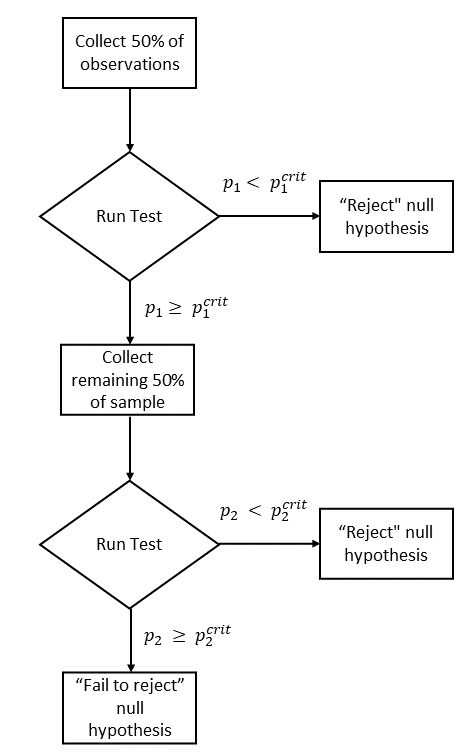
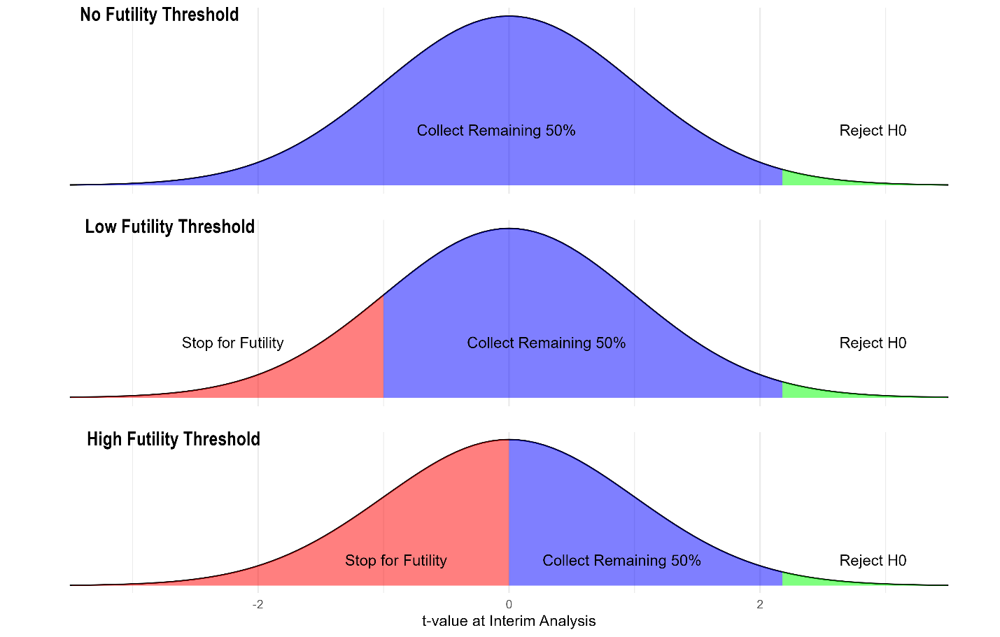
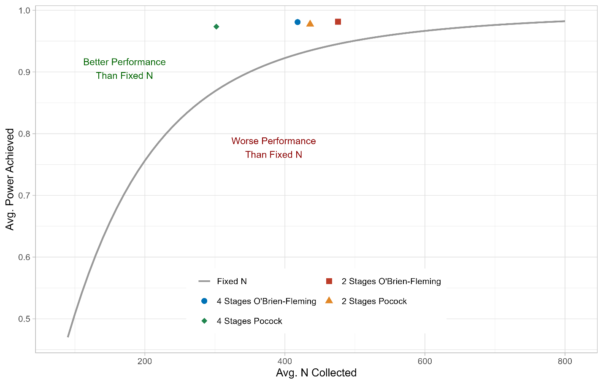
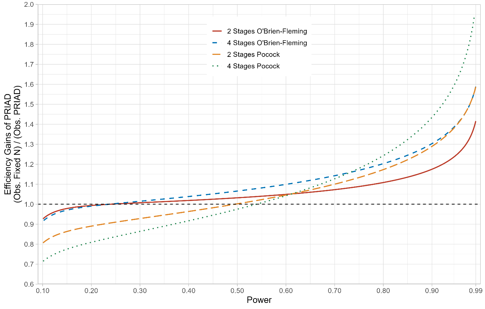
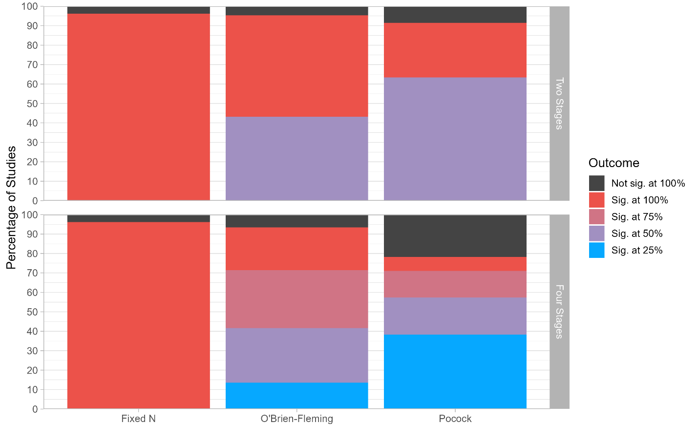
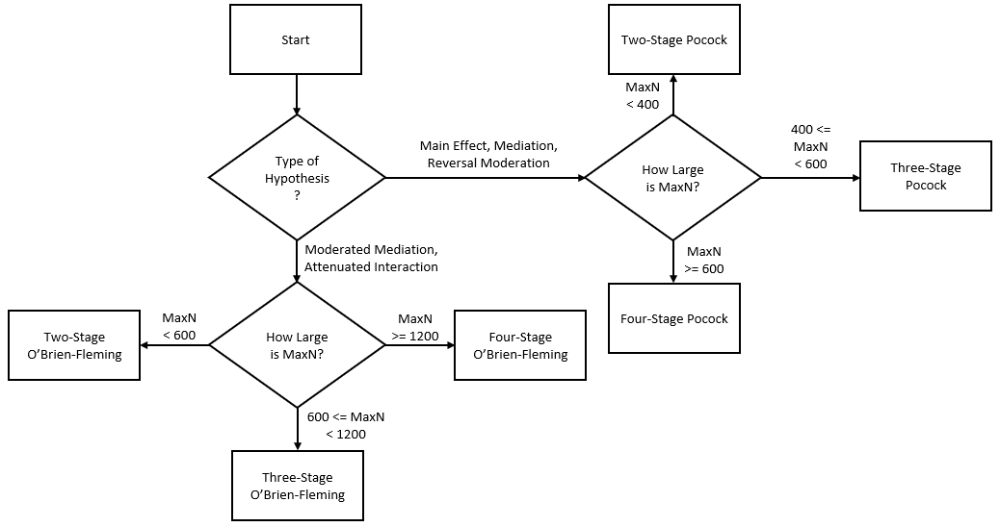

**Pre-Registered Interim Analysis Designs (PRIADs): Increasing the Cost-Effectiveness of Hypothesis Testing**

Quentin André

Nicholas Reinholtz

Forthcoming, *Journal of Consumer Research*

[*https://doi.org/10.1093/jcr/ucae028*](https://doi.org/10.1093/jcr/ucae028)

Quentin André (<quentin.andre@colorado.edu>) and Nicholas Reinholtz (<nicholas.reinholtz@colorado.edu>) are assistant professors of marketing at the Leeds School of Business, CU Boulder, CO 80309, United States of America. Address all correspondence to Quentin André. The authors wish to thank Daniël Lakens for creating excellent tutorials on group sequential designs; Gernot Wassmer and Friedrich Pahlke for designing rpact, an open-source R package implementing group sequential designs; PhD students at the University of Colorado Boulder for their feedback; the journal’s review team for their comments and suggestions; and Alix Barasch, Jackie Silverman, and Eva Buechel for their help in identifying pre-registered studies that were originally missed. Finally, the authors thank all the researchers who run pre-registered studies and make their data publicly available. The materials and code required to reproduce all analysis are available on the [OSF repository](https://osf.io/74596/) of the paper. Supplementary materials are included in the web appendix accompanying the online version of this article.

Editor: Andrew Stephen

Associate Editor: Keith Wilcox

# ABSTRACT

The difficulty of determining how many observations to collect is a source of inefficiency in consumer behavior research. Group sequential designs, which allow researchers to perform interim analyses while data collection is ongoing, could offer a remedy. However, they are scarcely used in consumer behavior research, probably owing to low awareness, perceived complexity, or concerns about the validity of this approach. This paper offers a tutorial on group sequential designs and introduces Pre-Registered Interim Analysis Designs (PRIADs): A practical five-step procedure to facilitate the adoption of these designs in marketing. We show that group sequential designs can be easily adopted by marketing researchers, and introduce a companion app to help researchers implement them. We demonstrate multiple benefits of PRIADs for researchers engaged in confirmatory hypothesis testing: They facilitate sample size decisions, allow researchers to achieve a desired level of statistical power with a smaller number of observations, and help conduct more efficient pilot studies. We validate this cost-saving potential through a comprehensive re-analysis of 212 studies published in the Journal of Consumer Research, which shows that using PRIADs would have reduced participant costs by 20% to 29%. We conclude with a discussion of limitations and possible alternatives to PRIADs.

*Keywords:* experiments, experimental methods, power analysis, group sequential designs, meta-science, statistics

# INTRODUCTION

The publication standards of top marketing journals have increased noticeably over the past decade. Following repeated calls for increased rigor and relevance (e.g., Inman et al. 2018; Madan et al. 2023; Schmitt et al. 2021), the average consumer behavior paper published in the Journal of Consumer Research now includes more studies than before (Janiszewski and van Osselaer 2021), and the data in these studies are becoming more costly to collect (owing to the need for more representative and larger samples, the use of incentive-compatible paradigms, the inclusion of field studies, etc.; Krefeld-Schwalb and Scheibehenne 2022). These rising standards have prompted researchers to identify more efficient ways of collecting and analyzing data. In an influential tutorial, Meyvis and van Osselaer offered researchers suggestions to increase the effect size (and therefore the statistical power) of their experiments (Meyvis and Van Osselaer 2018). They argue that using within-subjects comparisons, adding statistical controls, removing inattentive participants, eliminating “noise factors” in the treatment, or selecting a more homogenous population can help researchers achieve adequate power without collecting an inordinate number of participants.

This tutorial, however, did not address an important source of inefficiency in consumer research: The difficulty of determining the appropriate number of observations to collect for a study. This variable is a crucial input in any experimental design: All else equal, the more observations are collected, the more power researchers possess to detect an effect of a given size. However, larger samples impose a cost as they require more time and money to recruit participants, purchase experimental materials, pay research assistants, monitor data collection, handle data quality issues, and so on. For these reasons, sample size decisions reflect a difficult balancing act on the researcher’s part. If they collect “too many” observations (i.e., more than what they need to detect their effect of interest with a reasonable amount of power), researchers have effectively wasted time and money that could have been put to another productive use (e.g., a follow up study, or another research project). In contrast, if researchers collect “too few” observations (i.e., fewer than they need to achieve an acceptable level of statistical power), they have also wasted time and money running a study that yields an uninformative answer.

The oft-suggested solution to this problem is to conduct a power analysis: Researchers specify their expected effect size and compute the number of observations required to detect this effect with a given statistical test and a given level of statistical power. For instance, a researcher could calculate that they need to collect 128 observations (total) to have an 80% chance of detecting effect size of d = .5 with a two-sample t-test.

This type of power analysis, however, is only practical if researchers know the effect size that their experiment will yield. Unfortunately, researchers are typically unable to make this determination. First, intuitive estimates of effect size are prone to error: The effect size that an experiment will produce is influenced by such a wide array of parameters (Meyvis and Van Osselaer 2018) that even seasoned researchers struggle to predict the effect size of a given design (Giner-Sorolla et al. 2023). Second, estimating the effect size with a “pilot study” is impractical: The number of observations required to obtain an informative estimate of the effect size is orders of magnitude larger than the sample size required to detect a significant effect (Simonsohn 2014). Finally, meta-analytical estimates of effect sizes are distorted by publication bias and follow-up bias (Albers and Lakens 2018), and are often obtained from studies that are too dissimilar to be informative. Ultimately, the fact that consumer researchers frequently base their power analysis on the arbitrary (and inconsistent) “small,” “medium,” and “large” effect sizes offered by Cohen (1988) highlights the imprecise nature of the typical power analysis in a marketing paper (Correll et al. 2020; Sawyer and Ball 1981).

In this paper, we argue that a set of statistical techniques called group sequential designs can offer a potential solution to this problem. Group sequential designs give researchers the opportunity to collect and analyze their data in sequential batches, and to terminate data collection early if the data shows overwhelming (or underwhelming) evidence against the null hypothesis. This flexibility allows researchers to better manage the uncertainty regarding the effect size that their experiments will produce, and to collect a smaller number of observations (on average) to achieve a desired level of statistical power. Despite their usefulness and their widespread use in other disciplines (e.g., clinical trials), these designs have not been widely adopted by marketing researchers.

This paper is divided into six sections. We first describe the theory and statistical intuition that underlie group sequential designs, and explain why and how they allow researchers to conduct repeated hypothesis tests on their data without inflating false-positive rates. In the second section, we introduce Pre-Registered Interim Analysis Designs (PRIADs): A practical procedure to facilitate the adoption of group sequential designs in consumer research. We walk researchers through the five simple decisions required to create a PRIAD, offer pragmatic guidelines on how to make these decisions, and explain the conditions under which PRIADs offer a valid alternative to traditional fixed sample-size designs. We also introduce a web application that allows researchers to create PRIADs, to preview their expected impact, and to generate the text required to pre-register them. In the third section, we discuss benefits of PRIADs to marketing researchers: We explain their ability to manage effect size uncertainty, to increase the efficiency of hypothesis testing, and to conduct pilot studies without wasting data. In the fourth section, we validate their cost-saving potential through a re-analysis of 212 studies published in the Journal of Consumer Research: Our results suggest that using PRIADs could have saved the authors of these studies up to 29% of their participant costs. In the fifth section, we outline the circumstances in which PRIADs are not appropriate. We conclude with a general discussion in which we summarize the key aspects of our proposal, and highlight limitations and alternatives to PRIADs.

# THE THEORY OF SEQUENTIAL ANALYSIS

## The Statistical Intuition

In marketing and other behavioral disciplines, “Fixed N” designs are the norm for confirmatory hypothesis testing. In a Fixed N design, researchers must perform their hypothesis tests after having collected the entirety of their planned sample for the experiment: If they conduct additional hypothesis tests while data collection is ongoing, or if they collect additional data after finding a non-significant result, they will increase the false-positive rate of their experiment (Simmons, Nelson and Simonsohn 2011).

Other types of designs, however, do not have this constraint. In particular, a set of techniques called group sequential designs enables researchers to collect data in a set of sequential batches (called “stages”), to perform hypothesis tests at each stage, and to stop data collection as soon as a hypothesis test is able to reject the null — all without inflating the false-positive rate of their experiment (Lakens 2014)[^1]. These designs have become common in medical trials (as researchers are interested in stopping the trial as early as possible if there is sufficient evidence for the efficacy of a drug or procedure) but have not yet made their way to the marketing literature.

If group sequential designs allow researchers to perform multiple hypothesis tests (versus only one in a Fixed N design), how can they maintain false-positive rates at a nominal level (typically α = .05)? The answer is: (i) by requiring that the number and timing of the analyses are determined in advance, and (ii) by adjusting the significance thresholds against which the hypothesis tests are conducted. In a Fixed N design, researchers perform a single hypothesis test against $`p^{crit}`$ = .05. This rejection threshold guarantees that they will falsely reject the null 5% of the time when the null is true. To achieve the same false-positive rate, the hypothesis tests of a group sequential design must all be performed against more stringent rejection thresholds, such that the cumulative probability of falsely rejecting the null across all the hypothesis tests is exactly equal to 5%.

To illustrate, consider the group sequential design shown in Figure 1: A researcher will collect 50% of their desired sample and perform an interim test for significance. If this interim test is not significant, they will collect the remaining 50% of the observations and perform a final test on the full sample.

**FIGURE 1**

A GROUP SEQUENTIAL DESIGN WITH TWO STAGES



Let’s call the critical p-value at the interim analysis $`p_{1}^{crit}`$, the critical p-value at the final analysis $`p_{2}^{crit}`$, and the total false positive rate of the experiment ɑ<sub>total</sub>. To keep ɑ<sub>total</sub> at the desired 5% level, the following equality must be true:

$`P\left( p_{1} < p_{1}^{crit} \right) + \ P\left( \left( p_{1} \geq p_{1}^{crit} \right) \cap \left( p_{2} < p_{2}^{crit} \right) \right) = \ .05`$ (1)

If $`p_{1}^{crit}`$ and/or $`p_{2}^{crit}`$ are set at .05, it is clear that this equality will not hold. Instead, to maintain the overall false-positive rate at .05, the researcher needs to apply a correction such that $`p_{1}^{crit}`$ and $`p_{2}^{crit}`$ are *both* smaller than .05[^2].

Which correction exactly? Since the researcher is testing the same hypothesis twice (once at the first “peek”, and once at the end of the data collection), it might be tempting to apply a Bonferroni correction for multiple comparisons, which would set both $`p_{1}^{crit}`$ and $`p_{2}^{crit}`$ to .025 (i.e., .05 divided by two; Keppel and Wickens 2004). However, since the two statistical tests are not independent (the final test is based in part on the data collected for the interim analysis), these critical values would be too conservative: The overall false-positive rate after applying the Bonferroni correction will be less than .05. Instead, statisticians have developed specific corrections that account for the correlated nature of the tests, and that researchers can apply to maintain false-positive rates at the desired alpha level. In the example earlier, setting both set both $`p_{1}^{crit}`$ and $`p_{2}^{crit}`$ to .0294 (the Pocock correction; 1977) would lead to an overall false positive rate of 5%.

## Different Corrections for Different Goals: Maximizing Power vs. Stopping Data Collection Earlier

In Equality 1, $`p_{1}^{crit}`$ and $`p_{2}^{crit}`$ share a hydraulic relationship: The lower one critical value is, the higher the other can be. This relationship means that researchers can adjust the relative rejection thresholds at the interim versus final analysis, depending on their goal for the study. To put it differently, researchers have a fixed “testing budget” (defined by their desired false-positive rate alpha), and they must decide how they will “spend” it on the different tests they will perform.

If researchers set a relatively high value for $`p_{1}^{crit}`$, they are giving themselves a better chance of rejecting the null at the interim stage, and therefore maximizing the cost-saving potential of the sequential analysis. However, the fact that they are “spending” a significant part of their alpha at the interim stage forces them to set a more conservative critical value at the final stage, which gives them less power to detect an effect. At the extreme, setting $`p_{1}^{crit}`$ = .05 and $`p_{2}^{crit}`$ = 0 is equivalent to only collecting half the planned sample[^3]: It always saves researchers money by collecting fewer observations, but gives them much less power.

The reverse is also true: If researchers set a more conservative value for $`p_{1}^{crit}`$, they are less likely to reject the null at the interim analysis, and therefore less likely to save resources. However, this allows them to choose a higher value for $`p_{2}^{crit}`$, and therefore to achieve a higher level of power at the final stage of their analysis. At the extreme, setting $`p_{1}^{crit}`$ = 0 and $`p_{2}^{crit}`$ = .05 is equivalent to always collecting the full sample: Researchers never save money by rejecting the null early, but they maintain the full amount of power to detect their effect.

A number of different statistical corrections have been proposed by statisticians, each designed to achieve a balance between these two goals (e.g., Haybittle 1971; O’Brien and Fleming 1979; Peto et al. 1977; 1977; Wang and Tsiatis 1987; Whitehead 1997). We discuss two of these corrections, and when to use them, when we discuss our proposal to facilitate the adoption of group sequential designs.

## Peeking More than Once

In the prior examples, we described a group sequential design with only one peek performed halfway through the data collection process. However, researchers are not limited in how early or often they peek at their data. Someone could for instance design an experiment in which they peek a first time after collecting 25% of their data, a second time after collecting 75% of their data, and perform the final analysis after collecting 100% of the sample. As in the simpler examples described above, it is essential that researchers apply the appropriate critical values to the K different analysis, such that the following equation is true under the null:

``` math
P\left( p_{1} < p_{1}^{crit} \right) + \sum_{k = 1}^{K - 1}{P\left( \left( p_{k} \geq p_{k}^{crit} \right) \cap \left( p_{k + 1} < p_{k + 1}^{crit} \right) \right)}\  = .05\ \ \ \ \ \ \ \ \ (2)
```

While designs with multiple and unevenly spaced peeks are more complex, the intuitions behind them remain relatively straightforward and can be summarized in a few basic principles.

First, the more peeks performed, the more likely researchers are to realize cost-savings (as they have more opportunities to stop early), but the less powerful the design is in aggregate (as a larger part of the “testing budget” is spent on smaller samples).

Second, for unevenly spaced peeks, earlier peeks (e.g., at 25% of data collection and then not again until 100%) sacrifice more overall power than later peeks (e.g., not until 75% of data collection and again at 100%) but lead to larger cost savings opportunities. The intuition for this pattern has to do with the non-independence of the tests. An earlier test offers greater opportunity for cost savings (earlier termination) but will be less correlated with the final test than a later test and therefore requires a more conservative correction to maintain the same overall false-positive rate.

## Stopping For Futility

We have so far covered one benefit of interim statistical tests: the opportunity to end data collection early if the test reveals sufficient evidence against the null. Group sequential designs, however, also allow researchers to bring an early end to studies that show underwhelming evidence for the researcher’s hypothesis, and that therefore have little chance of ultimately reaching statistical significance.

When researchers run studies, they always face the possibility that their studies will “fail”. It is first possible that the null hypothesis is correct, and that the study will produce, in expectation, no effect. It is also possible that the effect is smaller than anticipated, so small in fact that their design has very little chance of detecting it. In both cases, the researcher may want to stop data collection early. Terminating a study that is unlikely to deliver statistically significant results if continued is called “stopping for futility”. The logic of this analysis is to choose a “futility threshold” below which the researcher will stop data collection at the interim stage.

Futility thresholds (unlike rejection thresholds) are most often expressed as test statistics (e.g., z-scores, or t-values). This is because p-values can be ambiguous with regard to the direction of an effect: In a two-sided t-test for instance, the same p-value can reflect a mean difference in the predicted direction or in the opposite direction of the hypothesis. T-statistics, on the other hand, are never ambiguous: a positive (negative) t-value always indicates a difference in the predicted (opposite) direction. For instance, if a researcher sets t = 0 as a futility threshold, it means that they will terminate data collection early (and not collect the maximum N) if an interim t-test reveals an effect in the opposite direction as the hypothesis.

Figure 2 illustrates the impact of different futility thresholds on the decisions a researcher will make at the interim analysis. Without futility thresholds (top panel), researchers will go on to collect the rest of their sample whenever the interim analysis doesn’t reveal a significant result. With a low futility threshold (middle panel), only the studies with the most unfavorable results will be interrupted at the interim analysis. It all but guarantees that no study which would have ultimately “succeeded” will be terminated early (and therefore will not have a negative impact on statistical power), but it will save the researcher less money (as some of the studies that would ultimately “fail” at the final stage are nonetheless continued). On the contrary, a high futility threshold (bottom panel) means interrupting any study that shows mildly disappointing results at the interim analysis. This will lead to significant cost-savings (as only the most promising studies will be continued), but also to a significant loss of statistical power (as many of these terminated studies, while underwhelming at the interim analysis, would have nonetheless yielded significant results if continued). Finally, the graphs show that futility thresholds cannot increase the false-positive rate of the experiment: The rejection region is identical, regardless of the choice of the futility threshold.

**FIGURE 2**

IMPACT OF FUTILITY THRESHOLDS ON THE DECISION MADE AT THE INTERIM ANALYSIS



# PRE-REGISTERED INTERIM ANALYSIS DESIGNS

The adoption of a tool depends heavily on its ease of use, perceived appropriateness, and perceived usefulness. This is our motivation for introducing Pre-Registered Interim Analysis Designs (PRIADs): A procedure designed to facilitate the adoption of group sequential designs in consumer research. This proposal relies on three pillars.

First, PRIADs make group sequential designs easy and accessible to researchers. Our proposal shows that group sequential design can be adopted with minimal changes to the researchers’ usual workflow; and allows marketing researchers to design group sequential designs tailored to their preferences and constraints by answering five simple questions. For each question, we offer guidelines and rule of thumbs, such that researchers can choose the PRIAD that best fits their goals and constraints. For researchers looking for default choices, we also offer a few “off-the-shelf” PRIADs in Appendix A.

Second, PRIADs aim at legitimizing group sequential designs in a marketing context. Readers, reviewers, and editors of marketing journals might fear that the flexibility of group sequential designs would translate into researchers’ degrees of freedom, and object to their use. We argue that linking group sequential designs to pre-registrations will allow researchers to leverage their benefits without increasing false-positive rates.

Third and finally, we provide user-friendly tools to design and report PRIADs. We introduce an interactive web app (PRIApp) that allows researchers to design PRIADs, simulate their expected outcomes under various assumptions, and effortlessly generate pre-registrations. We also include rejection thresholds for common PRIADs as well as sample texts to facilitate pre-registration and reporting in Appendices B, C and D of the paper.

## A Tutorial on PRIADs: Five Decisions, with Sensible Defaults and Rules of Thumb

We contend that a key factor that has hindered the adoption of group sequential designs is their apparent complexity. Researchers must make many decisions, but often lack intuition regarding the impact of these decisions, and do not have “default” options they can lean on. In this section, we break down the design of a group sequential analysis in five easy steps, offer an intuitive understanding for the impact of each of these decisions, and provide sensible guidelines that researchers can use (see table 1 for a summary). For researchers who do not wish to engage in these considerations, we offer a few “off-the-shelf” PRIADs in the Appendix A.

Before offering these guidelines, we want to stress that all possible decisions are equally valid from a statistical standpoint: As long as these choices are made prior to starting data collection, any PRIAD will maintain the false-positive rate of the experiment at the same expected level as a Fixed N design. As such, researchers should not be overly concerned about choosing the “correct” PRIAD; only about making informed choices that best reflect their knowledge about the hypothesis and their relative preferences regarding cost-saving potential and statistical power. For the same reason, reviewers of the research need not be overly concerned about the rationale behind different design choices in a PRIAD, so long as the choices reported in the paper match those of the pre-registration.

*Decision 0: What Hypothesis Test?* Since PRIADs work by adjusting the rejection threshold of statistical tests, they can be applied to any null-hypothesis statistical procedure that outputs a p-value: Regression analysis, t-tests, ANOVAs, main effects, moderation tests, or choice models are all valid uses for PRIADs.

For mediation tests (which do not generate a p-value, but instead determine statistical significance by generating a bootstrapped confidence interval), researchers need to adjust the width of the confidence interval. In PROCESS (Hayes 2017), this is accomplished by changing the *CONFINT* option from its default value of 95 (e.g., setting *CONFINT = 97.06* will be equivalent to having a rejection threshold of *p* = .0294; i.e., (1 - .0294) \* 100 = 97.06).

*Decision 1: How Many Observations?* In a traditional Fixed N experiment, the researcher commits to collecting a fixed number of observations. When designing a PRIAD, the researcher makes a different determination: They choose the maximum number of observations (“MaxN”) that their experiment will collect should it proceed to the final stage.

MaxN can be determined in multiple ways. In the absence of any information about the expected magnitude of the effect, it can be informed by cost (e.g., “I cannot afford to spend more than \$800 on this study) or logistical (e.g., “There are only 200 MBA students enrolled in the program”) constraints (Lakens 2022). MaxN can also be determined using the Smallest Effect Size of Interest (SESOI; Anvari and Lakens 2021) approach: The researcher determines the smallest effect they are interested in studying, and set MaxN such that they have X% chance of detecting it (typically 80% or 50%). For instance, a researcher might say that they are only interested in effects larger than d = .1. If they want to detect an effect this small at least 50% of the time, they will need to set Max N to 700 observations. A third possibility, finally, is to set MaxN using the lower bound of an estimated effect. If a researcher observed d = .5 with a 95% CI = \[.3; .7\] in a first study, they might set MaxN to 700 in a follow-up study, which will give them 80% chance of detecting an effect as small as d = .3.

*Decision 2: How Many Stages?* After deciding on the maximum number of observations that they are willing to collect, researchers must decide on how many times to peek at the data. More frequent peeks give researchers more control over the course of the data collection (i.e., more opportunities to detect a significant effect, or to terminate for futility), at the expense of statistical power and added logistical difficulties (need to interrupt and restart data collection a larger number of times). For simplicity, we limit our consideration to designs with three or fewer peaks (i.e., four or fewer stages).

Two factors influence how many peeks the researcher should perform. First, the uncertainty regarding the size of the effect. The more uncertainty researchers have about the potential magnitude of an effect, the more peeks they should perform. Indeed, if the predicted effect might range from very large to very small, researchers would probably want to peek often at the data, to maximize the odds that they do not collect more observations than needed. Second, the value chosen for MaxN. If researchers have decided on a large value for MaxN, it means that early peeks at the data (e.g., at 25% of the data) will still have a decently large sample size, and therefore some chance of detecting an effect. On the other hand, if researchers are more financially constrained and set a small value for MaxN, early peeks will have so little power to detect most effects that they are probably not worth doing.

*Decision 3: When to Peek?* Conditional on a number of peeks, researchers must decide how to spread them over the course of the data collection. As a default, we recommend spreading them uniformly: This approach evenly distributes the amount of information gained about the effect across peeks. There is one circumstance in which researchers might want to deviate from this default: When running pilot studies. We refer the reader to the “Benefits of PRIADs” section below for an illustration.

*Decision 4: Which Correction?* As discussed earlier, different corrections can be designed to achieve different goals: Optimizing for cost-savings, versus optimizing for statistical power. For parsimony, PRIADs only consider two types of corrections.

The Pocock correction (Pocock 1977), first, gives researchers a high chance of detecting an early effect, at the cost of a greater loss of statistical power at the final stage. It achieves this goal by using a relatively high rejection threshold for interim analyses, at the cost of a lower rejection threshold at the final stage (e.g., $`p_{1}^{crit} = p_{2}^{crit} = \ .0294`$ for a two-stage design with equally-spaced peeks). Given the resulting drop in power at the final stage, we recommend using the Pocock correction whenever running studies with a large MaxN, or when studying effects that are relatively easier to detect (e.g., main effects or reversal interactions, as opposed to attenuated interactions).

The O’Brien-Fleming correction (O’Brien and Fleming 1979), in contrast, gives researchers a smaller chance of detecting an early effect but maintains a higher level of statistical power at the final stage. It achieves this goal by setting very strict rejection thresholds for early stages, and progressively more liberal rejection thresholds for later stages (e.g., $`p_{1}^{crit} = .0052,\ p_{2}^{crit} = \ .048`$ for a two-stage design with equally-spaced peeks). We recommend using this correction whenever running a study designed to capture a subtle effect (e.g., an attenuated interaction), or when running a study that will be difficult to repeat (e.g., a field study) and for which it is therefore important to conserve as much statistical power as possible for the final analysis. Appendix B of the paper reports the exact O’Brien-Fleming and Pocock corrections for equally-spaced peeks, for up to four stages.

*Decision 5: Futility or Not?* The final decision researchers will have to make is whether to perform a futility analysis, and if so at which peeks and with which thresholds. As mentioned earlier, futility analyses allow researchers additional savings opportunities (by bringing an early end to studies that are unlikely to deliver in a significant effect), at the cost of an increase in false negatives (since some interrupted studies will have nonetheless turned out to be significant). The higher the futility threshold, the more power researchers are sacrificing, but the greater the cost-savings potential. The timing of futility analysis also matters. Futility analysis performed at early (vs. late) peeks will save the researchers more money (they will bring a very early end to unpromising studies) but will be more costly in terms of statistical power (since the decision is based on a small amount of data, the odds that the study will ultimately turn out to be significant are greater)

Unlike the other aspects of PRIADs, futility analysis decisions do not have be determined in advance and pre-registered. Since they cannot lead to an increase in false-positive rates, researchers can decide, at each peek, if they want to continue data collection or not.

**TABLE 1**

SUMMARY OF THE DECISIONS INVOLVED IN A PRIAD

|  | **What is this?** | **How to make this decision?** |
|----|----|----|
| Decision 1: MaxN? | The number of observations that the design will collect, in the "worst case" scenario | MaxN can reflect (i) the number of observations required to detect a smallest effect size of interest, (ii) the cost constraints of the researcher, or (iii) an informed prior on the smallest effect size that the experiment might return. |
| Decision 2: How many stages? | The number of interim analyses that will be conducted, plus one (for the final analysis) | We recommend two, three or four stages. More stages afford greater opportunities for cost-savings but lower the power of the overall design. |
| Decision 3: When to peek? | The timing of these tests. | We recommend spreading the tests uniformly, except when conducting a pilot study. In this case, we recommend a single early peek (e.g., after collecting 25% of the data). |
| Decision 4: Which correction? | The significance thresholds against which the tests will be performed. | We recommend using the Pocock correction whenever researchers expect a decent level of power (e.g., for studies with large MaxN, and when studying main effects or reversal interactions). Otherwise, the O'Brien-Fleming correction is more appropriate. |
| Decision 5: Futility analysis? | Whether studies with underwhelming results will be abandoned. | Designs without futility analysis provide more informative results when the null is true, but will be more costly to the researcher. Setting a futility threshold allows researchers to abandon unpromising studies, at the cost of lower statistical power and less informative null results. |

NOTE. — All choices are equally valid from the perspective of maintaining the false-positive at a nominal level: They only affect the trade-off between statistical power and cost-saving potential.

## Legitimizing Interim Analysis

Readers and reviewers might fear that the flexibility of group sequential designs will facilitate false positives. Indeed, for group sequential designs to effectively control Type I errors at a desired level, all the aspects of the design must be decided *ex ante:* The researcher must specify, before *any* data is collected, the maximum number of subjects, the number of peeks, the timing of these peeks, the type of correction that their group sequential design will use, and the exact procedure that they will use to analyze their data. Any form of “post hoc analysis decision” (i.e., decision made after seeing the data; Meyvis and Van Osselaer 2018) has the potential to increase Type I errors and lead to an uncontrolled false-positive rate (Simmons et al. 2011).

For this reason, our proposal emphasizes the importance of a well-crafted pre-registration (Simmons, Nelson and Simonsohn 2021) specifying (i) the number of experimental conditions, (ii) any data exclusion that will performed on the data prior to analysis, (iii) the exact statistical test that will be performed (including description of the independent variable, dependent variable, and control variables), (iv) the maximum number of observations collected, (v) the number and timing of peeks and (vi) the type of correction (and resulting critical values) that will be applied to the peeks. This pre-registration process will help researchers identify all decisions that must be made before collecting data, specify these decisions explicitly, and generate a document that can be shared with readers to help assuage any concerns about researchers’ degrees of freedom. To ensure that this extra step requires minimal effort on the researchers’ part, Appendix C of the paper contains a pre-registration text researchers can use as a template (highlighting all decisions that must be made). In addition, the companion app of the paper (see section below) can automatically generate this pre-registration text after creating a PRIAD.

## Using the PRIApp to Effortlessly Design and Generate Pre-Registered Interim Analysis Designs

A final factor that might explain the dearth of group sequential designs in marketing is the lack of accessible tools to design and pre-register them. While comprehensive statistical libraries are available in R (rpact; Wassmer and Pahlke 2023) and in SAS (the SEQDESIGN procedure), only a subset of marketing researchers use R and SAS, and an even smaller subset would have the time to explore and master these complex libraries. To bridge this gap, we designed and programmed an interactive web application called PRIApp. This app allows researchers to design PRIADs, simulate their impact under various assumptions, and generate the corresponding pre-registration text. PRIApp is accessible at the following URL: [<u>https://priadconsumerresearch.shinyapps.io/PRIApp/</u>](https://priadconsumerresearch.shinyapps.io/PRIApp/), and the documentation of the app is available on the OSF repository of the paper (<https://osf.io/74596/>).

## Reporting the Results of a PRIAD

After pre-registering their chosen PRIAD and collecting the data, researchers must finally report the results of their experiment. For the most part, the results of a PRIAD will be reported in the same way as the results of a Fixed N design, with three differences.

First, we recommend that researchers remind readers of the exact type of PRIAD they are using (e.g., “an O’Brien-Fleming PRIAD with four equally-spaced stages”) and of the corresponding critical values (e.g., “at each of these stages, we will reject the null only if p is respectively smaller than \[.0001; .0042: .0191: .0420\]”). While this information is accessible in the pre-registration, we believe this reminder will facilitate the interpretation of the results and minimize the likelihood of errors.

Second, we recommend that researchers specify whether the reported result was obtained from any of the interim peek(s) (e.g., “Our interim analysis performed after collecting X% of the data (N = XXX) revealed a significant effect”) or from the final analysis (e.g., “Our analysis performed on the full sample (N=XXX) revealed a significant effect”). This clear reporting will ensure that reviewers can assess the authors’ adherence to their pre-registration, and that other researchers can reproduce the authors’ analysis.

Third and finally, p-values obtained from sequential analyses have a slightly different interpretation: They might no longer represent the exact probability of obtaining a result at least as extreme as the one observed in the data when the null is true[^4]. For the same reason, confidence intervals (which are mathematically connected to the p-value) might not have the expected coverage. While this distortion will not affect the severity of the hypothesis test (i.e., the false-positive rate of the overall design is controlled at the desired nominal level), it can affect the conclusions of meta-analytical tools that rely on p-values as inputs (i.e., p-curve or z-curve)[^5]. For this reason, we recommend that authors respectively flag p-values as sequential p-values (e.g. “$`p_{\text{sequential}} = \ \ .XXX`$” or “sequential $`p = \ .XXX"`$) and confidence intervals as sequential confidence intervals (e.g., “Sequential 95% CI = \[LBCI, UBCI\]”); and that readers do not use sequential p-values when performing p-curve or z-curve analysis.

For researchers looking for practical examples, we provide in Appendix D a few sample write-ups describing the results of PRIADs.

## Evaluating the Results of a PRIAD

Researchers often have to evaluate experimental evidence (e.g., as a reviewer for a journal). Beyond the standard checks that reviewers typically perform on studies (e.g., assessing the internal validity of the design), a few other verifications are important when evaluating the results of a PRIAD.

First, reviewers should ensure that the design and analysis reported in the paper match the pre-registration. Second, reviewers should double-check that the researcher is testing against the correct significance thresholds: For instance, a researcher using a two-stage Pocock design must only claim a significant result if the p-value (at the interim or final stage) is lower than .0294. Finally, reviewers should ensure that p-values from PRIADs are appropriately reported as “sequential p-values.”

On the other hand, the choices a researcher makes when designing a PRIAD (e.g., the number of peeks, or the type of correction) do not require excessive scrutiny: All PRIADs will maintain false-positive rates at a nominal level, as long as they are pre-registered and followed through by researchers.

# THE BENEFITS OF PRIADs

A final reason for the limited uptake of group sequential designs might be that consumer researchers lack practical examples of the circumstances in which they can be used, or a good sense of their usefulness. In this section, we showcase multiple benefits of PRIADs, and explain how they can help researchers preserve valuable resources when running experiments. Note that while we focus for simplicity on two-cell “main effect” designs, we remind the reader that PRIADs can be applied to any confirmatory hypothesis test that generates a p-value (i.e., moderation, regression, choice models, etc.).

## PRIADs Allow Researchers to Manage Effect Size Uncertainty

As mentioned in the introduction, researchers rarely possess precise information about the effect size that their experiment will produce: At best, they have some confidence interval of how large or small the effect might be. This uncertainty is a key issue in Fixed N experiments, which require researchers to commit to a specific sample size.

Consider the following example: a researcher has run a study supporting their key hypothesis (N = 385, p \< .001, d = .4), and is now planning to replicate the effect with different stimuli. While they have no reason to believe that the effect will be systematically larger or smaller than in the first version of the study, they still face considerable uncertainty regarding the true magnitude of the effect: The 95% confidence interval for the effect size from the first study ranges from d = .2 to d = .6. In a Fixed N framework, the researcher must choose in advance whether to collect 90 observations (which would give them 80% power to detect d = .6 but only 15% power to detect d = .2), 790 observations (which would give them 80% power to detect d = .2, and over 99% power to detect d = .6), or anything in between. This inflexible design is a problem for the researcher: If they select a small sample size, they will often fail to detect smaller-than-expected effects. If they select a large sample size, they will collect many more observations than are required to detect larger-than-expected effects.

A PRIAD, on the other hand, will give the researcher welcome flexibility in this context: The researcher can simply set the MaxN corresponding to 80% power to detect the lower bound of their confidence interval (i.e., 790 observations), knowing that they will not collect the full sample if the effect turns out to be on the larger side of their expectations. This strategy will lead them to achieve a high level of statistical power overall, while collecting fewer participants (in expectation) than a Fixed N design.

To illustrate this benefit, let us assume a researcher studying a main effect, whose unknown effect size is drawn from a normal distribution N(.4, 0.102) (such that the 95% CI corresponds to the \[.2, .6\] observed by the researcher). Figure 3 displays the average number of observations required (x-axis) to achieve a given level of statistical power (y-axis) given this distribution of effect sizes. The gray line corresponds to the power achieved by Fixed N designs for a given sample size. We see that small sample sizes have very little power overall (N = 90 only has a 47% chance of detecting an effect), and that power is logarithmically increasing with the sample size (N = 400 has 92% chance of detecting an effect, N = 790 has 98% chance of detecting an effect)[^6].

**FIGURE 3**

COMPARISON OF THE EFFICIENCY ACHIEVED BY PRIADs AND BY FIXED N DESIGNS



NOTE. — This graph shows the efficiency (power achieved for an expected N collected) of PRIADs and Fixed N designs when studying an effect $`d \sim \mathcal{N}(.4,\ 0.102)`$.

We can use this gray line as a benchmark to compare the efficiency of various types of PRIADs to Fixed N designs: Any (N, Power) combination that falls below this line achieves a smaller amount of power for a given N, and any combination above this line achieves a greater amount of power for a given N.

The green diamond shows a PRIAD with MaxN = 790, four equally spaced stages (at 25%, 50%, 75%, and 100% of the data), and a Pocock correction. On average, a researcher using this design will collect 302 observations, and achieve 97% power. In contrast, a Fixed N strategy committed to collecting 302 observations will only achieve a little under 87% power.

The parameters chosen for this PRIAD (four peeks and a Pocock correction) are consistent with our guidelines given that the researcher is (i) studying a main effect with (ii) a large amount of uncertainty regarding the true effect size and 3) has chosen a large value for MaxN. However, the graph shows that even “less optimal” PRIADs will realize significant gains in power for the same expected sample size. Consider the orange triangle, blue circle, and red square on the graph, respectively corresponding to PRIADs with (i) an O’Brien-Fleming correction with four stages, (ii) a Pocock correction with two stages, and (ii) an O’Brien-Fleming correction with two stages. All three PRIADs, keeping the expected number of observations constant, achieve a higher level of statistical power than a Fixed N design.

## PRIADs Increase the Efficiency of Data Collection

The previous result showed that PRIADs can be more efficient than Fixed N designs when there is uncertainty about effect size: In expectation, they will collect a smaller number of observations to achieve a given level of statistical power. Perhaps surprisingly, PRIADs can also be more efficient for *known* effect sizes: Even in the absence of any uncertainty about the magnitude of the effect an experiment will yield, using a PRIAD can reduce the average number of observations needed to achieve a given level of power (vs. Fixed N designs).

The intuition for this result is that PRIADs allow researchers to “spend” some of their statistical power (by using a stricter rejection threshold at the final stage) to “buy” a chance at collecting fewer observations (by conducting interim hypothesis tests). Is this trade-off worth it? The answer depends on the overall level of statistical power of the PRIAD, which will influence both the “cost” and the “benefits” of this “transaction.”

If a PRIAD has high statistical power overall, the “cost” of using a stricter rejection threshold on power will be minimal. For instance, a test that has 90% power to detect an effect with $`p^{crit}`$ = .05 will still have 85% power to detect an effect with $`p^{crit}`$ = .0294, a mere 5.5% drop in power. In addition, the “benefits” will be high: If a PRIAD has high power overall, it will have a decent chance of rejecting the null at the interim analysis, and therefore a decent chance of collecting fewer observations. Altogether, the researcher would pay a minimal cost in power to achieve a decent expected decrease in participant costs.

If, on the other hand, a PRIAD has low statistical power overall, the “cost” of a stricter rejection threshold at the final stage will be high. For instance, a test that has 20% power to detect an effect with $`p^{crit}`$ = .05 will only have 14% power with $`p^{crit}`$ = .0294, a 30% decrease in power. And if the PRIAD has little power overall, it means that the interim analyses will only have a slim chance of detecting the effect. All in all, the researcher would pay a relatively large cost in power to achieve a minimal expected decrease in participant costs.

Figure 4 formalizes this intuition and shows, for different levels of power (x-axis), how many more observations a Fixed N requires to achieve the same level of power as a PRIAD (y-axis). Values smaller than 1 means that a Fixed N design requires fewer observations to achieve a given level of power (i.e., Fixed N is more efficient), and values greater than 1 means that a Fixed N design requires more observations (i.e., PRIAD is more efficient).

**FIGURE 4**

RELATIVE EFFICIENCY OF DIFFERENT KINDS OF PRIADs



NOTE. — Efficiency (on the y-axis) is defined as the ratio of observations collected by a Fixed N design (vs. a PRIAD) to achieve a given level of statistical power (on the x-axis).

This graph shows that PRIADs using the conservative O’Brien-Fleming correction are, even at very low levels of power, more efficient than Fixed N designs: As long as the researcher has more than ~25% power to detect an effect, these PRIADs will collect fewer observations than a Fixed N to achieve of desired level of power. The efficiency of these PRIADs then slowly ramps up with the level of power achieved by the researcher: At 80% power, a 2-stage (4-stage) O’Brien-Fleming PRIAD will save the researcher 12% (20%) of their participant costs. PRIAD using the liberal Pocock correction require more power to break-even with Fixed N designs (between 50 and 55%, depending on the number of stages), but then go on to achieve more substantial savings: At 80% power, a 2-stage (4-stage) Pocock PRIAD would save the researcher 17% (24%) in participant costs.

Are these power levels typically achieved by consumer researchers? If so, how much money would they have saved by using PRIADs? To answer these questions, we conducted a re-analysis of consumer research experiments. We successfully reproduced the key result of 212 studies published in the Journal of Consumer Research, and simulated the savings the researchers would have obtained by using a PRIAD instead of a Fixed N design. Our analysis, described in full in the “Validating the Cost-Saving Potential of PRIADs” section, suggests a meaningful saving potential: Researchers would have saved between 20% and 29% of their participant costs.

## PRIADs Allow Researchers to Conduct More Efficient Pilot Studies

The ability to collect fewer observations while achieving comparable levels of power is an obvious source of cost-savings for researchers, and PRIADs can also deliver savings in other ways. Marketing researchers often run pilot studies to calibrate their stimuli or assess the plausibility of a hypothesis. A typical strategy is to run a small sample study (the “pilot”), analyze the data, and run a full-sample version of this study if the results of the pilot are promising enough. However, this approach is wasteful: The data of a “successful” pilot study is discarded, and only the data from the full-sample study is used in testing the hypothesis. A well-crafted PRIAD, however, can avoid wasting the data of pilots that are followed-up by a full-scale study.

Let’s consider the sample size first: Researchers should choose the MaxN that corresponds to the number of participants that they are planning to run for the full study. Then, the number and timing of the peeks: The researcher will want to perform one early peek at the data, corresponding to the planned sample size of the pilot study (e.g., after collecting 25% of the observations). The first 25% of the sample will effectively serve as the pilot study, and the last 75% (if collected) would be added to serve as the main study.

Finally, the futility analysis and type of correction. The goal of this early peek is to diagnose potential issues with the design, and to discriminate between unpromising and promising studies: This suggests that researchers would benefit from performing a futility analysis. Since the researchers’ goal is not to have a high chance of rejecting the null at this early peek, they should choose the O’Brien-Fleming correction as to maintain as much power as possible at the final stage.

To illustrate the cost-savings potential of this strategy, consider the following scenario. For simplicity, we will assume a cost per participant of \$1. A researcher is running pilot studies with N = 100. Anytime a pilot study reveals a signal in the right direction (i.e., a t-statistics greater than 0), they run the full study with N = 400. This Fixed N design gives the researcher 80% power to detect d = .198, and costs them \$100 per “failed” pilot, \$500 per “successful” pilot. Now, imagine that the researcher is using a PRIAD instead. To obtain an equivalent design, the researcher will need to set MaxN = 400, and one peek at 25% of the data with a futility threshold of t = 0 (i.e., means of the two groups are equal). Since the researcher is less concerned about detecting an effect at the interim analysis, they choose the O’Brien and Fleming correction.

The futility threshold guarantees that the researcher will abandon a “failed” pilot study as often as they would do with a Fixed N design, for the same total cost of \$100. If the pilot “succeeds” on the other hand, the researcher would only need to collect 300 additional observations, for a total cost of \$400 (vs. \$500 in the Fixed N design). And since the researcher chose a conservative correction, the statistical power of the final analysis is basically unchanged: They would for instance have more than 79.99% power (vs. 80% power in the Fixed N design) to detect d = .198.

# VALIDATING THE COST-SAVING POTENTIAL OF PRIADS

Next, we provide an empirical validation of the cost-saving potential of PRIADs using data from consumer behavior experiments. To do so, we reproduce the results of Fixed N studies published in the Journal of Consumer Research and simulate the counterfactual results the researchers would have obtained if they had run a PRIAD instead.

## Method

Our re-analysis started by identifying a suitable set of studies to reproduce. To this end, we attempted to identify all pre-registered studies published in the Journal of Consumer Research with publicly available data. We used the software Publish or Perish (Harzing 2007) to conduct Google Scholar searches on April 3<sup>rd</sup> 2024. Our queries searched all the articles published in the Journal of Consumer Research which contain (i) at least one of the keywords “osf”, “Open Science Framework” or “researchbox” (to identify posted datasets), and (ii) at least one of the keywords “pre-registration”, “preregistration”, “pre-registered”, “preregistered”, or “aspredicted” (to identify pre-registrations).

*Sample of Studies.* This search returned 107 papers published between 2017 and 2024 (the full list, and detailed information about the papers, is available on the [OSF repository of the paper](https://osf.io/74596/)). Out of this set, 51 papers contained at least one pre-registered confirmatory experiment for which both the data and pre-registration were accessible. These papers contain an average of 4.39 such studies (min = 1, max = 10), for a total of 224 studies.

*Reproducing the Results.* For each of the 224 studies in our sample, we identified the key hypothesis test (defined as the first hypothesis test mentioned in the pre-registration). This key hypothesis was a main effect in 167 of the studies, a two-way attenuation interaction in 46 of them, a two-way reversal interaction in 7 of them, a three-way interaction in three of them, and a null result in one of them (which was therefore excluded from consideration)[^7].

We then wrote R code attempting to reproduce the statistical results associated with these key hypotheses. There were occasional discrepancies between the pre-registered statistical procedure and the statistical procedure reported in the paper: In these cases, we focused on reproducing the result described in the paper.

We managed to successfully reproduce the statistical results for 212 of the 223 studies, barring a few minor discrepancies (e.g., managing to reproduce the t-stats and the p-value but not the regression coefficient, or managing to reproduce the overall significance level but not the exact p-value). We were unable to reproduce the results of the remaining 11 studies (either because the code, data, and/or pre-registration did not contain enough information to reproduce the results; because the pre-registered outcome was not reported in the paper; or because of major numerical discrepancies between the reported and re-calculated results).

*Simulating the Impact of PRIADs.* Finally, we assessed the counterfactual impact of running PRIADs. For parsimony, we consider the four possible “off-the-shelf” PRIADs described in Appendix A. For each of the 212 studies that we successfully reproduced, we divided the raw data into the appropriate number of equal-sized batches (i.e., two batches respectively containing 50% and 100% of the observations for the two-stage PRIADs; and four batches respectively containing 25%, 50%, 75% and 100% of the observations for the four-stage PRIADs). When the data of a study includes a timestamp (specifying the time at which each observation was collected), we define the batches by the order in which participants completed the study. For the other studies, we generated the batches by randomly shuffling the order of the participants[^8]. We then applied the R code we wrote to these batches to obtain the counterfactual impact of using PRIADs.

## Results

We report two types of results. First, we assess the outcomes of running the PRIADs: Would the researcher have found a statistically significant result early (and if so, at which stage)? If not, would the researcher still have found a significant result at the final analysis? Next, we quantify the cost-savings afforded by PRIADs: How many observations would have been collected by the researchers if they had used these designs?

*Outcomes.* Using Fixed N designs, researchers always collected 100% of the participants, and found significant results in 96% of the studies. Figure 5 below compares the outcomes of this Fixed N approach to the counterfactual outcomes that would have been obtained by running each of the four different kinds of PRIADs we considered.

**FIGURE 5**

OBSERVED AND COUNTERFACTUAL OUTCOMES OBTAINED BY FIXED N DESIGNS AND FOUR KINDS OF PRIADs



Looking at the “Two Stages” PRIADs first (top panel), we see that researchers would have, for many studies, collected only half of the planned sample: The two-stage Pocock and O’Brien-Fleming PRIADs would have respectively found a significant result halfway through data collection in 63% and 43% of the studies. Importantly, the overwhelming majority of the studies that yielded a significant result with a Fixed N design would have also reached statistical significance with a two-stage PRIAD: 99% of the originally significant studies delivered a significant result with the O’Brien-Fleming correction, and 95% with the Pocock correction.

Looking at the “Four Stages” PRIADs next (bottom panel), we see that a non-trivial number of studies would have produced a significant result after only collecting a quarter of the planned sample (38% with the Pocock and 14% with the O’Brien-Fleming correction). However, the ability to terminate data collection earlier means (as expected) a greater decrease in statistical power at the final stage: 81% of the studies that were significant with a Fixed N remained significant with the Pocock correction, and 97% with the O’Brien-Fleming correction.

*Expected Savings.* For the 204 studies that delivered significant results with a Fixed N approach, researchers recruited an average of 716 participants (min = 100, median = 516, max = 4,040). How many fewer participants would have been recruited if researchers had used a PRIAD instead?

While it is straightforward to compute the savings of early stops (e.g., a study stopped at 25% of the data collection would save 75% of the participant costs), or of PRIADs that deliver a significant result at the final stage (such studies would save 0% of the participant costs), it is less clear how to factor in the studies that were significant with a Fixed N approach, but wouldn’t have turned out significant with a PRIAD. In our cost-savings calculations, we make the conservative assumption that such studies would be re-run as Fixed N designs with twice the original sample size. For example, a significant Fixed N study that collected 100 participants but failed to deliver significant results with a PRIAD would be coded as having collected 300 participants, delivering cost-savings of -200%.

Even with the sizeable penalty we imposed on non-significant results, our analysis suggests that PRIADs would have helped the researchers save money. Table 2 shows, across all studies in our data that were significant with a Fixed N design, how many fewer participants would have been collected by each of the four types of PRIADs (compared to the Fixed N designs originally used by researchers)[^9].

**TABLE 2**

COST-SAVINGS ACHIEVED BY FOUR DIFFERENT KINDS OF PRIADs

|             | Pocock | O’Brien-Fleming |
|:-----------:|:------:|:---------------:|
| Two Stages  |  29%   |       21%       |
| Four Stages |  20%   |       27%       |

NOTE. — The cost-savings are calculated across all 204 reproducible studies that were significant with a Fixed N, averaged across the 1,000 random shuffles.

# WHEN NOT TO USE PRIADS?

The results previously reported show that PRIADs have the potential to unlock significant savings for researchers. This tool, however, is not appropriate in all circumstances.

First, PRIADs are not particularly valuable when the marginal cost of data collection is very low, or even null. Consider for instance a researcher who has reached an agreement with a company to email a survey to all customers of the business. Since the added cost of emailing all the customers (vs. half of them) is zero, the cost-savings potential of using a PRIAD is non-existent: The researcher will be better-off using a Fixed N design.

Second, using PRIADs is also not recommended when the cost of losing power is very high. Consider a researcher running an experiment that would be very difficult to repeat (e.g., because it requires a very specific sample of respondents; or a unique set of circumstances). Here, the researcher’s chief concern will be that, if there is an effect, they are able to detect it: They would not want to use a PRIAD which would lower their chance of finding a significant effect in this particular experiment.

Third, PRIADs are not suited to studies without pre-determined hypotheses of interest. Indeed, PRIADs require researchers to specify and pre-register well-defined null hypothesis. As such, they are not appropriate in the early stage of research projects, when researchers typically need freedom to explore patterns in their data and develop hypothesis (Janiszewski and van Osselaer 2021).

Fourth, PRIADs are not recommended when the goal of an experiment is to provide a precise estimate of a meaningful quantity. Indeed, while the majority of consumer behavior papers seek to establish the existence of an effect (e.g., whether subjective time periods explain time-inconsistent preferences; Jang and Urminsky 2023), other papers instead try to estimate the magnitude of effects on the marketplace (e.g., quantifying the impact of price promotions on food waste; van Lin et al. 2023). In the latter type of investigations, researchers will want to achieve as much precision as possible in their estimates: It is therefore not advisable to apply a method that will stop data collection as soon as a significant effect is detected. In addition, the effect size obtained from a single group sequential design tends to be larger than the effect size obtained from a Fixed N study[^10]. If the goal of a given study is to generate a precise and unbiased estimate of the population effect size, we advise researchers to stick to Fixed N designs.

# GENERAL DISCUSSION

## Summary

The cost of doing consumer research has significantly increased over the past decade: A typical marketing paper now features more studies, with larger sample sizes, from harder-to-reach respondents, and with tighter control over researchers’ degrees of freedom. While these changes are benefiting the field’s ability to discover true and replicable findings, they are requiring researchers to find more efficient ways to collect and analyze data.

To this end, we introduced PRIADs: A framework based on group sequential designs that allows researchers to conduct interim analysis on their data without inflating the false-positive rates of their experiments. Our hope is that PRIADs will encourage the adoption of group sequential designs by the large and diverse audience of consumer researchers. We believe that our proposal addresses the three challenges that have so far limited their adoption.

First, PRIADs reduce the apparent complexity of group sequential designs. PRIADs manage this complexity by allowing researchers to design them in five simple decisions, by providing sensible defaults and rule of thumbs for each decision, and by introducing an interaction web application to help researchers design and use PRIADs.

Second, PRIADs alleviate potential concerns about the legitimacy of group sequential designs, and limit the likelihood that the greater flexibility of group sequential designs will result in uncontrolled researchers’ degrees of freedom. Since PRIADs require researchers to commit and document their experimental procedure ex-ante, they ensure that the adoption of group sequential designs will not inflate false-positive rates.

Third, PRIADs offer demonstrable value to marketing researchers. We have shown that PRIADs can help researchers design appropriately powered studies in the presence of effect size uncertainty, can be used to design more efficient pilot studies, and most importantly allow researchers to achieve equivalent levels of power while collecting fewer observations. Beyond the obvious cost-savings implications of this greater efficiency, the ability to collect fewer observations will also benefit researchers collecting data from hard-to-reach (e.g., marketing managers and executives) or vulnerable (e.g., low-income consumers, children) populations.

## Limitations of PRIADs

While PRIADs, when used in appropriate circumstances, can unlock significant benefits for researchers, it is important to acknowledge and understand some of their limitations.

*PRIADs Distort p-values and Confidence Intervals.* A downside of group sequential designs (and thus of PRIADs) is that the statistics typically reported by marketing researchers (i.e., p-value, confidence intervals, and effect size) are less straightforward to interpret.

Let us discuss p-values first. In a Fixed N experiment, a p-value represents the likelihood of obtaining a result at least as extreme as that of the statistical test under the null. A p-value of .05 means that, when the null is true, the researcher will observe a result more extreme only 5% of the time. In a sequential design, this definition no longer holds, because researchers are performing multiple non-independent statistical tests.

To illustrate this issue, consider for example a Pocock-based PRIAD with two stages. To keep the overall alpha at .05, the researcher will reject the null only if p \< .0294 at each of the two stages. In plain words, it means that obtaining p \< .0294 on either of the two stages is something that, under the null, will happen only 5% of the time (and not 2.94% of the time). A p-value obtained from a group sequential design therefore no longer matches its traditional definition. Since confidence intervals and p-values share the same mathematical underpinnings, the same issue applies to them: Confidence intervals derived from a sequential design will not have the expected coverage.

Statisticians have proposed approaches to “correct” the p-values and confidence intervals reported by sequential analysis (e.g., Jennison and Turnbull 1999; Proschan, Lan and Wittes 2006). However, other researchers have expressed doubts that these adjusted p-values contain meaningful information (Lakens, Pahlke and Wassmer 2021). Indeed, in the null-hypothesis significance testing (NHST) framework under which experimental consumer research operates, the important information is not the exact p-value: It is whether the statistical test rejects the null or not at the preset alpha level. As we have extensively discussed, this goal will be achieved by PRIADs: Across all statistical tests, a PRIAD will incorrectly reject the null when the null is true exactly 5% of the time.

For these reasons, we recommend that researchers do not compute adjusted p-values and confidence intervals when reporting the results of PRIADs, and instead report them as “sequential p-values” and “sequential confidence intervals”. These labels will ensure that the p-values are not included in p-value meta-analyses (i.e., a z-curve; Bartoš and Schimmack 2022; or a p-curve; Simonsohn, Nelson and Simmons 2013)[^11].

*PRIADs Lead to Inflated Effect Sizes in Single Studies (but not in Meta-Analysis).* Next, let us discuss the impact of PRIADs on effect sizes. PRIADs allow researchers to interrupt data collection in case of an early rejection of the null hypothesis. These early rejections are more likely when the observed effect size is unexpectedly large, which means that effect sizes obtained from early stops will overestimate the true effect size. In addition, early rejections are, by definition, significant, and conditioning on statistical significance leads to inflated effect sizes (Ioannidis 2008). In contrast, the experiment will tend to proceed to the final stage only when the observed effect size is unexpectedly small, which means that effect sizes obtained from the final analysis will underestimate the true effect size.

While one might expect the underestimation and the overestimation to cancel out, this is not the case. Since effect sizes from early stops are 1) computed on smaller samples and 2) selected to be significant, they overestimate the true effect more than effect sizes obtained at the final stage underestimate it. Consequently, the observed effect sizes obtained from individual PRIADs tend to be inflated.

Fortunately, meta-analytical effect sizes computed from multiple PRIADs are not affected by this inflation and will converge to the same value as meta-analytical effect sizes obtained from Fixed N studies. Indeed, since the effect sizes obtained from interim analyses have higher standard errors, they will be given less weight in the meta-analysis (Schönbrodt et al. 2017; Senn 2014). We refer the reader to simulations in the Web Appendix illustrating these results: We replicate (i) an effect size inflation in single studies and (ii) a convergence to the same effect size as Fixed N studies in meta-analyses.

We thus suggest caution when interpreting the effect size observed in individual PRIADs. In particular, researchers should not use the effect sizes derived from early peeks to determine their sample size for future studies: This will lead to overestimate the amount of power they have[^12]. On the other hand, researchers can be confident that using PRIADs will not bias the results of future meta-analysis, and that they can use meta-analytical effect sizes derived from PRIADs as inputs in their sample size decisions.

*When the Researchers’ Hypothesis is Wrong, PRIADs Will Collect Many Observations*. Our results have emphasized that, under reasonable levels of statistical power, PRIADs will save researchers money. However, researchers sometimes have incorrect intuitions about human behavior, and will design studies in which the effect size is so small the null hypothesis is effectively true. In these circumstances, the most likely outcome for a PRIAD is to collect the full MaxN (which is costly) and produce a non-significant result (which is often disappointing). There are two potential solutions to this issue.

First, if the perspective of collecting a large sample for a null result is particularly aversive to the researcher, they can make use of futility thresholds to minimize the odds that an unpromising study will run to its completion: While stopping for futility reduces the overall power of a PRIAD, it will help researchers avoid this “worst-case scenario”.

Alternatively, researchers can recognize that a null result from a well-designed PRIAD conveys valuable information. Indeed, one of the benefits of PRIADs is that (unlike Fixed N studies) they are not powered to capture an average expected effect size: They are powered to capture the smallest effect that a researcher is interested in (if MaxN was derived from the Smallest Effect Size of Interest) or can afford to study (if MaxN was derived from cost or feasibility concerns). As such, a PRIAD that fails to produce a significant effect provides an informative signal that the hypothesized effect is smaller than what the researcher can or wants to investigate, which should prompt them to divert resources to other projects.

## Potential Alternatives to PRIADs

PRIADs reflect an attempt to strike a balance between three key goals: (i) increase the cost-effectiveness of confirmatory hypothesis testing for marketing researchers, (ii) manage the complexity of designing and running experiments, and (iii) prevent a larger number of false-positives from entering the marketing literature. As such, other sequential analysis techniques that are either less relevant to confirmatory hypothesis testing or more complex to implement, or more likely to result in uncontrolled researchers’ degrees of freedom, were left out of this proposal. In this section, we briefly describe two of these related techniques and when they might be useful for consumer researchers.

First, a type of design called adaptive trials—often implemented as multi-arm bandits—afford even more flexibility to researchers. These designs allow researchers, based on the evidence accumulated so far, to interrupt data collection for significance or futility, but also to drop experimental conditions, change the allocation ratio to the different conditions, over-sample individuals or stimulus who are showing promising results, and so on. These adaptive trials are well-suited to situations where researchers are comparing the performance of many different conditions. In quantitative marketing, recent papers have used these methods to increase the efficacy of dynamic pricing (Misra, Schwartz and Abernethy 2019) and the effectiveness of display ads (Schwartz, Bradlow and Fader 2017). A recent working paper also makes a convincing case that behavioral “megastudies” (which test the effectiveness of many possible treatments; e.g., Milkman, Gromet, et al. 2021; Milkman, Patel, et al. 2021) might also be improved by adaptive trials techniques (Bowen, Green and Simmons 2022).

Second, a different approach to statistical testing, called likelihood-ratio tests, allow researchers to continuously monitor data collection, effectively allowing infinite peeks. In exchange for this flexibility, these tests require the researcher to specify an explicit alternative hypothesis (e.g., H1: d = .2) in addition to the null hypothesis (typically H0: d = 0). Data collection is terminated once sufficient evidence has been accumulated to accept one of these two candidate hypotheses. These tests are, by the Neyman-Pearson lemma (Neyman and Pearson 1933), the most efficient of all (i.e., they achieve the most power per sample size); but their implementation is not straightforward, as specific estimators must be constructed and validated for different kinds of statistical procedure (e.g., Hajnal 1961; Schnuerch and Erdfelder 2020 for the t-test). In addition, the specification of an alternative hypothesis requires a mindset shift from the traditional null hypothesis significance testing framework under which most of behavioral science operates. For both reasons, we fear that there currently are significant barriers to the adoption of these techniques.

# CONCLUSION

To produce rigorous and relevant insights with finite resources, marketing researchers need experimental designs that can achieve high levels of statistical power without collecting an inordinate amount of data, all the while maintaining false-positives to a nominal level. Previous tutorials (e.g., Meyvis and Van Osselaer 2018; Oppenheimer, Meyvis and Davidenko 2009; Sawyer and Ball 1981) had highlighted how attention checks, statistical controls, participant exclusion rules, or within-subject designs can help researchers “boost” their effect size, and therefore achieve higher statistical power. In this tutorial, we introduced another tool to help researchers increase the efficiency of their experiments: Pre-Registered Interim Analysis Designs (PRIADs). PRIADs allow researchers to plan an experiment in which data is collected and analyzed in batches by answering five simple questions. To help researchers adopt PRIADs, we have provided sensible defaults to help them answer these questions, and programmed a companion app called PRIApp, available at the following address: <https://priadconsumerresearch.shinyapps.io/PRIApp/>.

We have shown that adopting PRIADs have significant benefits for marketing researchers. We have explained how this method helps researchers manage effect size uncertainty, allows them to conduct pilot studies without wasting data, and most importantly increases the efficiency of data collection. We have also demonstrated that the greater efficiency of PRIADs can provide valuable savings to marketing researchers: A re-analysis of JCR experiments suggest that researchers would have saved between 20% and 29% of the original participant costs by running PRIADs.

We see these benefits as particularly attractive when running studies with large sample sizes, or for which the per-observation cost is high (e.g., incentive-compatible designs, or experiments in which participants’ compensation is expensive). On the other hand, PRIADs might be less valuable for studies in which the logistical costs of interrupting and restarting data collection would not outweigh the potential savings of early termination, or for studies in which the precision of the estimated effect matters more than the significance level. We hope that, by embracing PRIADs, marketing researchers can continue producing high-quality studies at a lower cost.

# DATA COLLECTION STATEMENT

No primary data was collected for this paper. The two authors jointly identified, downloaded, and attempted to reproduce the results of the Journal of Consumer Research articles mentioned in the paper between August 2023 and April 2024. The first author wrote the code of the simulations and statistical analyses reported in the paper, and wrote the code for the PRIApp. Both authors have reviewed and jointly approve of the results reported in the paper. The data, code, and materials required to reproduce all results reported in this paper and its appendixes are available on the OSF repository of the project: <https://osf.io/74596/>.

# APPENDIX A: “OFF-THE-SHELF” PRIADs

This flowchart should not be taken as offering “correct” choices: only as suggestions that researchers can use. We also encourage researchers to use the [PRIApp](https://priadconsumerresearch.shinyapps.io/PRIApp/) to simulate the impact of these defaults.



# APPENDIX B: REJECTION THRESHOLDS

|  |  |  |  |  |
|----|----|----|----|----|
| PRIAD Type | First Stage | Second Stage | Third Stage | Fourth Stage |
| Two-Stage Pocock | .0294 | .0294 |  |  |
| Three-Stage Pocock | .022 | .022 | .022 |  |
| Four-Stage Pocock | .0182 | .0182 | .0182 | .0182 |
| Two-Stage O’Brien-Fleming | .0052 | .048 |  |  |
| Three-Stage O’Brien-Fleming | .0005 | .0137 | .0452 |  |
| Four-Stage O’Brien-Fleming | .0001 | .0042 | .0194 | .0429 |

These rejection thresholds assume equally-spaced stages. To compute rejection thresholds for unequally-spaced stages, we recommend using the PRIApp, the R package rpact, or the SAS procedure SEQDESIGN.

# APPENDIX C: PRE-REGISTRATION TEXT

Researchers wanting to run a PRIAD should add the following text to a comprehensive pre-registration specifying (i) the design of the experiment, (ii) any data exclusion that will be performed on the data prior to analysis, (iii) the exact statistical test that will be performed (including description of the independent variable, dependent variable, and control variables):

*Following our Pre-Registered Interim Analysis Design (PRIAD; André and Reinholtz 2024), we will collect up to {MaxN} observations and perform {N_Stages} analysis in total. We will test for significance at N = \[{Sample_Stage_1}, {Sample_Stage_2}, …\]. According to the {Pocock (1977) \| O'Brien-Fleming (1979)} correction, we will reject the null and stop data collection if p is respectively smaller than \[{Rejection_Threshold_1}, {Rejection_Threshold_2}, …\] at each of these stages.*

Researchers can also use the PRIApp to automatically generate the pre-registration text corresponding to their choice of PRIAD. *  *

# APPENDIX D: REPORTING EXAMPLES

Case 1: A significant result is found at the first of three peeks.

*Following our pre-registered three-stage Pocock design with equally spaced peeks, we set to collect up to 600 participants in three batches. At each stage, we set to reject the null if p is respectively smaller than \[.022; .022; .022\]. A two-sample t-test performed after collecting 33% of this data (N = 200) revealed a significant difference between conditions: t(198) = 2.921, sequential p-value = .004, d = 0.413.*

Case 2: A significant result is found at the third of four peeks.

*Following our pre-registered four-stage O’Brien-Fleming design with equally spaced peeks, we set to collect up to 800 participants in three batches. At each stage, we set to reject the null if p is respectively smaller than \[.0001, .0042, .0194, .0429\]. The first two interim analyses (performed on N = 200 and N = 400) revealed no significant differences between conditions. The third interim analysis (N = 600) revealed a significant difference between conditions: t(598) = 2.432, sequential p-value = .015, d = 0.199.*

Case 3: A significant result is found at the end of data collection.

*Following our pre-registered two-stage Pocock design with equally spaced peeks, we set to collect up to 300 participants in two batches. At each stage, we set to reject the null if p is respectively smaller than \[.0294, .0294\]. The interim analysis (performed on N = 150) revealed no significant differences between conditions. The final analysis performed on the full data (N = 300) revealed a significant difference between conditions: t(298) = 5.342, sequential p-value \< .001, d = 0.617.  *

# REFERENCES

Albers, Casper and Daniël Lakens (2018), “When Power Analyses Based on Pilot Data Are Biased: Inaccurate Effect Size Estimators and Follow-up Bias,” *Journal of Experimental Social Psychology*, 74, 187–95.

Anvari, Farid and Daniël Lakens (2021), “Using Anchor-Based Methods to Determine the Smallest Effect Size of Interest,” *Journal of Experimental Social Psychology*, 96, 104159.

Bartoš, František and Ulrich Schimmack (2022), “Z-Curve 2.0: Estimating Replication Rates and Discovery Rates,” *Meta-Psychology*, 6.

Bowen, Dillon, Etan Green, and Joseph Simmons (2022), “Making Megastudies More Effective.”

Cohen, Jacob (1988), *Statistical Power Analysis for the Behavioral Sciences*, Academic press.

Correll, Joshua, Christopher Mellinger, Gary H. McClelland, and Charles M. Judd (2020), “Avoid Cohen’s ‘Small’, ‘Medium’, and ‘Large’ for Power Analysis,” *Trends in Cognitive Sciences*, 24(3), 200–207.

Giner-Sorolla, Roger, Amanda Montoya, Chris Aberson, Tom Carpenter, Jr Neil Lewis, Dries H. Bostyn, Beverly Conrique, Brandon W. Ng, Alan Reifman, Alexander M. Schoemann, and Courtney K. Soderberg (2023), “Power to Detect What? Considerations for Planning and Evaluating Sample Size,” https://psyarxiv.com/rv3kw/.

Hajnal, J. (1961), “A Two-Sample Sequential t-Test,” *Biometrika*, 48(1/2), 65–75.

Harzing, A.W. (2007), “Publish or Perish,” https://harzing.com/resources/publish-or-perish.

Haybittle, J. L. (1971), “Repeated Assessment of Results in Clinical Trials of Cancer Treatment,” *The British journal of radiology*, 44(526), 793–97.

Hayes, Andrew F. (2017), *Introduction to Mediation, Moderation, and Conditional Process Analysis: A Regression-Based Approach*, Guilford publications.

Inman, J. Jeffrey, Margaret C. Campbell, Amna Kirmani, and Linda L. Price (2018), *Our Vision for the Journal of Consumer Research: It’s All about the Consumer*, Oxford University Press.

Ioannidis, John PA (2008), “Why Most Discovered True Associations Are Inflated,” *Epidemiology*, 640–48.

Jang, Minkwang and Oleg Urminsky (2023), “Cross-Period Impatience: Subjective Financial Periods Explain Time-Inconsistent Choices,” *Journal of Consumer Research*, 50(4), 787–809.

Janiszewski, Chris and Stijn M. J. van Osselaer (2021), “The Benefits of Candidly Reporting Consumer Research,” *Journal of Consumer Psychology*, 31(4), 633–46.

Jennison, Christopher and Bruce W. Turnbull (1999), *Group Sequential Methods with Applications to Clinical Trials*, CRC Press.

Keppel, Geoffrey and Thomas D. Wickens (2004), *Design and Analysis: A Researcher’s Handbook*, 4 edition, Upper Saddle River, N.J: Pearson.

Krefeld-Schwalb, Antonia and Benjamin Scheibehenne (2022), “Tighter Nets for Smaller Fishes? Mapping the Development of Statistical Practices in Consumer Research between 2008 and 2020,” *Marketing Letters*, 1–15.

Lakens, Daniël (2014), “Performing High-Powered Studies Efficiently with Sequential Analyses,” *European Journal of Social Psychology*, 44(7), 701–10.

——— (2022), “Sample Size Justification,” *Collabra: Psychology*, 8(1), 33267.

Lakens, Daniel, Friedrich Pahlke, and Gernot Wassmer (2021), “Group Sequential Designs: A Tutorial,” https://psyarxiv.com/x4azm/.

van Lin, Arjen, Aylin Aydinli, Marco Bertini, Erica van Herpen, and Julia von Schuckmann (2023), “Does Cash Really Mean Trash? An Empirical Investigation into the Effect of Retailer Price Promotions on Household Food Waste,” *Journal of Consumer Research*, 50(4), 663–82.

Madan, Shilpa, Gita Venkataramani Johar, Jonah Berger, Pierre Chandon, Rajesh Chandy, Rebecca Hamilton, Leslie K. John, Aparna A. Labroo, Peggy J. Liu, and John G. Lynch Jr (2023), “Reaching for Rigor and Relevance: Better Marketing Research for a Better World,” *Marketing Letters*, 34(1), 1–12.

Meyvis, Tom and Stijn M. J. Van Osselaer (2018), “Increasing the Power of Your Study by Increasing the Effect Size,” *Journal of Consumer Research*, 44(5), 1157–73.

Milkman, Katherine L., Dena Gromet, Hung Ho, Joseph S. Kay, Timothy W. Lee, Pepi Pandiloski, Yeji Park, Aneesh Rai, Max Bazerman, and John Beshears (2021), “Megastudies Improve the Impact of Applied Behavioural Science,” *Nature*, 600(7889), 478–83.

Milkman, Katherine L., Mitesh S. Patel, Linnea Gandhi, Heather N. Graci, Dena M. Gromet, Hung Ho, Joseph S. Kay, Timothy W. Lee, Modupe Akinola, and John Beshears (2021), “A Megastudy of Text-Based Nudges Encouraging Patients to Get Vaccinated at an Upcoming Doctor’s Appointment,” *Proceedings of the National Academy of Sciences*, 118(20), e2101165118.

Misra, Kanishka, Eric M. Schwartz, and Jacob Abernethy (2019), “Dynamic Online Pricing with Incomplete Information Using Multiarmed Bandit Experiments,” *Marketing Science*, 38(2), 226–52.

Neyman, Jerzy and Egon Sharpe Pearson (1933), “IX. On the Problem of the Most Efficient Tests of Statistical Hypotheses,” *Philosophical Transactions of the Royal Society of London. Series A, Containing Papers of a Mathematical or Physical Character*, 231(694–706), 289–337.

O’Brien, Peter C. and Thomas R. Fleming (1979), “A Multiple Testing Procedure for Clinical Trials,” *Biometrics*, 549–56.

Oppenheimer, Daniel M., Tom Meyvis, and Nicolas Davidenko (2009), “Instructional Manipulation Checks: Detecting Satisficing to Increase Statistical Power,” *Journal of Experimental Social Psychology*, 45(4), 867–72.

Peto, Richard, MCetal Pike, Philip Armitage, Norman E. Breslow, D. R. Cox, S. V. Howard, N. Mantel, K. McPherson, J. Peto, and P. G. Smith (1977), “Design and Analysis of Randomized Clinical Trials Requiring Prolonged Observation of Each Patient. II. Analysis and Examples,” *British journal of cancer*, 35(1), 1–39.

Pocock, Stuart J. (1977), “Group Sequential Methods in the Design and Analysis of Clinical Trials,” *Biometrika*, 64(2), 191–99.

Proschan, Michael A., KK Gordon Lan, and Janet Turk Wittes (2006), *Statistical Monitoring of Clinical Trials: A Unified Approach*, Springer Science & Business Media.

Reinholtz, Nicholas, Philip M. Fernbach, and Bart de Langhe (2021), “Do People Understand the Benefit of Diversification?,” *Management Science*, 67(12), 7322–43.

Sawyer, Alan G and A Dwayne Ball (1981), “Statistical Power and Effect Size in Marketing Research,” *Journal of Marketing Research*.

Schmitt, Bernd H., June Cotte, Markus Giesler, Andrew T. Stephen, and Stacy Wood (2021), *Our Journal, Our Intellectual Home*, 47 Journal of Consumer Research 633–35, Oxford University Press.

Schnuerch, Martin and Edgar Erdfelder (2020), “Controlling Decision Errors with Minimal Costs: The Sequential Probability Ratio t Test.,” *Psychological Methods*, 25(2), 206–26.

Schönbrodt, Felix D., Eric-Jan Wagenmakers, Michael Zehetleitner, and Marco Perugini (2017), “Sequential Hypothesis Testing with Bayes Factors: Efficiently Testing Mean Differences,” *Psychological Methods*, 22, 322–39.

Schwartz, Eric M., Eric T. Bradlow, and Peter S. Fader (2017), “Customer Acquisition via Display Advertising Using Multi-Armed Bandit Experiments,” *Marketing Science*, 36(4), 500–522.

Senn, Stephen (2014), “A Note Regarding Meta-Analysis of Sequential Trials with Stopping for Efficacy,” *Pharmaceutical Statistics*, 13(6), 371–75.

Simmons, Joseph P., Leif D. Nelson, and Uri Simonsohn (2011), “False-Positive Psychology: Undisclosed Flexibility in Data Collection and Analysis Allows Presenting Anything as Significant,” *Psychological Science*, 22(11), 1359–66.

——— (2021), “Pre-Registration: Why and How,” *Journal of Consumer Psychology*, 31(1), 151–62.

Simonsohn, Uri (2014), “\[17\] No-Way Interactions,” *Data Colada*, http://datacolada.org/17.

Simonsohn, Uri, Leif D Nelson, and Joseph P Simmons (2013), “P-Curve: A Key to the File-Drawer,” *Journal of Experimental Psychology: General*, 14.

Wang, Samuel K. and Anastasios A. Tsiatis (1987), “Approximately Optimal One-Parameter Boundaries for Group Sequential Trials,” *Biometrics*, 193–99.

Wassmer, Gernot and Friedrich Pahlke (2023), “Rpact: Confirmatory Adaptive Clinical Trial Design and Analysis,” https://cran.r-project.org/web/packages/rpact/index.html.

Whitehead, John (1997), *The Design and Analysis of Sequential Clinical Trials*, John Wiley & Sons.

[^1]: The group sequential designs that are the focus of this paper are one of multiple techniques that allow researchers to perform repeated hypothesis tests on their data. For the interested reader, we discuss some of these other techniques in the general discussion, under the section “potential alternatives to PRIADs”.

[^2]: Researchers occasionally report that they have, after observing a non-significant result in a Fixed N design, collected additional data and ran a second hypothesis test (e.g., Reinholtz, Fernbach and de Langhe 2021). While this transparency is laudable, Equality 1 shows that this approach will nonetheless result in inflated Type I error rates: Since the first statistical test was already performed against p = .05, any additional test will push the total false-positive rate of the experiment north of 5%.

[^3]: With $`p_{2}^{crit}`$ = 0, the researcher knows that they will never be able to reject the null at the final stage, so there is no point in collecting the second half of the data.

[^4]: We refer the reader to the general discussion for a more comprehensive treatment of this issue.

[^5]: Meta-analysis of effect sizes, on the other hand, will not be affected. We again refer the reader to the general discussion for a more comprehensive treatment of this issue.

[^6]: The data and code required to reproduce all the analysis and simulations of the paper are available on the OSF repository of the paper: <https://osf.io/74596/>.

[^7]: A second paper in our sample also pre-registered a null hypothesis as key hypothesis. However, this paper also specified a second, non-null, hypothesis test in the pre-registration: We thus attempted to reproduce this result rather than dropping it from our consideration set.

[^8]: To ensure that our results are consistent across possible permutations of the data, we report the average outcomes and savings across these 1,000 random shuffles. Given that (i) most studies report timestamps and (ii) the large number of studies in our sample, we find very minimal variations across shuffles.

[^9]: If we alternatively consider that a “failed” study would be re-run with the same (rather than double the) sample size, we find larger cost-savings: 33% for the two- and four-stage Pocock, and 22% (30%) for the two-stage (four-stage) O’Brien-Fleming.

[^10]: This is only true of single studies: Meta-analysis of group sequential designs converge to the same effect size as meta-analysis of Fixed N studies. We provide a more comprehensive treatment of this issue in the general discussion.

[^11]: To the extent that p-value meta-analysis is mostly used to detect and assess the impact of uncontrolled use of researchers’ degrees of freedom (“p-hacking”), it is unclear why it would be applied to p-values obtained from PRIADs (which are by definition pre-registered).

[^12]: We thank an anonymous reviewer for this excellent point.
