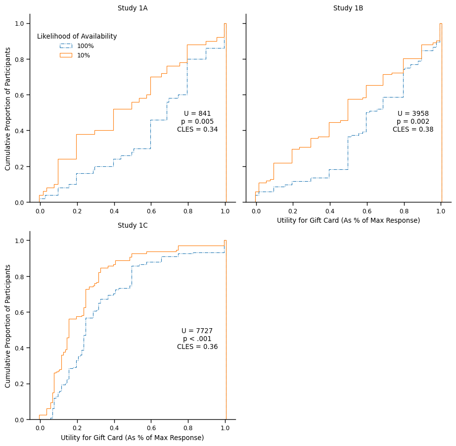
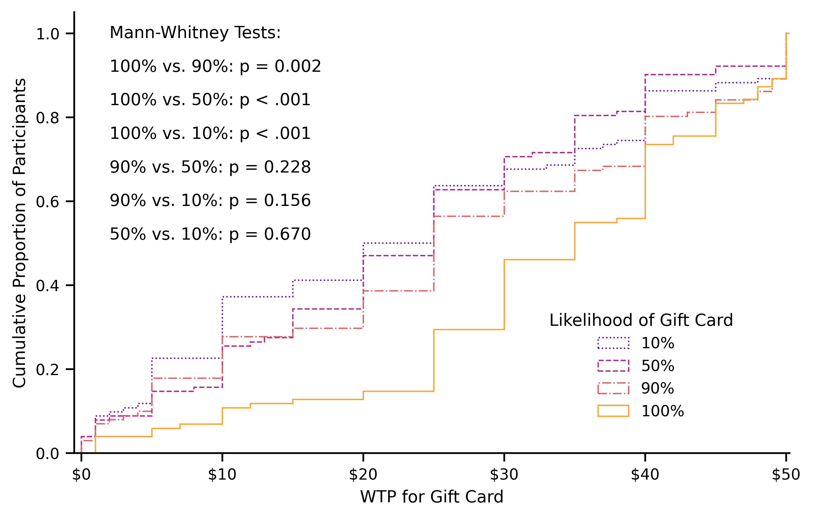

**Probabilistic Outcomes Are Valued Less in Expectation, Even Conditional on Their Realization**

GABRIELE PAOLACCI

QUENTIN ANDRÉ

Gabriele Paolacci (<gpaolacci@rsm.nl>) is Associate Professor of Marketing at Rotterdam School of Management, Erasmus University. Quentin André (quentin.andre@colorado.edu) is Assistant Professor of Marketing at the Leeds School of Business, University of Colorado Boulder. The [OSF repository](https://osf.io/4mue3/?view_only=13295d3121db422c9b419fe5d3b4c57e) of the project contains experimental materials, data, code and files needed to reproduce all the figures and analyses reported in this manuscript. The authors thank Joachim Vosgerau, Nick Reinholtz, Dan Schley, and Sam Hirshman for their valuable input on an earlier draft of this manuscript.

# ABSTRACT

Most theories of decision-making under risk assume that payoffs and probabilities are separable: In the context of a lottery, the subjective value of a prospective outcome (the payoff) is assumed to be independent of the likelihood that the outcome will occur (the probability). In violation of this assumption, we present eight experiments showing that people anticipate less utility from uncertain outcomes than from certain outcomes, even conditional on their realization. The devaluation of uncertain outcomes is observed across different measures of utility (willingness to spend money or time; choice between different options), different populations (student and online samples), and different manipulations of uncertainty. We show that this result does not simply reflect a misunderstanding of the instructions, or people’s aversion towards “weird” transaction with unexplained features. We highlight the implications of this phenomenon for empirical investigations of risk preferences, and conclude with a discussion of the psychological mechanisms that might drive the devaluation of probabilistic outcomes.

# INTRODUCTION

People frequently make decisions over outcomes that are uncertain. Should I start my own company (which might fail or succeed) or stay at my current job? Should I buy this stock (which might go up or down) or invest in bonds? Should I take a different route for my commute (which might be shorter or not) or stick to the one I normally use?

Such decisions over uncertainty have been a prominent object of research for decades. The classical paradigm in studies of risk and uncertainty features participants evaluating *prospects* (sometimes called *lotteries* or *gambles*) that can yield different *outcomes* with different *probabilities*. For instance, participants may be asked to report their willingness to pay for a prospect with two possible outcomes: Winning \$0 with probability .2, and winning \$100 with probability .8. The most influential model of risky decisions, Expected Utility Theory (Von Neumann & Morgenstern, 1945) states that people compute the utility of such prospect by weighing the utility of the constituent outcomes (e.g., \$0 and \$100) by their probability of occurrence (e.g., 20% and 80%).

Over the years, this framework has been considerably enriched, and multiple theories have refined our understanding of how people evaluate prospects. For instance, Prospect Theory (Kahneman & Tversky, 1979) suggested that people evaluate outcomes based on how they deviate from a salient reference point (i.e., reference-dependence), that negative deviations loom larger than positive deviations (i.e., loss aversion), and that larger deviations yield smaller marginal effects on utility (i.e., diminishing sensitivity). Similarly, Regret Theory (Loomes & Sugden, 1982, 1986) proposed that people’s choices under uncertainty are based on the anticipated regret (or anticipated joy) of obtaining an inferior (superior) outcome.

While these models have challenged many assumptions of Expected Utility Theory (e.g., how people convert monetary amounts into utilities, or how they translate numeric probabilities into decision weights), other assumptions have received less attention. In particular, the utilities of the constituent outcomes of a prospect are generally assumed to be independent of their probability of occurrence. In other words, the desirability of the outcome is not assumed to influence how likely it is perceived to materialize; and the likelihood of an outcome is not assumed to influence how desirable it is perceived to be.

The present paper offers an empirical test of this latter assumption and elicits, in a classical paradigm of decision-making under uncertainty, people’s valuation for outcomes that are described as certain (vs. uncertain) to become available. Across 8 studies, we consistently find that people anticipate less utility from an outcome when it is described as uncertain (vs. certain). We discuss the implications of this devaluation for our understanding of people’s decisions under risk, and how this finding relates to anomalies such as the uncertainty effect (Gneezy et al., 2006) and direct risk aversion (Simonsohn, 2009). Finally, we discuss a host of psychological mechanisms which might underpin this effect.

# THEORETICAL BACKGROUND

Research in decision-making has devoted a lot of effort to understanding how people evaluate uncertain events. As discussed in the introduction, models of decision-making under uncertainty assume that people evaluate the desirability of a prospect by considering payoffs (the value of the many different outcomes that could arise) and probabilities (the likelihood that each of the many different outcomes will materialize). While these models differ in how people convert objective outcomes in subjective valuations, or objective probabilities into subjective likelihood of occurrence, they tend to operate under the assumption that payoffs and probability are independent (they do not influence each other) and therefore separable (payoffs can be manipulated independently of probabilities, and vice versa).

This assumption has important implications for the design of experiments and the interpretation of empirical results. Consider for instance the standard pattern of “risk aversion,” such that people prefer a certain \$50 to a 50% chance of getting \$100 (Arrow 1971). This preference is typically explained by assuming diminishing marginal sensitivity over outcomes: if the utility of \$100 is less than twice the utility of \$50, then the 50% chance of an extra \$50 does not offset the 50% chance of not getting \$50 for sure.

However, this interpretation hinges on the implicit assumption that the sheer utility of the uncertain outcomes in the lottery (\$0 and \$100) can be compared to the sheer utility of the certain outcome (\$50; cf. Schley & Peters, 2014). If this assumption is relaxed, such that people would anticipate more utility from outcomes that are certain (vs. uncertain), diminishing marginal sensitivity might no longer be needed to explain this pattern of results. Indeed, a person with a constant marginal utility (i.e., someone who sees \$100 as twice as valuable than \$50) might still prefer a certain \$50 to a 50% chance of getting \$100 if the presence of uncertainty dampens the subjective value of the \$100 outcome.

How plausible is the assumption of independence between outcomes and probabilities? A first stream of research on “optimism” or “wishful thinking” has explored the possibility that the valence of an outcome (positive vs. negative) might influence its subjective likelihood (e.g., Krizan & Windschitl, 2007, 2009). A general conclusion from this research is that there is evidence that people are more likely to *predict* positive outcomes than negative outcomes, even when the objective probability is 50%. This wishful thinking reflects that people derive present utility from believing that better outcomes are more likely (Brunnermeier & Parker, 2005). For instance, when playing a card game in which drawing a black card would win them money, and drawing a red card would lose them money, people were more likely to predict that the next card would be black (e.g., Budescu & Bruderman, 1995; Lench & Ditto, 2008). Similarly, sports fan were more likely to predict that their favorite team would win, and this tendency persisted throughout the sports season (Massey et al., 2011; Simmons & Massey, 2012). However, this wishful thinking was attenuated when people were asked to report the subjective *probabilities* of outcomes: People correctly recognized that the odds of an outcome were not much greater when it was framed as positive (vs. negative). In particular, the effect of wishful thinking disappeared altogether when people evaluated simpler, non-naturalistic outcomes (e.g., odds in a game of chance; Krizan & Windschitl, 2007).

The reverse relationship (the idea that probabilities might drive the subjective value of outcomes) has been discussed in two different streams of literature. First, when there is ambiguity about the quality of an outcome, people have been shown to take its uncertainty into account. For example, the literature on product scarcity suggests that when products are perceived as scarce, people sometimes assume that this scarcity reflects a high demand and therefore a high quality (see Hamilton et al., 2019 for a review). Similarly, in the context of product effectiveness judgments, benefits that are likely to be obtained are expected to be larger in magnitude, because people infer stronger causal antecedents from larger probabilities of occurrence of a benefit (Kupor & Laurin, 2020).

A second stream of literature has hypothesized that, much like Aesop’s fox, people would derogate unlikely (or foregone) outcomes, and become warmer to likely (or realized) outcomes (e.g., Russo & Corbin, 2016; Zeelenberg et al., 2000). However, the few empirical tests of this hypothesis were restricted to emotionally-loaded and complex stimuli, such as the support for a political candidate or a specific policy (e.g., Kay et al., 2002; Morwitz & Pluzinski, 1996). In addition, the hypothesized psychological mechanism (a dissonance reduction strategy) and the fact that the effect was only found in high-involvement context (Kay et al., 2002) makes it difficult to extrapolate from these findings to simple outcomes and probabilities, and therefore to empirical investigations of decisions under uncertainty.

Relaxing the independence assumption would also offer possible explanations to anomalies previously documented in the context of expected utility theory. Indeed, research has shown that people can value a lottery lower than its worst possible outcome, a result that is incompatible with expected utility theory (e.g., Gneezy et al., 2006; Simonsohn 2009). Several explanations were offered for this anomalous result. A first explanation is that risk directly enters the utility function, and lowers the overall valuation of the lottery (Simonsohn, 2009). A second explanation is that people are averse to “weird” transactions, and that their lower valuation of lotteries reflect this distaste (Mislavsky & Simonsohn, 2018). Any dependence between probability and valuation would offer a third, complimentary, explanation: People may value a lottery less than its worst constituent outcome also because they value the worst constituent outcome of the lottery less than its certain equivalent.

In the present paper, we offer a formal test of the hypothesis that the probability of an outcome can influence its valuation 1) independently of any ambiguity about the quality of the outcome and 2) in the context of the simple lotteries used in classical paradigms of decision-making under uncertainty. To do so, we present participants with well-defined, unambiguous outcomes (e.g., a \$100 Amazon gift card), manipulate between-participants the likelihood that this outcome is available, and elicit people’s valuation for the outcome (often, though not always, willingness to pay) conditional on its realization.

# STUDY OVERVIEW

We present eight studies. For all studies, we determined our final sample size in advance, and report all data exclusions (if any), all manipulations, and all measures (Simmons et al., 2012). Preregistrations (when applicable), detailed experimental materials, raw data, and data analysis scripts are available on the [OSF repository of the paper](https://osf.io/4mue3/?view_only=13295d3121db422c9b419fe5d3b4c57e).

Studies 1A-1C present three demonstrations of our basic effect: People report a lower valuation for an outcome when its availability is uncertain rather than certain. We replicate this effect using hypothetical and incentive-compatible settings, using different measures of utility (willingness to pay, willingness to spend time), different populations (online and student samples). Studies 2A and 2B address possible alternative explanations. They show that the devaluation of uncertain outcomes is not caused by a subset of participants misunderstanding the instructions (e.g., participants reporting their valuation of the prospect rather than of the constituent outcome), and that it does not simply reflect an aversion to “weird” transactions (Mislavsky & Simonsohn, 2018). Study 3 shows that even a minor decrease in the probability of availability (from 100% to 90%) affects people’s valuation of the outcome. Finally, Study 4A and 4B show that the devaluation of uncertain outcomes also affects choices: People are less likely to pre-commit to buying a gift certificate at a given price when it is described as uncertain (vs. certain) to become available.

In our studies, we rely on gift certificates as stimuli. This choice is consistent with previous research on risk preferences (e.g., Gneezy et al., 2006; Mislavsky & Simonsohn, 2018; Newman & Mochon, 2012; Yang et al., 2013), and ideal for two reasons. First, the hypothesis that outcome valuations are independent of outcome probabilities was originally formulated in the context of lotteries with monetary payoffs. It is therefore theoretically, methodologically, and practically important to know if the utility of receiving a fixed monetary amount depends on the probability of obtaining this amount. However, it is methodologically challenging: For obvious reasons, we cannot directly ask how much money people would be willing to pay to obtain \$100. Instead, we elicit people’s willingness to pay for a gift certificate (another fungible currency) of an equivalent amount.

Second, we have discussed that introducing uncertainty about the availability of an outcome can change people’s beliefs about the underlying quality of the outcome. For instance, if a car make only has a 10% chance of being available at a retailer, some people might infer that the car is in high demand, or that it is an exclusive model, and therefore conclude that it is a better product (a "scarcity effect," Hamilton et al., 2019). On the contrary, people may believe that the low availability of the car means that no retailer wants to stock it, or that it fell out of fashion, and therefore conclude that it is an inferior product. Such inferences about the quality of the outcome are undesirable: Our goal is to investigate how the provision of uncertainty affects the utility that people anticipate from an *identical* outcome. Using gift certificates allows us to eliminate any ambiguity regarding the intrinsic value of the outcome (it is transparent that a \$100 Amazon gift card allows you to buy \$100 worth of goods on Amazon, regardless of how likely it is to be available), and therefore to provide a clean test of our hypothesis.

# STUDY 1A: UNCERTAINTY REDUCES OUTCOME VALUATION

Study 1A establishes our experimental paradigm and demonstrates that people value an outcome less when it is uncertain than when it is certain. In this study, participants were randomly assigned to one of two conditions. In our “certainty” condition, participants are asked for their valuation of an outcome that is certain to be available. In our “uncertainty” condition, participants learn that the outcome might be available or not and state their valuation of the outcome *conditional on its availability*. If the valuation of an outcome is independent of its likelihood to occur, we should find that participants in both conditions report a comparable valuation.

## Method

One hundred adults (66.0% females, *Mage* = 22.0, *SD* = 2.63) were recruited and compensated €10 for participating in a lab session at a European university that comprised several tasks. In our experiment, participants were randomly assigned to either a certainty or uncertainty condition. In the certainty condition, participants imagined they were eligible to buy a €50 Amazon certificate, and reported their willingness to pay (WTP) for it (“*What is the maximum amount of money that you would be willing to pay for the €50 gift certificate?*”) using a slider scale anchored at €0 and €50. In the uncertainty condition, participants imagined that there was a 10% probability that they would be eligible to buy a \$50 Amazon certificate, and reported their WTP conditional on this eligibility (“*If it turns out that you can buy the €50 gift certificate, what is the maximum amount you would be willing to pay for it?*”). If, as predicted by normative models of decision-making, the valuation of an outcome is independent of its prior probability of occurrence, we would expect a similar distribution of WTPs across conditions.

## Results and Discussion

Because distributions of WTPs are typically non-normal, we report the results of non-parametric tests (e.g., Mann-Whitney) for all studies in the paper. Similar results are obtained using parametric tests (t-tests and ANOVAs) and are presented on the OSF repository of the paper. In line with our hypothesis, we found that WTPs were lower in the uncertainty condition than in the certainty condition (medians: €20 vs. €35; U = 841, *p* = .005, CLES = .34). This confirms our hypothesis that people assign less utility to an outcome when its realization is uncertain.

# STUDY 1B: REPLICATION IN AN INCENTIVE-COMPATIBLE DESIGN

Study 1B provides a conceptual replication of Study 1A with incentive-compatible choices and with a different sample, i.e., US residents recruited from Amazon Mechanical Turk (MTurk). In this study as well as in the other MTurk studies, we recruited participants with a task approval rate of at least 95%, and compensated participants with payment equivalent to about \$6-9 per hour.

## Method

Two hundred five MTurk participants (36.1% females, *Mage* = 33.88, *SD* = 11.07) were recruited and informed they might be able to earn real money in the study. We explained that one participant would be selected at random at the end of the study, and that this participant would receive the outcome of their choices for real (i.e., additional money granted through the MTurk bonus function, an Amazon gift certificate, and/or both). This procedure, widely used in the decision under risk literature to create incentive-compatibility (e.g., Read, 2005), ensured that participants’ choices were consequential rather than hypothetical[^1].

Participants were randomly assigned to one of two conditions. In the certainty condition, participants were told that they had been endowed with \$50, and that they could decide to bid some of this money on a \$50 Amazon gift certificate to be received via email. We elicited WTP using an incentive-compatible Becker-de Groot-Marschak (BDM; 1964) procedure. Participants were asked for their WTP for the gift certificate (“*What is the highest amount of money that you would pay for the gift certificate?*”), and we explained in detail the BDM procedure: A selling price S will be drawn at random from the interval \[\$1; \$50\]. If their WTP is equal to or greater than S, they would receive the gift card, plus the difference between this selling price and \$50. If not, they would only receive the \$50. After stating their WTP using a \$0-\$50 slider scale, participants learned the result of the BDM procedure.

In the uncertainty condition, the procedure was identical to the certainty condition except that participants were not necessarily eligible to acquire the \$50 gift certificate. Participants were told that a lottery would determine if they are eligible (10% probability) or not (90% probability) to acquire the gift certificate. Participants were asked to provide their WTP for the gift certificate in case they were eligible to obtain it (“*Should the lottery determine that you are eligible to obtain the gift certificate, what is the highest amount of money you would pay for it?*”). After stating their WTP using a \$0-\$50 slider scale, participants learned the result of the lottery: They received \$50 with a 90% probability or moved on to the BDM procedure with a 10% probability.

## Results and Discussion

We again find that the median WTP was lower in the uncertainty condition than in the certainty condition (\$25.00 vs. \$30.50, U = 3958, *p* = .002, CLES = .38). This replicates the result of Study 1A with consequential, incentive-compatible choices and with a different sample of respondents.

# STUDY 1C: REPLICATION USING AN ALTERNATIVE MEASURE OF UTILITY

Study 1C replicates the previous results with a different operationalization of outcome utility. Participants read a scenario about a gift card that was either certainly or uncertainly available, and reported their willingness to drive to obtain it should it turn out to be available (Schley & Peters, 2014; Tversky & Kahneman, 1981). The amount of time that participants were willing to invest for the outcome (conditional on its realization) served as our dependent measure.

## Method

Two-hundred sixty-six undergraduates at a European university participated in the experimental session that included this study, in exchange for course credit. Participants were asked to imagine that they could get a €30 gift card for the shop of their choice, and that this card was located in a different place. Half of the participants were assigned to the certainty condition, and were asked to state the amount of time (in minutes) they would spend in the car to pick up the gift card (“*How much time would you be willing to spend in the car to pick up the gift card (and go back)?*”). Half of the participants were assigned to the uncertainty condition, and were told that there was a 10% probability that they could be eligible to pick up the gift card. They then stated the amount of time (on a 0–120 minutes slider scale) they would spend in the car to pick up the gift card conditional on a lottery determining that they were eligible (“*How much time would you be willing to spend in the car to pick up the gift card (and go back)? (There is a 10% probability that you will actually be eligible to pick it up; you would only need to go pick up the card if you won the lottery.*”). Again, those instructions make it clear that participants will only incur the cost (driving) if the outcome becomes available. If uncertainty does not affect outcome valuation, participants in the certain and uncertain conditions should be willing to spend an approximately equal amount of time to pick up the gift card. On the contrary, we expected that willingness to drive would be lower in the uncertainty condition than in the certainty condition.

## Results and Discussion

Replicating previous results, we find that willingness to drive (in minutes) was lower in the uncertainty condition than in the certainty condition (medians 20 minutes vs. 30 minutes; U = 7727, *p* \< .001, CLES = .36).

Figure 1: Cumulative distributions of expected utilities in Studies 1A-1C, split by conditions.

Altogether, Study 1A-1C provide evidence that people anticipate a lower utility from uncertain outcomes than from certain outcomes (see Figure 1). This effect is replicated with hypothetical and incentive-compatible choices, using different scenarios, and with different samples.

# STUDIES 2A AND 2B: RULING OUT POTENTIAL CONFOUNDS

The evidence presented so far shows that people report lower willingness to pay (in time or in money) for uncertain outcomes. Our interpretation is that the uncertainty tied to the provision of an outcome can reduce the utility that people expect from the outcome itself. To bolster this interpretation, we seek to rule out two possible confounds in Studies 2A and 2B.

The first possible confound is a misunderstanding of the instructions: While the instructions of Study 1A and 1B clearly stated that participants are meant to indicate their WTP for the gift certificate (rather than for the lottery that might yield the gift certificate), it is important to rule out the possibility that the devaluation was caused by a subset of participants incorrectly providing their WTP for the prospect (rather than for the constituent outcome). We address this possibility in Study 2A.

The second confound is that the observed devaluation would not be caused by uncertainty, but by the unusual features of the transaction we have described. Mislavsky and Simonsohn (2018) have recently demonstrated that people report a lower WTP in transactions that they perceive as “weird” (i.e., including “features that are not implicitly, explicitly or self-evidently justified”). It is conceivable that the transactions that we have described in the “uncertainty” conditions so far are not only more uncertain, but also “weirder.” For instance, we did not explain why some people would become eligible to buy the gift card and others would not. We address this possibility in Study 2B.

## Study 2A: Method

Study 2A rules out a possible misunderstanding of the instructions by conducting preregistered analyses that are increasingly conservative in their inclusion of participants. Following our pre-registration (https://aspredicted.org/blind.php?x=zd85si), we posted 400 HITs on MTurk, and obtained 407 responses (42.8% females, *Mage* = 40.11, *SD* = 12.74).

Study 2A had the same design as Study 1A but included a few additional elements. First, we further clarified the instructions: Before indicating their WTP, participants in the uncertainty condition were reminded (as we did in Study 1C) that “You will only pay this amount if you are eligible to buy the gift certificate. If you are not eligible to buy it, you will pay \$0.”

Second, we added two questions at the end of the survey testing the participants’ understanding of the study. The first question asked them to indicate which of the three statements they saw in the instructions: “\[they\] are eligible to buy the \$50 gift certificate”, “There is a 50% chance that \[they\] are eligible to buy the \$50 gift certificate,” or “There is a 10% chance that \[they\] are eligible to buy the \$50 gift certificate.” The second statement asked them to indicate the circumstances in which they would pay the amount that they have indicated: “Only if \[they\] are eligible to buy the gift certificate”, or “Even if you are not eligible to buy the gift certificate. As a first robustness check, we pre-registered that we would only analyze the responses of participants who correctly answered both questions.

Finally, we pre-registered a second robustness check. If some participants mistakenly report their valuation for the lottery (i.e., a 10% chance of getting a \$50 gift certificate) rather than of the constituent outcome (i.e., a \$50 gift certificate), the valuation of these “inattentive” participants should (assuming risk neutrality or aversion) be smaller than \$5 (i.e., 10% of \$50). To eliminate any plausible influence of these “inattentive” participants, our second robustness check would exclude all participants who give a valuation for the gift certificate that is lower than or equal to \$5, and re-run the analysis on this subset of the data. We note that this analysis is conservative, as it assumes that any valuation lower than \$5 reflects a misunderstanding of the instructions rather than genuine preferences.

## Study 2A: Results and Discussion

Following our pre-registration, we first analyzed the differences in WTP between conditions using a Mann-Whitney test. We replicate the results of Study 1A and 1B, and find that the WTPs were lower in the uncertainty condition (medians: \$35 vs. \$45; U = 12630, *p* \< .001, CLES = .30). Next, we repeated this analysis on the subset of participants who correctly answered both questions testing their understanding of the procedure (N = 339), and also find lower WTPs in the uncertainty condition (medians: \$35 vs. \$45; U = 8294, *p* \< .001, CLES = .29). Finally, we repeated this analysis on the subset of participants who indicated a WTP for the gift certificate that is strictly greater than \$5 (N = 381), and again find lower valuations in the uncertainty condition (medians: \$35 vs. \$45; U = 12031, *p* \< .001, CLES = .33).

In light of those results, we have no reason to believe that our effect is uniquely driven by a misunderstanding of the instructions. It is still observed when excluding participants who report an incorrect understanding of the procedure, and remains observable after excluding all responses that might plausibly reflect a misunderstanding of the instructions.

## Study 2B: Method

Study 2B rules out weirdness by making the instructions in the “Certain” condition at least as weird as the instructions in the “Uncertain” condition. The planned sample size, number of conditions, main dependent variable and analysis were identical to those we pre-registered in Study 2A. As per our previous preregistration, we posted 400 HITs on MTurk, and 400 obtained complete responses. All participants were informed that we are selling \$50 gift certificate, but that “not everybody will be eligible to buy it,” and that eligibility to buy would be determined by rolling a six-sided die. Half of the participants (the “Uncertain” condition) were told that if the die was to land on “5”, they would be eligible to buy the gift certificate, but that they would not be eligible if it landed on any other number. The other half of participants (the “Certain” condition) were told that if the die was to land on “1,” “2,” “3,” “4,” “5,” or “6” they would be eligible to buy it, but that they would not be eligible if it landed on any other number. Since a six-sided die cannot, by definition, give any other number, we expected that participants in the “Certain” condition would find the procedure at least as “weird” as participants in the “Uncertain” condition.

After reading these instructions, participants were asked to indicate “the maximum amount of money that you would be willing to pay for the \$50 gift certificate?” As in study 1C, we reminded them that “you will only pay this amount if you are eligible to buy the \$50 gift certificate: Otherwise, you will not pay anything.” Finally, we measured how weird they perceived the transaction to be using the original explanation of the concept and 4-point scale by Mislavsky and Simonsohn (2018; 1 = not weird at all, 4 = extremely weird). We also tested participants’ understanding of the two crucial elements of the procedure: The likelihood that they will be eligible to buy the \$50 gift certificate (1/6 vs. 3/6 vs. 6/6), and the circumstances under which they would need to pay the amount that they have indicated (“only if you are eligible,” “even if you are not eligible”).

## Study 2B: Results and Discussion

As expected from our design, we observed that the average weirdness score is significantly higher in the “Certain” than in the “Uncertain” condition (M: 2.26 vs. 2.56, SD = 0.91 vs. 0.88, t(398) = 3.404, p = .001). Following the previous pre-registration, we first analyzed the differences in WTP between conditions using a Mann-Whitney test. We replicate the results of previous studies, and find that the WTPs were lower in the uncertainty condition (medians: \$24 vs. \$29; U = 17328, *p* = .021, CLES = .43). Next, we repeated this analysis on the subset of participants who correctly answered both questions testing their understanding of the procedure (N = 334). We also find lower WTPs in the uncertainty condition (medians: \$24 vs. \$29.6; U = 11422, *p* = .005, CLES = .41), and lower weirdness scores (means: 2.30 vs. 2.70, SD = 0.88 vs. 0.90, t(332) = 4.054, p \< .001).

## Study 2A and 2B: Discussion

Taken together, these results suggest that the effect of uncertainty on the valuation of outcomes cannot uniquely reflect a misunderstanding of the instructions, and is not driven by differences in weirdness between the conditions. Indeed, the effect is still observed among participants who demonstrate a correct understanding of the instructions (Study 2A), and is still observed when the “Certain” condition is designed to be (and perceived as) weirder than the “Uncertain” condition (Study 2B).

# STUDY 3: VARYING LEVELS OF UNCERTAINTY

In all our previous experiments, we operationalized uncertainty as a 10% probability that the outcome will occur. It is theoretically and practically important, however, to understand whether people also anticipate less utility from outcomes with a higher probability, and how different levels of uncertainty affect people’s expected utility for an outcome. In Study 3, we varied uncertainty by adding conditions with different probability levels to our design.

### Method

Four hundred and seven MTurk participants (39.3% females, *Mage* = 31.6, *SD* = 9.93) participated in this study. The procedure, wording, and measurement were identical to Study 1B, including incentive-compatibility. This time, however, participants were randomly assigned to one of four conditions. The certainty condition was identical to the respective condition in Study 1B. The other three conditions were identical to the uncertainty condition in Study 1B, except they varied in the probability of participants being eligible to obtain the \$50 Amazon gift certificate (10%, 50%, 90%). We tested whether the detrimental effect of uncertainty on outcome valuation is present also for medium and high probabilities, and more generally how anticipated utility responds to the amount of uncertainty tied to the outcome.

### Results and Discussion

An omnibus Kruskal-Wallis test revealed significant differences across conditions (H(3) = 28.01, *p* \< .001, cf. Figure 2), with participants in all the uncertain conditions reporting lower WTPs compared to the certain condition (all ps \< .002).

It is noteworthy that we observed a devaluation of the outcome even when the probability of eligibility was 90% (Median100% = \$35 vs. $`\text{Median90\% }`$= \$25, p = .005, r = 0.2), which suggests that the mere provision of uncertainty is sufficient to induce a drop in anticipated utility. This result provides additional evidence that the effect is unlikely to be driven by a fraction of participants providing their valuation of the lottery (rather than the outcome): This explanation would have predicted a minimal (and potentially non-significant) difference between the 100% and the 90% condition.

These results do not allow to conclude whether the level of uncertainty, beyond the provision of uncertainty, leads to stronger decline in valuation. While the means (M10% = 22.9, M50% = \$23.62, M90% = \$26.3) and medians (Median10% = \$22.5, Median50% = \$25, Median90% = \$25) of the uncertain conditions are directionally consistent with this hypothesis, pairwise comparisons between these conditions do not reach statistical significance (p-values of Mann-Whitney tests: .156 \< p \< .670).

Figure 2: Cumulative distributions of WTP in Study 3, by condition

# STUDIES 4A-4B: UNCERTAINTY INFLUENCES LIKELIHOOD TO BUY AT A FIXED PRICE

All the studies reported so far asked participants to indicate their willingness to spend resources (money or time) for an item that will (vs. might) be available. In Studies 4A and 4B, we test whether uncertainty regarding the availability of the good would also affect people’s reported willingness to buy it at a given price point. Study 4A shows that the effect is also observed (albeit smaller) when the utility of participants for the outcome is measured using a willingness to buy (vs. willingness to pay) dependent variable. Study 4B provides a pre-registered replication of the effect of uncertainty on willingness to buy, with additional items confirming participants’ understanding of the procedure.

### Study 4A: Method

We posted 600 HITs on MTurk, and obtained complete responses from 597 participants (51.1% male, 48.1% female, 0.8% other, *Mage* = 39.9, *SD* = 13.3). Participants were randomly assigned to one of four conditions of a two (Certainty: “Certain” vs. “Uncertain”) by two (DV: “Willingness to Pay” vs. “Willingness to Buy”) factorial design.

The first factor manipulated, as in previous studies, the likelihood of the outcome. In the “Certain” condition, participants were informed that they were eligible to buy a \$50 Amazon gift certificate. In the “Uncertain” condition, participants were informed that there was a 10% chance that they are eligible to buy it.

The second factor manipulated how participants expressed their utility for the outcome. Participants in the “Willingness to Pay” condition were asked, as in previous studies, to indicate how much they would be willing to pay to acquire the \$50 Amazon gift certificate (should it turn out to be available). Participants in the “Willingness to Buy” were asked about their willingness to buy the Amazon gift certificate at a reduced price of \$40 (should it turn out to be available) using a binary response item (yes vs. no).

### Study 4A: Results

Among the participants who indicated their willingness to pay (N = 295), we again find that uncertain reduced the participants’ valuation of the gift certificate: medians: \$35 vs. \$45; U = 14588, *p* \< .001, CLES = .33.

Among the participants who indicated their willingness to buy the gift certificate (N = 302), a logistic regression also revealed a significant impact of uncertainty: 84% of participants in the “Certain” indicated that they would buy the certificate at the reduced price of \$40, versus only 74% of participants in the “Uncertain” condition (z = 2.107, p = .035, r = .122).

This study confirms that the impact of uncertainty on valuation is not restricted to willingness to pay measures, and that they also affect choice-based measured of utilities. While effect size comparisons between different types of measures are difficult to interpret (indeed, it is unclear if they reflect differential sensitivity of dependent variables, differential psychological effects, or a combination of the two), we nonetheless note that the effect of uncertainty on choice was smaller (d = .25, 90% CI = \[.05, .44\]) than the effect of uncertainty on WTP (d = .60, 90% CI = \[.40, .80\]).

### Study 4B: Method

In Study 4B, we conducted a pre-registered (<https://aspredicted.org/3JJ_62K>) replication of the effect of uncertainty on choice. Following our pre-registration, we posted 400 HITs on MTurk, and obtained complete responses from 412 participants (44.7% male, 54.6% female, 0.7% other, *Mage* = 39.2, *SD* = 12.5). Participants were randomly assigned to one of two conditions. In the “Certain” condition, they were informed that they are eligible to buy a \$50 Amazon gift certificate, and indicated their willingness to buy it at the reduced price of \$44 using a binary response item (yes vs. no). In the “Uncertainty” condition, they were informed that there is a 10% chance that they are eligible to buy the gift certificate, and asked them about their willingness to buy it at the reduced price of \$44 should it be available to them.

After expressing their preference, we asked participants two questions testing their understanding of two critical aspects of the procedure: The likelihood that they are eligible to buy the gift certificate (10% vs 50% vs. 100%), and the circumstances under which they would pay the \$44 if they had indicated that they would buy the gift card (“Only if you are eligible to buy the gift certificate” vs. “Even if you are not eligible to buy the gift certificate”).

### Study 4B: Results

Our pre-registered logistic regression revealed that participants’ willingness to buy the gift certificate was lower in the “Uncertain” condition compared to the “Certain” condition: 69.0% vs. 78.9%, z = 2.268, p = .023. Following our pre-registered robustness check, we replicated the analysis on the subset of participants who correctly answered all the comprehension questions (N = 286). Even within this smaller sample, we observe an equally sized difference in choice proportions (69.9% vs. 79.7%, z = 1.906, p = .057). These results confirm that the uncertainty effect does not only affect people’s reported willingness to pay, but also their reported willingness to buy at a given price.

# GENERAL DISCUSSION

The independence of outcome probability and outcome utility is a fundamental feature of models of risky decision-making. The present paper documented repeated violations of this assumption: Across eight experiments, we found that participants anticipate less utility when the outcome is uncertain rather than certain. We observed this effect across different populations, outcome valuations, measures of utility, and in incentive-compatible designs.

We have also shown that the effect is unlikely to be driven by participants mistakenly providing their evaluation of the prospect: Multiple studies made it maximally transparent that valuations only apply to outcomes conditional on their availability, such that no cost will be incurred if the outcome turns out not to be available (Studies 1C, 2A, 2B, 4A and 4B). We observed the effect when restricting our analysis to participants who demonstrate a correct understanding of the instructions, and found it to be robust to the exclusion of all plausibly erroneous responses (Study 2A and 4B). Finally, our results suggest that the devaluation of uncertain outcomes does not simply reflect an aversion to unusual transaction features (Study 2B).

We now discuss the relevance of this effect for our understanding of people’s preferences when risk is present. We also outline possible mechanisms underlying this effect, and hope that this discussion will encourage future investigations.

## Implications for Empirical Investigations of Risk

The observation that utilities and probabilities are not independent, and that people devalue the utility of uncertain outcomes, has important implications for empirical investigations of risk and uncertainty. As mentioned earlier, lotteries are the “fruit flies” of experimental economics and have been used extensively to investigate people’s attitudes toward risk, payoffs, and uncertainty. The interpretation of lottery-based studies, however, often hinges on the assumption that payoffs and probability are separable. For instance, the observation that people are risk averse, and prefer a lottery with a 100% chance of getting \$50 to a lottery with a 50% chance of getting \$100, is often explained with reference to diminishing marginal utility. However, our findings show that people’s devaluation of uncertain outcomes may offer a complimentary explanation to this choice, and that we may observe this preference even among individuals with constant marginal utility. From that perspective, our findings constitute additional evidence that one might observe behavioral risk aversion for reasons that are both psychologically and mathematically distinct from diminishing marginal utility (e.g., Diecidue et al., 2004a, 2004b; Simonsohn, 2009).

More broadly, our findings suggest that using lotteries to estimate people’s risk preferences might inadvertently capture people’s tendency to devalue uncertain outcomes. For instance, we present on the OSF repository of the paper an experiment (Study S1) revisiting the classic “uncertainty aversion” effect, in which people value a lottery less than its worst possible outcome (Gneezy et al., 2006; Simonsohn, 2009). As alluded in the theoretical background, one of the factors that might drive this effect (beyond aversion to weirdness, Mislavsky & Simonsohn, 2018; or to risk itself, Simonsohn, 2009) is that the uncertainty inherent to the lottery context leads people to value each of the *uncertain* outcomes of the lottery less than their *certain* equivalent.

To test this hypothesis, we elicit (in a between-participants experiment) people’s valuation of a lottery (getting a \$50 or a \$100 gift certificate with equal probability), of its *certain* constituent outcomes (a \$50 gift certificate, and a \$100 gift certificate), and of its *uncertain* constituent outcomes (a \$50 gift certificate that has a 50% chance of being available to buy, and a \$100 gift certificate that has a 50% chance of being available to buy). When we compare the subjective value of the lottery to the subjective value of its constituent outcomes, we replicate the anomalous “uncertainty effect”: The WTP for the lottery is typically lower than the WTP for the worst outcome, i.e., the \$50 gift certificate. In contrast, we do not replicate the uncertainty aversion when comparing the WTP for the lottery to the WTP for the *uncertain* \$50 gift certificate, i.e., WTP is higher for the lottery than for the outcome.

This specific result deserves corroboration and may be open to different interpretations. However, we hope that it demonstrates the importance of challenging the independence of outcomes and probabilities, and that it will inspire researchers to develop novel methodologies to account for the devaluation of uncertain outcomes in empirical investigations of decision-making under uncertainty.

## Psychological Mechanisms

Our studies suggest that neither misunderstanding, nor an aversion to “weird” transactions, are sufficient to explain why uncertainty decreases outcome evaluation. However, we did not elaborate on the psychological mechanisms that might drive this phenomenon. The strength of the effect of uncertainty on people’s evaluations suggests that multiple processes might be at play, perhaps both affective and cognitive in nature. We discuss a few possibilities that might explain the effect, and hope that this discussion will spur future investigations.

### Contrast between prospective and retrospective utility for uncertain outcomes.

Our results might appear superficially at odds with research by Mellers and colleagues (1997), who found that people experience *more* positive affect following a positive outcome that was uncertain (rather than certain) to occur; or with recent research from Hu, Yin, and Moon (2023) finding that people are less willing to exchange a good obtained through an uncertain mechanism (e.g., a lottery). These findings, however, apply to the retrospective utility of the outcome, after the uncertainty has been resolved. In contrast, our results show people’s tendency to devalue uncertain outcomes *in prospect*, before uncertainty is resolved.

It is not surprising that prospective and retrospective utilities are misaligned, as people are known to be far from perfect forecasters of their future utilities (e.g., Buechel et al., 2014; Morewedge et al., 2007; Nelson & Meyvis, 2008; Wilson & Gilbert, 2005). The contrast between the two findings is nonetheless interesting. First, it suggests that dynamic inconsistencies might be stronger in presence of uncertainty: People would pre-commit to pay less for uncertain (vs. certain) outcomes but would in retrospect derive more utility from a positive outcome that was previously uncertain (vs. that was always certain). Second, it is possible that the mechanisms underlying the two effects are related: The *ex-post* increase in utility after uncertainty is resolved might be an overcorrection (or a contrast effect) from the *ex-ante* decrease in anticipated utility.

### Affective reactions to uncertain outcomes

Why would people devalue uncertain outcomes in the first place? A first possible class of explanations would be that uncertainty evokes a different set of emotions from certainty, which affects people’s valuation of the outcomes.

One specific possibility is that uncertain outcomes trigger more muted affective reactions because they are perceived as more psychologically distant. There is evidence that people tend to perceive uncertain events as psychologically more distant than certain events (Trope et al., 2007). Construal Level Theory (Trope & Liberman, 2010) proposes that when people evaluate psychologically close (distant) stimuli, they weigh more heavily their more concrete (abstract) features. Beyond this weight-shifting mechanism, more recent research (Williams et al., 2014) recently argued that psychological distance may reduce the intensity of affective judgments. For instance, participants in one experiment evaluated a gift certificate less positively when they imagined receiving it the day after than when they imagined receiving it in one year, a manipulation of temporal distance.

In the OSF repository of the paper, we report the results of study (Study S2) that tests a prediction of psychological distance in the context of our effect. Investigations of the effects of psychological distance on judgments and decisions have found that people exhibit diminishing marginal sensitivity to cross-dimensions instantiations of psychological distance (Maglio et al. 2013). When an event is already experienced as distant on one dimension, people become less sensitive to further distance on other dimensions. For instance, a delay in receiving an outcome feels less long when another person (vs. oneself) experiences it (a social distance manipulation; Pronin et al., 2008). Building on this finding, we hypothesized that the effect of uncertainty on outcome evaluations would be less pronounced when outcomes are temporally distant (vs. close).

We randomly assigned 602 MTurk participants (41.0% females, *Mage* = 31.7, *SD* = 10.24) to one condition of a 2 (certainty vs. uncertainty) x 2 (no delay vs. one-year delay) between-participants design and asked them to state their WTP for a \$80 Amazon gift certificate. The no delay conditions mirrored our basic paradigm. In the one-year delay conditions, participants learned that they “*would obtain the certificate one year from now*” and stated their WTP for the gift “*to receive it one year.*” A Scheirer-Ray-Hare test (the non-parametric equivalent to the between-participants ANOVA) revealed a significant interaction between uncertainty and delay (H(1) = 10.57, p \< .001): In the no delay conditions, the gift certificate was valued less when uncertain than certain (medians: \$50 vs. \$65; U = 7355, p \< .001, CLES = .33). In the one-year delay conditions, the WTP for the gift certificate was only marginally lower in the uncertainty condition than in the certainty condition, with a smaller effect size (p = .06, CLES = .44).

These results are consistent with psychologically distance causing more muted reactions to uncertain outcomes. When outcomes are already psychologically distant, the fact that they are certain or uncertain makes less of a difference for their valuation. However, we do not believe that this finding provides discriminant evidence for psychological distance being a mechanism underlying our effect, let alone the sole mechanism. In particular, the interaction we observed between uncertainty and psychological distance might be a statistical byproduct of generally lower WTPs in the distance condition (i.e., caused by a floor effect) rather than a psychologically informative moderation.

Beyond the effect of psychological distance, there is evidence for an emotional component to risk and uncertainty, which might drive part of the effect that we described. If uncertainty is psychologically aversive (e.g., Simonsohn, 2009), some of the negative affect triggered by uncertainty might extend to the evaluation of the outcome itself, thereby lowering valuation (Nisbett & Wilson, 1977).

### Cognitive effects of uncertainty

Other mechanisms, cognitive in nature, might also drive the lower valuation of uncertain outcomes. First, people appear to be driven by a “cognitive consistency” principle; an inclination to hold beliefs that are consistent with one another (Chaxel & Russo, 2015). Indeed, seminal theories like Congruity Theory (Osgood & Tannenbaum, 1955) and Cognitive Dissonance Theory (Festinger, 1957) have long posited that people are uncomfortable with cognitive states that are inconsistent with one another, and that they are motivated to achieve or restore some balance between incongruent beliefs when they are present.

Past research has speculated that this mechanism might play a role in outcome valuation. As mentioned earlier, Russo and Corbin (2016) and Zeelenberg and colleagues (2000) have argued that people might reduce their preference for less likely events. Others have suggested that electoral candidates or policies may become more desirable as their likelihood to pass increase (e.g., Kay et al., 2002; Morwitz & Pluzinski, 1996). However, the mental processes underpinning these effects (dissonance acknowledgment then rationalization, attentional shifts to positive vs. negative features of the outcome…) are rather involved, and it is unclear how likely they would be to play a role in the simple willingness-to-pay judgments for unambiguous outcomes that participants provided in our studies.

Beyond the principle of cognitive consistency, uncertainty might reduce the extent to which people engage with the features of the outcome. If people perceive an outcome as unlikely, they might not mentally simulate desirable features of the outcome, which would presumably lower their valuation (Mrkva et al., 2020).

Finally, an interesting hypothesis would be that the devaluation of uncertain outcomes has links to mental accounting (Thaler, 1985), and that it reflects an unwillingness to earmark scarce resources (time and money) to uncertain mental accounts[^2]. Consider for instance a person deciding how much money they should budget to a set of activities they might or might not be eligible for. If they earmark money to an uncertain outcome, it reduces their ability to plan for other activities; and if they budget their full willingness to pay to each activity, it increases the likelihood (if it turns out that they are eligible for most) that they would exceed their total budget. Both observations predict that people would allocate less resources to uncertain outcomes. Whereas we documented that probabilistic outcomes can be less valuable even conditional on their realization, we hope future research will delve deeper into the question of when (e.g., for which types of outcomes? for which people?) and why this is the case.

# REFERENCES

Becker, G. M., Degroot, M. H., & Marschak, J. (1964). Measuring utility by a single-response sequential method. *Behavioral Science*, *9*(3), 226‑232. https://doi.org/10.1002/bs.3830090304

Brunnermeier, M. K., & Parker, J. A. (2005). Optimal expectations. *American Economic Review*, *95*(4), 1092‑1118.

Budescu, D. V., & Bruderman, M. (1995). The relationship between the illusion of control and the desirability bias. *Journal of Behavioral Decision Making*, *8*(2), 109‑125. https://doi.org/10.1002/bdm.3960080204

Buechel, E. C., Zhang, J., Morewedge, C. K., & Vosgerau, J. (2014). More Intense Experiences, Less Intense Forecasts : Why People Overweight Probability Specifications in Affective Forecasts. *Journal of personality and social psychology*, *106*(1), 20‑36. https://doi.org/10.1037/a0034478

Chaxel, A.-S., & Russo, J. E. (2015). *Cognitive consistency : Cognitive and motivational perspectives.*

Diecidue, E., Schmidt, U., & Wakker, P. P. (2004a). A theory of the gambling effect. *Journal of Risk and Uncertainty*, *29*, 241‑259.

Diecidue, E., Schmidt, U., & Wakker, P. P. (2004b). The utility of gambling reconsidered. *Journal of Risk and Uncertainty*, *29*(3), 241‑259.

Festinger, L. (1957). *A theory of cognitive dissonance* (Vol. 2). Stanford university press.

Gneezy, U., List, J. A., & Wu, G. (2006). The uncertainty effect : When a risky prospect is valued less than its worst possible outcome. *The Quarterly Journal of Economics*, *121*(4), 1283‑1309.

Hamilton, R., Thompson, D., Bone, S., Chaplin, L. N., Griskevicius, V., Goldsmith, K., Hill, R., John, D. R., Mittal, C., & O’Guinn, T. (2019). The effects of scarcity on consumer decision journeys. *Journal of the Academy of Marketing Science*, *47*(3), 532‑550.

Kahneman, D., & Tversky, A. (1979). Prospect Theory : An Analysis of Decision under Risk. *Econometrica*, *47*(2), 263‑291.

Kay, A. C., Jimenez, M. C., & Jost, J. T. (2002). Sour grapes, sweet lemons, and the anticipatory rationalization of the status quo. *Personality and Social Psychology Bulletin*, *28*(9), 1300‑1312.

Krizan, Z., & Windschitl, P. D. (2007). The influence of outcome desirability on optimism. *Psychological Bulletin*, *133*(1), 95‑121. https://doi.org/10.1037/0033-2909.133.1.95

Krizan, Z., & Windschitl, P. D. (2009). Wishful thinking about the future : Does desire impact optimism? *Social and Personality Psychology Compass*, *3*(3), 227‑243.

Kupor, D., & Laurin, K. (2020). Probable Cause : The Influence of Prior Probabilities on Forecasts and Perceptions of Magnitude. *Journal of Consumer Research*, *46*(5), 833‑852. https://doi.org/10.1093/jcr/ucz025

Lench, H. C., & Ditto, P. H. (2008). Automatic optimism : Biased use of base rate information for positive and negative events. *Journal of Experimental Social Psychology*, *44*(3), 631‑639.

Loomes, G., & Sugden, R. (1982). Regret Theory : An Alternative Theory of Rational Choice under Uncertainty. *Economic Journal*, *92*(368), 805‑824.

Loomes, G., & Sugden, R. (1986). Disappointment and Dynamic Consistency in Choice under Uncertainty. *The Review of Economic Studies*, *53*(2), 271. https://doi.org/10.2307/2297651

Massey, C., Simmons, J. P., & Armor, D. A. (2011). Hope over experience : Desirability and the persistence of optimism. *Psychological Science*, *22*(2), 274‑281.

Mellers, B. A., Schwartz, A., Ho, K., & Ritov, I. (1997). Decision affect theory : Emotional reactions to the outcomes of risky options. *Psychological Science*, *8*(6), 423‑429.

Miller, K. M., Hofstetter, R., Krohmer, H., & Zhang, Z. J. (2011). How should consumers’ willingness to pay be measured ? An empirical comparison of state-of-the-art approaches. *Journal of Marketing Research*, *48*(1), 172‑184.

Mislavsky, R., & Simonsohn, U. (2018). When risk is weird : Unexplained transaction features lower valuations. *Management Science*, *64*(11), 5395‑5404.

Morewedge, C. K., Holtzman, L., & Epley, N. (2007). Unfixed Resources : Perceived Costs, Consumption, and the Accessible Account Effect. *Journal of Consumer Research*, *34*(4), 459‑467. https://doi.org/10.1086/518540

Morwitz, V. G., & Pluzinski, C. (1996). Do polls reflect opinions or do opinions reflect polls ? The impact of political polling on voters’ expectations, preferences, and behavior. *Journal of Consumer Research*, *23*(1), 53‑67.

Mrkva, K., Ramos, J., & Van Boven, L. (2020). Attention influences emotion, judgment, and decision making to explain mental simulation. *Psychology of Consciousness: Theory, Research, and Practice*, *7*(4), 404.

Nelson, L. D., & Meyvis, T. (2008). Interrupted Consumption : Disrupting Adaptation to Hedonic Experiences: *Journal of Marketing Research*. https://doi.org/10.1509/jmkr.45.6.654

Newman, G. E., & Mochon, D. (2012). Why are lotteries valued less ? Multiple tests of a direct risk-aversion mechanism. *Judgment and Decision Making*, *7*(1), 19.

Nisbett, R. E., & Wilson, T. D. (1977). The halo effect : Evidence for unconscious alteration of judgments. *Journal of personality and social psychology*, *35*(4), 250.

Osgood, C. E., & Tannenbaum, P. H. (1955). The principle of congruity in the prediction of attitude change. *Psychological review*, *62*(1), 42.

Pronin, E., Olivola, C. Y., & Kennedy, K. A. (2008). Doing unto future selves as you would do unto others : Psychological distance and decision making. *Personality and social psychology bulletin*, *34*(2), 224‑236.

Read, D. (2005). Monetary incentives, what are they good for? *Journal of Economic Methodology*, *12*(2), 265‑276.

Russo, J. E., & Corbin, J. C. (2016). Not by desire alone : The role of cognitive consistency in the desirability bias. *Judgment and Decision Making*, *11*(5), 449.

Schley, D. R., & Peters, E. (2014). Assessing “economic value” symbolic-number mappings predict risky and riskless valuations. *Psychological science*, *25*(3), 753‑761.

Simmons, J. P., & Massey, C. (2012). Is optimism real? *Journal of Experimental Psychology: General*, *141*(4), 630.

Simmons, J. P., Nelson, L. D., & Simonsohn, U. (2012). A 21 word solution. *Available at SSRN 2160588*.

Simonsohn, U. (2009). Direct Risk Aversion : Evidence From Risky Prospects Valued Below Their Worst Outcome. *Psychological Science*, *20*(6), 686‑692. https://doi.org/10.1111/j.1467-9280.2009.02349.x

Simonsohn, U., Simmons, J., & Nelson, L. (2015). *AsPredicted*. AsPredicted. https://aspredicted.org/

Thaler, R. (1985). Mental Accounting and Consumer Choice. *Marketing Science*, *4*(3), 199‑214.

Trope, Y., & Liberman, N. (2010). Construal-level theory of psychological distance. *Psychological review*, *117*(2), 440.

Trope, Y., Liberman, N., & Wakslak, C. (2007). Construal levels and psychological distance : Effects on representation, prediction, evaluation, and behavior. *Journal of consumer psychology*, *17*(2), 83‑95.

Tversky, A., & Kahneman, D. (1981). The framing of decisions and the psychology of choice. *science*, *211*(4481), 453‑458.

Von Neumann, J., & Morgenstern, O. (1945). *Theory of games and economic behavior*. Princeton University Press Princeton, NJ.

Williams, L. E., Stein, R., & Galguera, L. (2014). The distinct affective consequences of psychological distance and construal level. *Journal of Consumer Research*, *40*(6), 1123‑1138.

Wilson, T. D., & Gilbert, D. T. (2005). Affective forecasting : Knowing what to want. *Current directions in psychological science*, *14*(3), 131‑134.

Yang, Y., Vosgerau, J., & Loewenstein, G. (2013). Framing influences willingness to pay but not willingness to accept. *Journal of Marketing Research*, *50*(6), 725‑738.

Zeelenberg, M., Van Dijk, W. W., Manstead, A. S., & vanr de Pligt, J. (2000). On bad decisions and disconfirmed expectancies : The psychology of regret and disappointment. *Cognition & Emotion*, *14*(4), 521‑541.

[^1]: One might be concerned that because the incentive is probabilistic, it would interfere with our goal of studying the effect of uncertain outcomes. However, the probabilistic nature of the incentives applies to both conditions, and does not interfere with our manipulation of uncertainty. Moreover, uncertainty applies both to the medium (the money that participants are endowed with) and the outcome (the gift card), and therefore does not affect the tradeoff between the two. Finally, such probabilistic BDM procedure has been extensively validated, and shown to be equivalent to real choices (Miller et al., 2011).

[^2]: We thank an anonymous reviewer for this suggestion.
