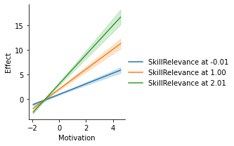
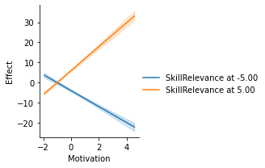
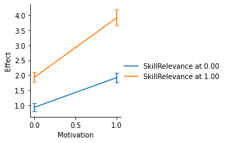
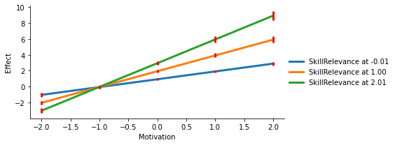

<div class="software-links" style="margin-bottom: 1.5em;">
<a href="https://github.com/QuentinAndre/pyprocessmacro" class="btn btn-outline-primary btn-sm" target="_blank" rel="noopener">See on GitHub</a>
<a href="https://quentinandre.github.io/softwares/pyprocessmacro/" class="btn btn-outline-primary btn-sm" target="_blank" rel="noopener">Documentation</a>
<a href="files/notebook.ipynb" class="btn btn-outline-primary btn-sm" target="_blank" rel="noopener">Example Notebook</a>
<a href="files/data.csv" class="btn btn-outline-primary btn-sm" target="_blank" rel="noopener">Example Data</a>
</div>

The Process Macro by Andrew F. Hayes has helped thousands of researchers
in their analysis of moderation, mediation, and conditional processes.
Unfortunately, Process was only available for proprietary softwares
(SAS and SPSS), which means that students and researchers had to
purchase a license of those softwares to make use of the Macro.

Because of the growing popularity of Python in the scientific community,
I decided to implement the features of the Process Macro into an
open-source library, that researchers will be able to use without
relying on proprietary softwares. pyprocessmacro is open-source, and
released under a MIT license.

# 1. Features

## A. Current Implementation

In the current version, pyprocessmacro replicates the following features
from the original Process Macro v2.16:

* All models (1 to 76), with the exception of Model 6 (serial mediation)
are supported, and have been numerically tested for accuracy against the
output of the original Process macro (see the `test_models_accuracy.py`)
* Estimation of binary/continuous outcome variables. The binary outcomes
are estimated in Logit using the Newton-Raphson convergence algorithm,
the continuous variables are estimated using OLS.
* Estimation of (conditional) direct and indirect effects
* Indices for Partial/Conditional/Moderated Moderated Mediation
* Automatic generation of spotlight values for continuous/discrete
moderators.
* Rich set of options to tweak the estimation and display of the
different models: (almost) all the options from Process exist in
pyprocessmacro. See the documentation for more details

## B. Changes and Improvements


The following changes and improvements have been made from the original Process Macro:

* Variable names can be of any length, and even include spaces and
special characters.
* All mediation models support an infinite number of mediators
(versus a maximum of 10 in Process).
* Normal theory tests for the indirect effect(s) are not reported, as
the bias-corrected bootstrapping approach is now widely accepted and in
most cases more robust.
* Plotting capabilities: pyprocessmacro can generate the plot of direct
and indirect effects at various levels of the moderators.
* Fast estimation process: pyprocessmacro leverages the capabilities of
NumPy to efficiently compute a large number of bootstrap estimates,
which dramatically speeds up the estimation of complex models.
* Transparent bootstrapping: pyprocessmacro automatically store the
bootstrap estimates for convenient inspection, and explicitely reports
the samples that have been discarded because of numerical instability.

## C. Missing Features

In the current version, the following features have not yet been ported to pyprocessmacro:

* Support for categorical independent variables.
* Generation of individual fixed effects for repeated measures.
* R² improvement from moderators in moderation models (1, 2, 3).
* Estimation of serial mediation (Model 6)
* Some options (`normal`, `varorder`, ...). pyprocessmacro will issue a
warning if you are trying to use an option that has not been implemented.

# 2. Installation and Usage 

## A. Installation 

You can install pyprocessmacro with pip:

    pip install pyprocessmacro
    
or with conda:
    
    conda install pyprocessmacro -c conda-forge

## B. Minimal Example


```python
import warnings

import matplotlib.pyplot as plt
import pandas as pd
from pyprocessmacro import Process

warnings.filterwarnings("ignore", category=DeprecationWarning)

df = pd.read_csv("data.csv")
p = Process(data=df, model=4, x="Effort", y="Success", m=["MediationSkills"])
p.summary()
```

    Process successfully initialized.
    Based on the Process Macro by Andrew F. Hayes, Ph.D. (www.afhayes.com)
    
    
    ****************************** SPECIFICATION ****************************
    
    Model = 4
    
    Variables:
        Cons = Cons
        x = Effort
        y = Success
        m1 = MediationSkills
    
    Sample size:
    1000
    
    Bootstrapping information for indirect effects:
    Final number of bootstrap samples: 5000
    Number of samples discarded due to convergence issues: 0
    
    ***************************** OUTCOME MODELS ****************************
    
    Outcome = Success 
    OLS Regression Summary
    
         R²  Adj. R²    MSE          F  df1  df2  p-value
     0.9699   0.9698 2.0003 16083.2644    2  997   0.0000
    
    Coefficients
    
                     coeff     se        t      p    LLCI   ULCI
    Cons            1.8755 0.0664  28.2317 0.0000  1.7453 2.0057
    Effort          0.0653 0.0500   1.3060 0.1919 -0.0327 0.1632
    MediationSkills 1.0053 0.0066 153.1107 0.0000  0.9925 1.0182
    
    -------------------------------------------------------------------------
    
    Outcome = MediationSkills 
    OLS Regression Summary
    
         R²  Adj. R²     MSE        F  df1  df2  p-value
     0.2648   0.2633 46.4881 359.3661    1  998   0.0000
    
    Coefficients
    
            coeff     se       t      p   LLCI   ULCI
    Cons   4.1472 0.2921 14.1967 0.0000 3.5746 4.7197
    Effort 3.9167 0.2066 18.9570 0.0000 3.5118 4.3216
    
    -------------------------------------------------------------------------
    
    
    ********************** DIRECT AND INDIRECT EFFECTS **********************
    
    Direct effect of Effort on Success:
    
      Effect     SE      t      p    LLCI   ULCI
      0.0653 0.0500 1.3060 0.1919 -0.0327 0.1632
    
    Indirect effect of Effort on Success:
    
                       Effect  Boot SE  BootLLCI  BootULCI
      MediationSkills  3.9377   0.2362    3.4967    4.4323
    
    


Two important notes:
* There is no argument `varlist` in pyprocessmacro: this list is automatically inferred from the variable names given to x, y, m, etc...
* The argument supplied to `m` is a list, even if you have a single mediator.

Other than this, the syntax for pyprocessmacro is (almost) identical to that of Process. Unless this documentation
mentions otherwise, you can assume that all the options/keywords from Process exist in pyprocessmacro.

Once the object is initialized, its `summary()` method is used to
display the estimation results.

## C. Suppress the Initialization Message


When the Process object is initialized by Python, it displays various
information about the model (model number, list of variables,
sample size, number of bootstrap samples, etc...). If you wish not to
display this information, just add the argument `suppr_init=True` when
initializing the model.


```python
p = Process(
    data=df,
    model=4,
    x="Effort",
    y="Success",
    m=["MediationSkills"],
    controls=["ModerationSkills"],
    controls_in="all",
    suppr_init=True,
)
```

## D. Adding Statistical Controls

In Process, the controls are defined as "any argument in the varlist
that is not the IV, the DV, a moderator, or  a mediator." 

In
pyprocessmacro, the list of variables to include as controls have to
be explicitely specified in the "controls" argument.


```python
p = Process(
    data=df,
    model=4,
    x="Effort",
    y="Success",
    m=["MediationSkills"],
    controls=["ModerationSkills"],
    controls_in="all",
    suppr_init=True,
)
```


The equation(s) to which the controls are added is specified through
a `controls_in` argument:

  * `x_to_m` means that the controls will only be added in the path
  from the IV to the mediator(s) only.
  * `all_to_y` means that the controls will only be added in the path
  from the IV and the mediators to the DV.
  * `all` means that the controls will be added in all equations.
  

## E. Logistic Regressions for Binary Outcomes


The original Process Macro automatically uses a Logistic (instead of OLS)
regression when it detects a binary outcome.
 
pyprocessmacro favors a more explicit approach, and requires you to set
the parameter `logit` to `True` if your DV should be estimated using a
Logistic regression. It goes without saying that this will return an error if your DV is not
dichotomous.


```python
p = Process(
    data=df,
    model=4,
    x="Effort",
    y="SuccessBinary",
    m=["MediationSkills"],
    controls=["ModerationSkills"],
    logit=True,
    suppr_init=True,
)
```

## F. Spotlight Values for Moderators

In Process as in pyprocessmacro, the spotlight values of the moderators
 are defined as follow:

* By default, the spotlight values are equal to M - 1SD, M and M + 1SD,
where M and SD are the mean and standard deviation of that variable.
* If the option `quantile=True` is specified, then the spotlight values
for each moderator are the 10th, 25th, 50th, 75th and 90th percentile of
that variable.
* If a moderator is a discrete variable, the spotlight values are those
discrete values.

In Process, custom spotlight values can be applied to each moderator
q, v, z, ... through the arguments qmodval, vmodval, zmodval...

In pyprocessmacro, the user must instead supply custom values for each
moderator in a dictionary passed to the `modval` parameter:


```python
p = Process(
    data=df,
    model=13,
    x="Effort",
    y="Success",
    w="Motivation",
    z="SkillRelevance",
    m=["MediationSkills"],
    modval={
        "Motivation": [-5, 0, 5],
        # Moderator 'Motivation' at values -5, 0 and 5
        "SkillRelevance": [-1, 1]
        # Moderator 'SkillRelevance' at values -1 and 1
    },
    suppr_init=True,
)
```

# 3. Accessing the Results

## A. `summary()`

This method replicates the output that you would see in Process, and
displays the following information:

* Model summaries and parameters estimates for all outcomes (i.e. the independent variable, and the mediator(s)).
* If the model has a moderation, conditional effects at the spotlight values of the moderator(s).
* If the model has a mediation, direct and indirect effects.
* If the model has a moderation and a mediation, conditional direct and indirect effects at values of the moderator(s).
* If those statistics are relevant, indices for partial, conditional, and moderated moderated mediation will be 
reported.


```python
p = Process(
    data=df, model=4, x="Effort", y="Success", m=["MediationSkills"], suppr_init=True
)
p.summary()
```

    
    ***************************** OUTCOME MODELS ****************************
    
    Outcome = Success 
    OLS Regression Summary
    
         R²  Adj. R²    MSE          F  df1  df2  p-value
     0.9699   0.9698 2.0003 16083.2644    2  997   0.0000
    
    Coefficients
    
                     coeff     se        t      p    LLCI   ULCI
    Cons            1.8755 0.0664  28.2317 0.0000  1.7453 2.0057
    Effort          0.0653 0.0500   1.3060 0.1919 -0.0327 0.1632
    MediationSkills 1.0053 0.0066 153.1107 0.0000  0.9925 1.0182
    
    -------------------------------------------------------------------------
    
    Outcome = MediationSkills 
    OLS Regression Summary
    
         R²  Adj. R²     MSE        F  df1  df2  p-value
     0.2648   0.2633 46.4881 359.3661    1  998   0.0000
    
    Coefficients
    
            coeff     se       t      p   LLCI   ULCI
    Cons   4.1472 0.2921 14.1967 0.0000 3.5746 4.7197
    Effort 3.9167 0.2066 18.9570 0.0000 3.5118 4.3216
    
    -------------------------------------------------------------------------
    
    
    ********************** DIRECT AND INDIRECT EFFECTS **********************
    
    Direct effect of Effort on Success:
    
      Effect     SE      t      p    LLCI   ULCI
      0.0653 0.0500 1.3060 0.1919 -0.0327 0.1632
    
    Indirect effect of Effort on Success:
    
                       Effect  Boot SE  BootLLCI  BootULCI
      MediationSkills  3.9377   0.2362    3.4967    4.4323
    
    


## B. `outcome_models`

This command gives you individual access to each of the outcome models
through a dictionary. This allows you to recover the model and
parameters estimates for each outcome.

Each OutcomeModel object has the following methods:

* `summary()` prints the full summary of the model (as Process does).
* `model_summary()` returns a DataFrame of goodness-of-fit statistics
for the model.
* `coeff_summary()`  returns a DataFrame of estimate, standard error,
corresponding z/t, p-value, and confidence interval for each of the
parameters in the model.
* `estimation_results` gives you access to a dictionary containing all
the statistical information of the model.


```python
# The model for the outcome "MediationSkills"
model_medskills = p.outcome_models["MediationSkills"]

# Print the summary for this model
print(model_medskills.summary())
```

    Outcome = MediationSkills 
    OLS Regression Summary
    
         R²  Adj. R²     MSE        F  df1  df2  p-value
     0.2648   0.2633 46.4881 359.3661    1  998   0.0000
    
    Coefficients
    
            coeff     se       t      p   LLCI   ULCI
    Cons   4.1472 0.2921 14.1967 0.0000 3.5746 4.7197
    Effort 3.9167 0.2066 18.9570 0.0000 3.5118 4.3216


```python
# Acccess the DataFrame of estimates
model_medskills.coeff_summary()
```


<div>
<style scoped>
    .dataframe tbody tr th:only-of-type {
        vertical-align: middle;
    }

    .dataframe tbody tr th {
        vertical-align: top;
    }

    .dataframe thead th {
        text-align: right;
    }
</style>
<table border="1" class="dataframe">
  <thead>
    <tr style="text-align: right;">
      <th></th>
      <th>coeff</th>
      <th>se</th>
      <th>t</th>
      <th>p</th>
      <th>LLCI</th>
      <th>ULCI</th>
    </tr>
  </thead>
  <tbody>
    <tr>
      <th>Cons</th>
      <td>4.147182</td>
      <td>0.292122</td>
      <td>14.196744</td>
      <td>8.392403e-42</td>
      <td>3.574633</td>
      <td>4.719730</td>
    </tr>
    <tr>
      <th>Effort</th>
      <td>3.916699</td>
      <td>0.206610</td>
      <td>18.956953</td>
      <td>1.096456e-68</td>
      <td>3.511751</td>
      <td>4.321648</td>
    </tr>
  </tbody>
</table>
</div>


```python
# Access the R² of the model
model_medskills.estimation_results["R2"]
```


    0.2647525050214643


Note that the methods are called from the `model_medskills` object!
If you call `p.coeff_summary()`, you will get an error.

## C. `direct_model`

When the Process model includes a mediation, the direct effect model
can be accessed. It implements the following methods:
* `summary()` prints the full summary of the direct effects, as printed
when calling Process.summary().
* `coeff_summary()` returns a DataFrame of estimate, standard error,
t-value, p-value, and confidence interval for each of the (conditional)
direct effect(s).


```python
direct_effect_model = p.direct_model

# Store the DataFrame of estimates into a variable.
df_params_direct = direct_effect_model.coeff_summary()

# Print the summary for this model
print(direct_effect_model.summary())
```

    Direct effect of Effort on Success:
    
      Effect     SE      t      p    LLCI   ULCI
      0.0653 0.0500 1.3060 0.1919 -0.0327 0.1632
    


Note that the methods are called from the `direct_effect_model` object!
If you call `p.coeff_summary()`, you will get an error.

## D. `indirect_model`


When the Process model includes a parallel mediation, the indirect
effect model can be accessed as well. It implements the following
methods:

* `summary()` prints the full summary of the indirect effects, and other
related indices, as printed by Process.summary().
* `coeff_summary()` returns a DataFrame of indirect effect(s) and their
SE/CI for each of the mediation paths
* `MM_index_summary()` returns a DataFrame of indices for Moderated Mediation, 
and their SE/CI, for each of the mediation paths. If the model does not compute 
a MM, this will return an error.
* `PMM_index_summary()` returns a DataFrame of indices for Partial
Moderated Mediation, and their SE/CI, for each of the moderators and
mediation paths. If the model does not compute a PMM, this will return
an error.
* `CMM_index_summary()` returns a DataFrame of indices for Conditional
Moderated Mediation, and their SE/CI, for each of the moderators and
mediation paths. If the model does not compute a CMM, this will return
an error.
* `MMM_index_summary()` returns a DataFrame of indices for Moderated
Moderated Mediation, and their SE/CI, for each of the mediation paths.
If the model does not compute a MMM, this will return an error.


```python
# The model for the direct effect
indirect_effect_model = p.indirect_model

# Store the DataFrame of estimates into a variable.
df_params_direct = indirect_effect_model.coeff_summary()
```

Note that the methods are called from the `indirect_effect_model` object!
If you call `p.coeff_summary()`, you will get an error.

# 4. Recover the Bootstrap Estimates

The original Process macro allows you to save the parameter estimates
for each bootstrap sample by specifying the `save` keyword. The Macro
then returns a new dataset of bootstrap estimates.

In pyprocessmacro, this is done by calling the method
`get_bootstrap_estimates()`, which returns a DataFrame containing
the parameters estimates. Each row represents a bootstrap repetition,
and the columns are explicitely labeled to identity the variables and
the model.


```python
boot_estimates = p.get_bootstrap_estimates()  # Called from the Process object directly.
boot_estimates.groupby("OutcomeName").head(
    5
)  # Estimates in the first 5 bootstrap samples
```


<div>
<style scoped>
    .dataframe tbody tr th:only-of-type {
        vertical-align: middle;
    }

    .dataframe tbody tr th {
        vertical-align: top;
    }

    .dataframe thead th {
        text-align: right;
    }
</style>
<table border="1" class="dataframe">
  <thead>
    <tr style="text-align: right;">
      <th></th>
      <th>BootSample</th>
      <th>OutcomeName</th>
      <th>Cons</th>
      <th>Effort</th>
      <th>MediationSkills</th>
    </tr>
  </thead>
  <tbody>
    <tr>
      <th>0</th>
      <td>0</td>
      <td>Success</td>
      <td>1.891449</td>
      <td>0.019013</td>
      <td>1.010788</td>
    </tr>
    <tr>
      <th>1</th>
      <td>1</td>
      <td>Success</td>
      <td>1.999370</td>
      <td>0.047046</td>
      <td>0.991365</td>
    </tr>
    <tr>
      <th>2</th>
      <td>2</td>
      <td>Success</td>
      <td>1.879890</td>
      <td>-0.013556</td>
      <td>1.017109</td>
    </tr>
    <tr>
      <th>3</th>
      <td>3</td>
      <td>Success</td>
      <td>1.889204</td>
      <td>0.018213</td>
      <td>1.007163</td>
    </tr>
    <tr>
      <th>4</th>
      <td>4</td>
      <td>Success</td>
      <td>1.781783</td>
      <td>0.085147</td>
      <td>1.010819</td>
    </tr>
    <tr>
      <th>5000</th>
      <td>0</td>
      <td>MediationSkills</td>
      <td>4.008258</td>
      <td>4.035267</td>
      <td>NaN</td>
    </tr>
    <tr>
      <th>5001</th>
      <td>1</td>
      <td>MediationSkills</td>
      <td>4.097921</td>
      <td>3.992029</td>
      <td>NaN</td>
    </tr>
    <tr>
      <th>5002</th>
      <td>2</td>
      <td>MediationSkills</td>
      <td>3.842924</td>
      <td>3.913002</td>
      <td>NaN</td>
    </tr>
    <tr>
      <th>5003</th>
      <td>3</td>
      <td>MediationSkills</td>
      <td>4.206325</td>
      <td>3.959671</td>
      <td>NaN</td>
    </tr>
    <tr>
      <th>5004</th>
      <td>4</td>
      <td>MediationSkills</td>
      <td>4.140622</td>
      <td>3.867696</td>
      <td>NaN</td>
    </tr>
  </tbody>
</table>
</div>


# 5. Spotlight and Floodlight Analysis

pyprocessmacro offers four convenience functions for spotlight and floodlight analysis: 
* `floodlight_direct_effect()` runs a floodlight analysis on the direct effect
* `floodlight_indirect_effect()` runs a floodlight analysis on the indirect effect
* `spotlight_direct_effect()` runs a spotlight analysis on the direct effect
* `spotlight_indirect_effect()` runs a spotlight analysis on the indirect effect

Let's consider a new model, in which the direct and indirect paths are moderated by two moderators (Process Model 12).


```python
df = pd.read_csv("data.csv")
p = Process(
    data=df,
    model=12,
    x="Effort",
    y="Success",
    w="Motivation",
    z="SkillRelevance",
    m=["MediationSkills", "ModerationSkills"],
    suppr_init=True,
)
```

## A. Spotlight Analysis

The two functions `spotlight_direct_effect()` and `spotlight_indirect_effect()` return the conditional direct/indirect effects at various levels of the moderator(s).

`spotlight_direct_effect()` can be called without any argument, but `spotlight_indirect_effect()` requires you to specify the name of the mediator for which you want to compute the indirect effects, 

By default, the spotlight values are the ones provided at initialization, but you can change them through the `spotval` argument:


```python
p.spotlight_indirect_effect("MediationSkills", spotval={"SkillRelevance": [0, 1]})
```


<div>
<style scoped>
    .dataframe tbody tr th:only-of-type {
        vertical-align: middle;
    }

    .dataframe tbody tr th {
        vertical-align: top;
    }

    .dataframe thead th {
        text-align: right;
    }
</style>
<table border="1" class="dataframe">
  <thead>
    <tr style="text-align: right;">
      <th></th>
      <th>Effect</th>
      <th>Boot SE</th>
      <th>LLCI</th>
      <th>ULCI</th>
      <th>Motivation</th>
      <th>SkillRelevance</th>
    </tr>
  </thead>
  <tbody>
    <tr>
      <th>0</th>
      <td>0.946619</td>
      <td>0.070250</td>
      <td>0.802410</td>
      <td>1.083349</td>
      <td>0.012446</td>
      <td>0.0</td>
    </tr>
    <tr>
      <th>1</th>
      <td>1.958880</td>
      <td>0.077158</td>
      <td>1.809195</td>
      <td>2.114763</td>
      <td>0.012446</td>
      <td>1.0</td>
    </tr>
    <tr>
      <th>2</th>
      <td>1.935696</td>
      <td>0.078388</td>
      <td>1.781905</td>
      <td>2.090382</td>
      <td>1.013064</td>
      <td>0.0</td>
    </tr>
    <tr>
      <th>3</th>
      <td>3.939386</td>
      <td>0.134884</td>
      <td>3.681146</td>
      <td>4.214726</td>
      <td>1.013064</td>
      <td>1.0</td>
    </tr>
    <tr>
      <th>4</th>
      <td>2.924774</td>
      <td>0.116568</td>
      <td>2.696748</td>
      <td>3.152203</td>
      <td>2.013683</td>
      <td>0.0</td>
    </tr>
    <tr>
      <th>5</th>
      <td>5.919893</td>
      <td>0.202711</td>
      <td>5.527697</td>
      <td>6.328969</td>
      <td>2.013683</td>
      <td>1.0</td>
    </tr>
  </tbody>
</table>
</div>


## B. Floodlight Analysis

`floodlight_direct_effect()` and `floodlight_indirect_effect()` use an iteration procedure to find the Johnson-Neyman region(s) of significance for the direct/indirect effect.

You must specify:
* The name of the moderator on which to run the Johnson-Neyman procedure
* The name of the mediation path (only for `floodlight_indirect_effect()`)

If there are multiple moderators, the analysis is run assuming that all the other moderators are at 0. You can change this behavior through the `other_modval` argument.


```python
jn_region = p.floodlight_indirect_effect(
    "MediationSkills", "SkillRelevance", other_modval={"Motivation": 1}
)
print(jn_region)
```

    ********************** FLOODLIGHT ANALYSIS OF THE INDIRECT EFFECT **********************
    
    ----------------------------------- Analysis Details -----------------------------------
    
    Mediator:
        MediationSkills
    
    Focal Moderator:
        SkillRelevance, Range = [-2.108, 4.502]
    
    Spotlight value for other moderators:
        Motivation = 1
    
    ----------------------------------- Analysis Results -----------------------------------
    
    The indirect effect is significantly negative on the interval [-2.108, -1.042]
    The indirect effect is significantly positive on the interval [-0.8986, 4.502]
    
    
    ****************************************************************************************
    


# 6. Plotting Capabilities


pyprocessmacro allows you to plot the conditional direct and indirect
effect(s), at different values of the moderators.

The methods `plot_conditional_indirect_effects()` and `plot_direct_effects()` are
identical in syntax, with one small exception: you must specify the name
of the mediator for `plot_indirect_effects` as a first argument.

They return a `seaborn.FacetGrid` object that can be used to further
tweak the appearance of the plot.

## A. Basic Usage

When plotting conditional direct (and indirect) effects, the effect is
always represented on the y-axis. The various spotlight values of the
moderator(s) can be represented on several dimensions:

* On the x-axis (moderator passed to `x`).
* As a color-code, in which case several lines are displayed on the same
plot (moderator passed to `hue`).
* On different plots, displayed side-by-side (moderator passed to `col`).
* On different plots, displayed one below the other (moderator passed
to `row`)

At the minimum, the `x` argument is required, while the `hue`, `col`
and `row` are optional.
The examples below are showing what the plots could look like for a
model with two moderators.


```python
# Conditional direct effects of Effort, at values of Motivation (x-axis)
g = p.plot_conditional_direct_effects(x="Motivation", hue="SkillRelevance")

# Display figure
g.add_legend(title="")
fig = plt.gcf()
plt.close()
display(fig, metadata=dict(filename="Fig1"))
```





## B. Different Spotlight Values

By default, the spotlight values used to plot the effects are the same
as the ones passed when initializing Process.

However, you can pass custom values for some, or all, the moderators
through the `mods_at` argument. The library will automatically compute
the conditional effects at those new spotlight values, and plot them.


```python
g = p.plot_conditional_indirect_effects(
    med_name="MediationSkills",
    x="Motivation",
    hue="SkillRelevance",
    # Change the spotlight values for SkillRelevance
    modval={"SkillRelevance": [-5, 5]},
)

# Display figure
g.add_legend(title="")
fig = plt.gcf()
plt.close()
display(fig, metadata=dict(filename="Fig2"))
```





## C. Different Visualizations of Uncertainty

The display of confidence intervals for the direct/indirect effects can
be customized through the `errstyle` argument:
* `errstyle="band"` (default) plots a continuous error band between the
lower and higher confidence interval. This representation works well
when the moderator displayed on the x-axis is continuous (e.g. age),
as it allows you to visualize the error at all levels of the moderator.
* `errstyle="ci"` plots an error bar at each value of the moderator on
x-axis. It works well when the moderator displayed on the x-axis is
dichotomous or has few values (e.g. gender), as it reduces clutter.
* `errstyle="none"` does not show the error on the plot.


```python
g = p.plot_conditional_indirect_effects(
    med_name="MediationSkills",
    x="Motivation",
    hue="SkillRelevance",
    # Dichotomous values for moderators...
    modval={"SkillRelevance": [0, 1], "Motivation": [0, 1]},
    # Call for error bars rather than error bands
    errstyle="ci",
)

# Display figure
g.add_legend(title="")
fig = plt.gcf()
plt.close()
display(fig, metadata=dict(filename="Fig3"))
```





## D. Customizing Plots

Under the hood, the plotting functions relies on a `seaborn.FacetGrid`
object, on which the following functions are called:

 * `plt.plot` when `errstyle="none"`
 * `plt.plot` and `plt.fill_between` when `errstyle="band"`
 * `plt.plot` and `plt.errorbar` when `errstyle="ci"`
 
You can pass custom arguments to each of those objects to customize the appearance of the plot:


```python
# Plot: Make the lines bolder
plot_kws = {"lw": 3}
# Errors: Make the CI bolder, red, and remove the 'caps'
err_kws = {"ecolor": "red", "elinewidth": 3, "capsize": 0}
# Grid: Change the aspect ratio of the plot
facet_kws = {"aspect": 2}

g = p.plot_conditional_indirect_effects(
    med_name="MediationSkills",
    x="Motivation",
    errstyle="ci",
    hue="SkillRelevance",
    modval={"Motivation": [-2, -1, 0, 1, 2]},
    plot_kws=plot_kws,
    err_kws=err_kws,
    facet_kws=facet_kws,
)

# Display figure
g.add_legend(title="")
fig = plt.gcf()
plt.close()
display(fig, metadata=dict(filename="Fig4"))
```





# 7. About

pyprocessmacro was developed by Quentin André during his Ph.D. in
Marketing at INSEAD, France.

His work on this library was made possible by Andrew F. Hayes' 
[book](http:/afhayes.com/introduction-to-mediation-moderation-and-conditional-process-analysis.html), 
by the financial support of INSEAD and by the ADLPartner Ph.D. award.

# 8. Copyright Notice

The original Process Macro for SAS and SPSS, and its associated files,
are copyrighted by Andrew F. Hayes.

The original code must not be edited or modified, and must not be distributed outside of
[http://www.processmacro.org](http://www.processmacro.org).
 
Because pyprocessmacro is a complete reimplementation of the Process
Macro, and was not based on the original code, pyprocessmacro is released under a MIT
license.
 
Andrew F. Hayes does not endorse pyprocessmacro: All potential
errors, bugs and inaccuracies are my own, and Andrew F. Hayes was not
involved in writing, reviewing, or debugging the code.
